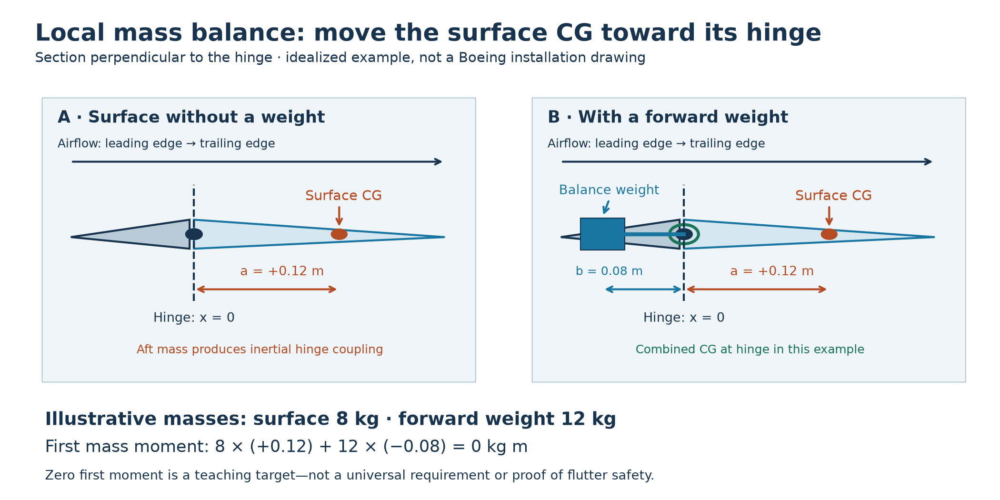
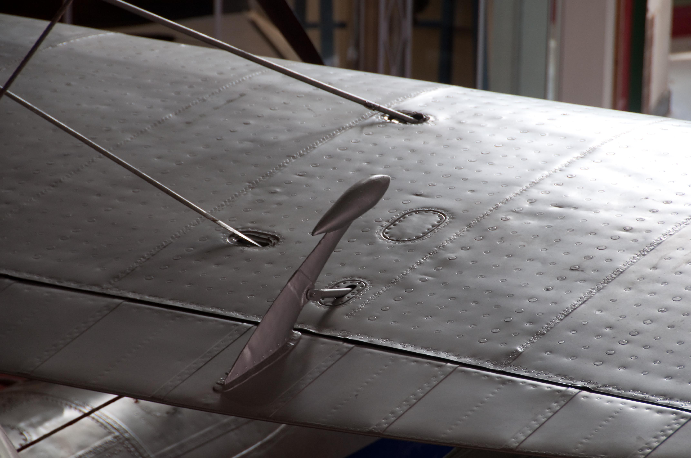
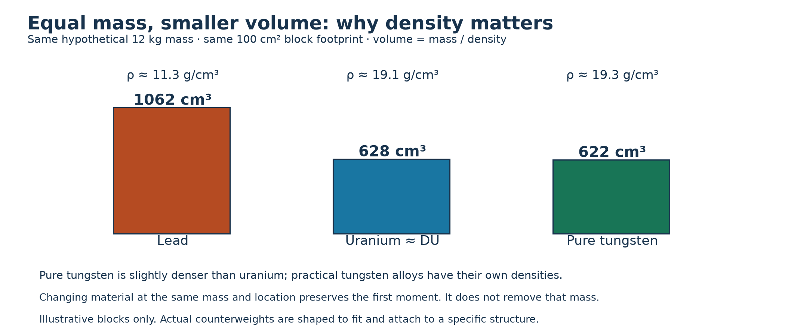
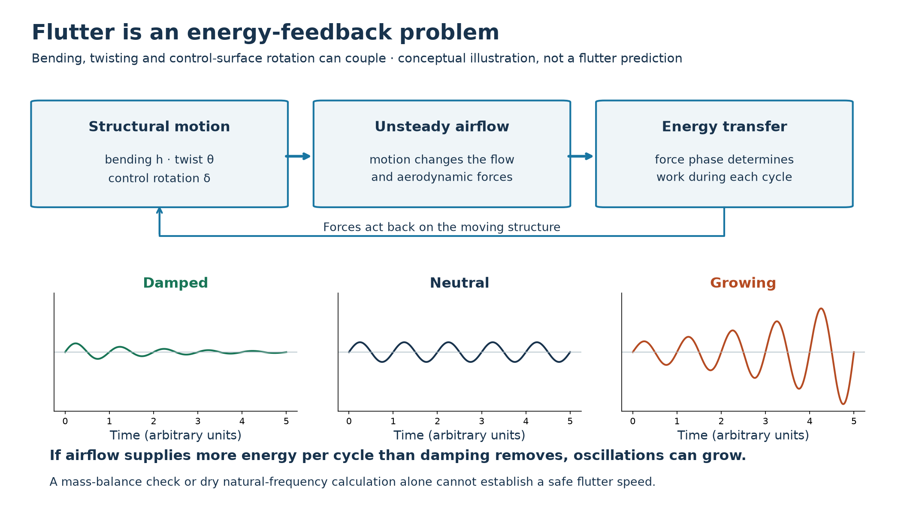
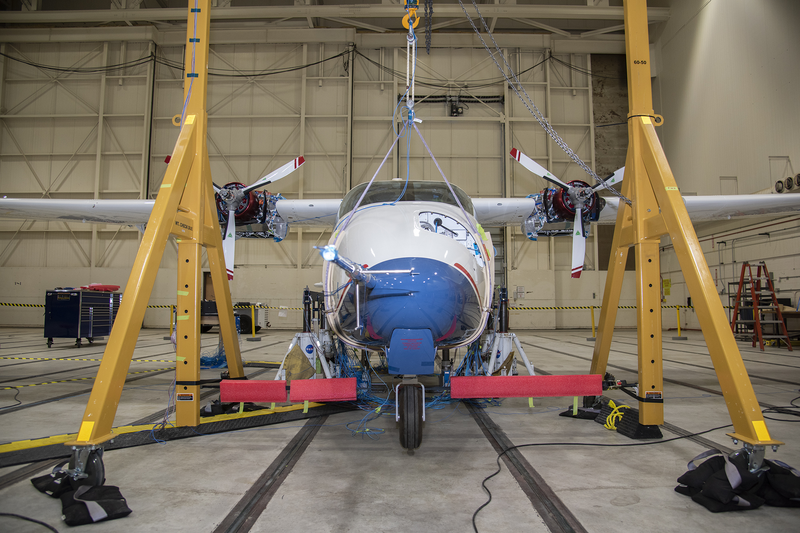

# Why did early Boeing 747s carry depleted-uranium counterweights?

MIE 446 · Aerospace Structures · University of Massachusetts Amherst

[Course home](README.md) · [Lecture 1](notebooks/MIE446_Lecture_01_Trust_Forces_Airfoils.ipynb) · [Wing Lab](https://ehsan-roohi.github.io/Aerospace-Structures/wing-lab.html)

**The engineering question:** Aircraft designers usually try to remove mass. Why would they deliberately add a very dense metal to a moving control surface?

The answer connects mass distribution, structural stiffness and aeroelastic stability. The material was **depleted uranium (DU)**, used as a compact counterweight—not as fuel, a power source, or a way to strengthen the wing skin. This reading is an independent educational case study prompted by [Amir Abdolmaleki's Zoomit article](https://www.zoomit.ir/aviation-aerospace/468407-boeing-747-uranium-counterweights/), with technical claims checked against the sources linked below. It is not a translation or an aircraft maintenance procedure.

## 1. What was actually installed—and where?

*Figure 1. A real 747 tail, viewed from behind: the vertical tail carries the rudder; the horizontal tails carry the elevators. The counterweights are not exposed in this photograph. A picture of an aircraft does not establish what counterweight material it contains. Photo: Martin Smith, [original photograph and attribution](https://commons.wikimedia.org/wiki/File:Boeing_747_Tail_end_-_323517.jpg), [CC BY-SA 2.0](https://creativecommons.org/licenses/by-sa/2.0/); unmodified.*

The NRC's summary of Boeing's 1983 correspondence identifies **outboard elevator and upper rudder assemblies** on the first 550 aircraft. It reports approximately 12,000 cast parts, over 200 tons of DU in total, and either 21 or 31 weights per aircraft, depending on the model. These are historical program figures, not a specification for every 747 ever built. [NRC: Boeing counterweight correspondence](https://www.nrc.gov/facilities-safety/radiation-protection/boeing-company-request-concerning-depleted-uranium-counterweights).

The word *counterweight* describes a function, not a spherical shape. NRC's broader review describes aircraft counterweights of different shapes and sizes. Do not picture loose uranium balls rolling inside a wing: these were attached components. A [photograph of an actual DU aircraft-control counterweight](https://periodictable.com/Items/092.29/index.html) is available in Theodore Gray's collection; that page does not establish a 747 installation. [NRC NUREG-1717, §3.17.2](https://www.orau.org/health-physics-museum/files/library/consumer/1717.pdf#page=529).

An **elevator** rotates to change horizontal-tail loading and pitch moment; a **rudder** changes vertical-tail loading and yaw moment. Their thin, movable structures have little room for a large counterweight. That limited space is central to this material choice.

## 2. Two different meanings of “balance”

| Whole-aircraft weight and balance | Local control-surface mass balance |
|---|---|
| Considers the aircraft, passengers, cargo, fuel and equipment together. | Considers a movable surface and its attached components. |
| Measures CG location from an aircraft reference datum. | Measures mass positions relative to the surface's hinge axis. |
| Affects loading limits, trim and longitudinal stability. | Affects inertial coupling and the surface's vibration behavior. |
| Aircraft CG: **xCG = Σ(mᵢ xᵢ) / Σmᵢ**. | First mass moment about hinge: **S = Σ(mᵢ xᵢ)**. |

The same algebra appears in both columns, but the **system boundary and reference axis differ**. A tail counterweight contributes to the aircraft's overall CG too; that does not mean whole-aircraft trim is its principal purpose.

Also distinguish **mass balance** from **aerodynamic balance**. A horn or area ahead of the hinge can change the aerodynamic hinge moment. A dense weight ahead of the hinge changes mass properties. One component can contribute to both, but these are not interchangeable mechanisms.

## 3. Why put a weight ahead of a hinge?

Imagine a control surface whose own CG lies behind its hinge. If the supporting wing or tail accelerates, the surface's inertia can create a moment about that hinge. Moving the combined CG toward the hinge can reduce this particular coupling. It does not make the surface weightless or eliminate all moments.

*Figure 2. Read left to right along the chord. The fixed structure is gray, the movable surface is pale blue, its original CG is orange, and the forward weight is blue. The hinge axis extends into/out of the page. The right panel uses a deliberately simple zero-first-moment target—not a drawing of a 747 assembly.*

### A transparent calculation

Take **x positive aft**, with x = 0 at the hinge. Approximate the surface as a mass mₛ at an aft distance a; put a balance mass mᵦ a distance b forward of the hinge:

**S = mₛa − mᵦb** &nbsp; [kg m]

For the illustrative target S = 0:

**mᵦ = mₛa / b**

With mₛ = 8 kg, a = 0.12 m and b = 0.08 m:

**mᵦ = (8 × 0.12) / 0.08 = 12 kg.**

The counterweight exceeds the surface mass because its available forward lever arm is shorter. That is a packaging constraint, not an arithmetic error. If b increases to 0.16 m, the same first-moment target requires only 6 kg—but there may be no room for that arm.

In a small-motion rigid-surface model, transverse base acceleration aₙ produces an inertial hinge-moment contribution with magnitude **|Mᵢ| ≈ |S aₙ|**. This explains why the first mass moment matters. Its sign depends on the acceleration and rotation conventions.

**Important limit:** Real balance targets can permit specified imbalance or overbalance. Spanwise mass distribution, surface flexibility and actuator behavior also matter; placing the combined CG exactly at the hinge is not a universal prescription. FAA guidance explicitly treats balance-weight magnitude, spanwise position and control-surface torsional modes. [FAA AC 25.629-1C, §7.1.4.2](https://www.faa.gov/documentLibrary/media/Advisory_Circular/AC_25.629-1C.pdf#page=16).

*Figure 3. An exposed aileron balance weight on Supermarine S.6A “N248.” Look for the oval weight on a projecting arm in the center of the photograph. It makes the “mass at a lever arm” idea visible; it is not a 747, and this photograph does not identify uranium. Photo: SovalValtos, [source and full-resolution image](https://commons.wikimedia.org/wiki/File:Supermarine_S.6A_%27N248%27_wing_detail.jpg), [CC BY-SA 3.0](https://creativecommons.org/licenses/by-sa/3.0/); unmodified.*

## 4. Why uranium? High mass in a small volume

For a prescribed counterweight mass, **volume = mass / density**. Uranium metal has a density of about 19.1 g/cm³, versus about 11.3 for lead and 19.3 for pure tungsten. Isotopic depletion does not materially change this classroom comparison. [Royal Society of Chemistry: uranium](https://periodic-table.rsc.org/element/92/uranium), [lead](https://periodic-table.rsc.org/element/82/lead), [tungsten](https://periodic-table.rsc.org/element/74/tungsten).

*Figure 4. All three illustrative blocks have mass 12 kg and the same footprint. Lead requires approximately 1,062 cm³, uranium 628 cm³, and pure tungsten 622 cm³. Uranium occupies about 59% of the lead volume. These are calculated comparison blocks, not manufactured aircraft parts.*

High density saves **space at a specified mass**; it does not reduce that mass. Pure tungsten is actually slightly denser than uranium. Practical tungsten-heavy-alloy densities depend on composition, so a replacement must use the approved part's geometry and mass properties, not merely the element's name. The historical choice cannot be explained by claiming tungsten was too light. NRC identifies space limits as a reason for DU counterweights. [NUREG-1717, §3.17.2](https://www.orau.org/health-physics-museum/files/library/consumer/1717.pdf#page=529).

“Depleted” means the U-235 fraction is lower than in natural uranium. It does **not** mean nonradioactive. The counterweight exploits density, not a nuclear reaction. [NRC glossary: depleted uranium](https://www.nrc.gov/reading-rm/basic-ref/glossary/depleted-uranium).

## 5. How this connects to flutter

**Flutter is a self-excited aeroelastic instability:** aerodynamic forces, inertia and elastic deformation interact so that a disturbance can grow. It is not simply “the wing shakes,” nor is every resonant vibration flutter.

Think of a flexible wing or tail with a hinged surface. Bending changes its position, twisting changes its incidence, and surface rotation changes local airflow. The resulting forces act back on the structure. Their timing matters: aerodynamic work can feed energy into the motion rather than remove it.

*Figure 5. The curves illustrate possible amplitude histories, using arbitrary time units. They are not measured data, modes of a 747, or calculated flutter speeds. A stable dry vibration mode can become unstable when coupled to airflow.*

A compact way to organize the governing problem is:

**M q̈ + C q̇ + K q = Qₐₑᵣₒ(q, q̇, flow history; U)**

Here q collects motion coordinates such as bending, twist and control rotation; M is the mass/inertia matrix, C represents structural damping, K is stiffness, Qₐₑᵣₒ is the generalized unsteady aerodynamic force, and U is airspeed. Dots denote time derivatives. Real aerodynamic models can introduce additional flow states; this equation is an organizing statement, not a complete solver.

Changing a balance weight changes **mass distribution and inertia**, hence entries in M. It can alter coupling and flutter behavior. Changing a spar or torsion box changes K. These are different design levers.

A static balance calculation only checks a first moment. A dry vibration calculation finds frequencies without aerodynamic feedback. **Neither calculation alone supplies a safe flutter speed.** Predicting it requires the coupled aeroelastic model and its validation, not a universal formula based on counterweight mass.

## 6. The structural connection: the weight must stay attached

The balance weight is not the spar, skin or rib. It is a concentrated mass whose loads must enter those structural members through an attachment.

**Weight → attachment/arm → local stiffener or rib → control-surface structure → hinges/supporting tail structure.**

For an illustrative acceleration of 10g, the 12 kg weight in Figure 2 develops:

**F = m a = 12 × 10 × 9.81 ≈ 1,177 N.**

If that force acts perpendicular to an 0.08 m attachment arm, its local bending moment is approximately **94.2 N m**. These numbers are a classroom attachment-load example, **not a 747 design load or a certification criterion**.

This gives students a concrete reason to examine fastener shear/bearing, arm bending, local skin reinforcement, fatigue and corrosion. A small, dense part does not imply a small attachment load. A loose attachment also changes the dynamic system.

Another useful distinction is **first moment versus second moment of mass**. Moving a fixed mass changes its first moment in proportion to distance, but its point-mass contribution to hinge rotational inertia is **I = m r²**. Even two layouts with the same first moment can have different inertias. Structural **area** moment of inertia used in EI is a different quantity, with different units.

### Why maintenance matters

The 1983 NRC correspondence records an expectation that over 20% of the DU weights would require reprocessing because of corrosion at major overhauls, typically four to five years apart. Transport and limited reprocessing availability added burden. Two proposed protective-coating procedures received different regulatory assessments. This is a historical maintenance estimate—not a claim that every weight failed after five years. [NRC correspondence](https://www.nrc.gov/facilities-safety/radiation-protection/boeing-company-request-concerning-depleted-uranium-counterweights).

Adding paint or repair material behind a hinge also changes mass properties. As a simple example, 0.20 kg added at x = +0.25 m adds **0.050 kg m** of aft first moment. An existing balance check may therefore no longer apply. FAA guidance includes painting/repair allowances and attachment freeplay. [AC 25.629-1C, §7.1.4.2](https://www.faa.gov/documentLibrary/media/Advisory_Circular/AC_25.629-1C.pdf#page=16).

## 7. What do newer aircraft do?

**Replace the material where appropriate.** NRC's 2001 review reports that Boeing supplied tungsten replacement weights and used tungsten in new 747 aircraft starting in 1981. That does not establish that every older aircraft was immediately retrofitted, nor does it identify today's material in a particular airframe. [NUREG-1717, §3.17.2.3](https://www.orau.org/health-physics-museum/files/library/consumer/1717.pdf#page=530).

**Design the complete dynamic system.** Current FAA guidance addresses stiffness and mass distributions, control systems, freeplay, balance weights, dampers and relevant failure conditions. A modern solution may combine these measures. Counterweights have not become universally unnecessary, and fly-by-wire does not automatically make an aircraft flutter-proof. [AC 25.629-1C, §§6–7](https://www.faa.gov/documentLibrary/media/Advisory_Circular/AC_25.629-1C.pdf).

**Measure and validate.** For its A350F, Airbus describes a June 2026 ground vibration test using external shakers, control-surface excitation and accelerometers to tune finite-element aeroelastic models before flight vibration testing. This is a documented modern validation example—not evidence of the A350F's counterweight composition. [Airbus: A350F ground vibration testing](https://www.airbus.com/en/newsroom/stories/2026-08-pushing-the-a350f-to-the-limits-ground-vibration-testing).

*Figure 6. NASA's X-57 prepared for ground vibration testing. The suspension and instrumentation help engineers study structural dynamics; this is not an airborne flutter test. Photo: NASA / Lauren Hughes, [source and caption](https://www.nasa.gov/news-release/nasa-to-begin-high-voltage-ground-testing-on-all-electric-x-57/). Reproduced unmodified for education under [NASA media-use guidance](https://www.nasa.gov/nasa-brand-center/images-and-media/); no endorsement implied.*

## 8. What students should take into our printed-wing project

Our PLA wing and reinforcing rods are **not a DU-counterweight design**. The lesson is to track both stiffness and where mass goes.

- Skin, rods/spars, ribs and joints contribute differently to stiffness and mass. A heavy rib is not automatically an effective flutter-control device.
- Added tip mass can strongly affect inertia and modes even if the static load case is unchanged. State whether the calculation includes the added mass's weight.
- Moving a mass chordwise can change bending–torsion coupling without changing total mass.
- The frequencies in Wing Lab/our structural solver are **dry structural-mode results**, not certified flutter margins. Comparing those results is useful; calling them a safe flight speed is not.

Use numerical comparisons and staff-provided evidence for this discussion. **Do not add uranium, alter a real aircraft counterweight, fly student wings, or load them to failure.** Student-built wings remain subject to the course's [unloaded inspection and supervised-fabrication rules](PROJECT.md).

## 9. A short classroom discussion

1. **Predict:** For the same required first moment, what happens to counterweight mass if its forward arm doubles? Then check mᵦb = mₛa.
2. **Compare:** For that change, what happens to the counterweight's contribution mᵦb² to hinge inertia? Explain why improving one metric does not hold every metric constant.
3. **Audit a claim:** “If the surface balances on its hinge, flutter is impossible.” Identify the missing physics and evidence.
4. **Design decision:** Compare two materials with the same installed mass and location. Which outcomes remain the same? Which manufacturing, maintenance and handling questions remain?
5. **Connect to structures:** Sketch the weight's attachment load path. Mark where bending, fastener loads and local reinforcement enter the problem.

**Takeaway:** Density controls packaging; mass distribution controls inertial coupling; stiffness and damping influence motion; airflow can supply energy. A good aerospace design must satisfy all of these—not just static strength or a balance scale.

## Sources, videos and image credits

Historical and material sources are linked beside the relevant claims. For deeper study:

- [NRC NUREG-1717](https://www.orau.org/health-physics-museum/files/library/consumer/1717.pdf#page=529), §3.17: historical counterweight uses and substitution. This is a 2001 report, not a live fleet inventory.
- [FAA AC 25.629-1C](https://www.faa.gov/documentLibrary/media/Advisory_Circular/AC_25.629-1C.pdf), particularly §7.1.4.2: aeroelastic validation, balance and attachments.
- [Airbus: flutter-test video and explanation](https://flightsafety.airbus.com/2022/02/17/flutter-tests/): watch how vibration testing fits into aircraft development.
- [Airbus A350F GVT story with video](https://www.airbus.com/en/newsroom/stories/2026-08-pushing-the-a350f-to-the-limits-ground-vibration-testing): compare controlled ground excitation with flight testing.
- [NRC background on DU](https://www.nrc.gov/facilities-safety/low-level-waste-disposal/decision-support/low-level-radioactive-waste-disposal-rulemaking/background-information-on-depleted-uranium): DU is radioactive; inhalation/ingestion can also cause chemical toxicity. An intact installed part and contaminated dust are different exposure situations.
- [FAA AC 20-123](https://www.faa.gov/documentLibrary/media/Advisory_Circular/AC20-123.pdf): specialist precautions for damaged DU aircraft weights during accident investigation. Do not use this reading as handling permission.
- [Full image provenance and reproduction terms](docs/case-studies/boeing-747-mass-balance/IMAGE_CREDITS.md).

Original calculations and teaching figures are illustrative, not Boeing/Airbus engineering data. Sources checked October 6, 2026.
