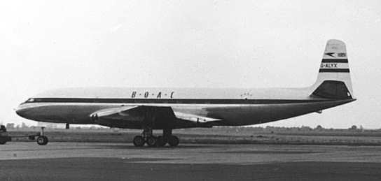
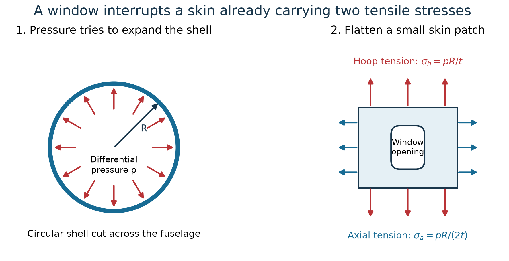
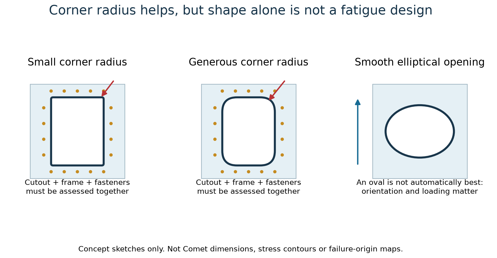
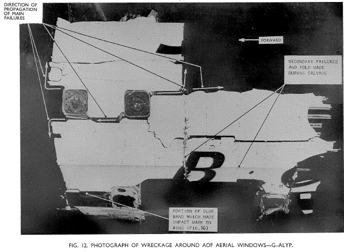
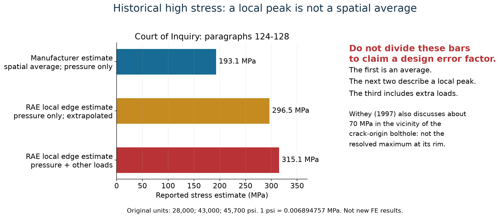
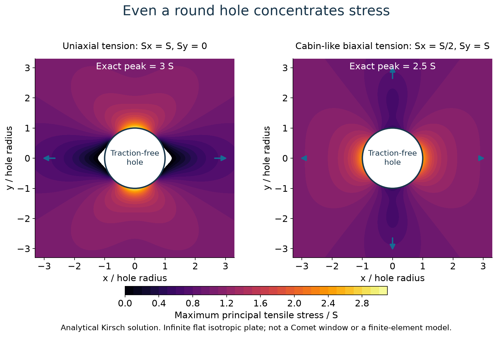
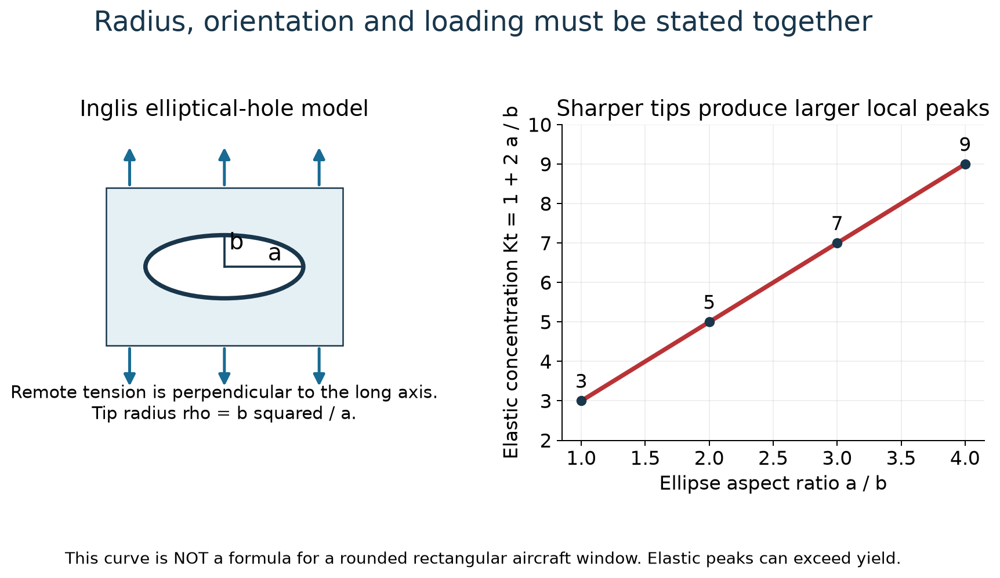
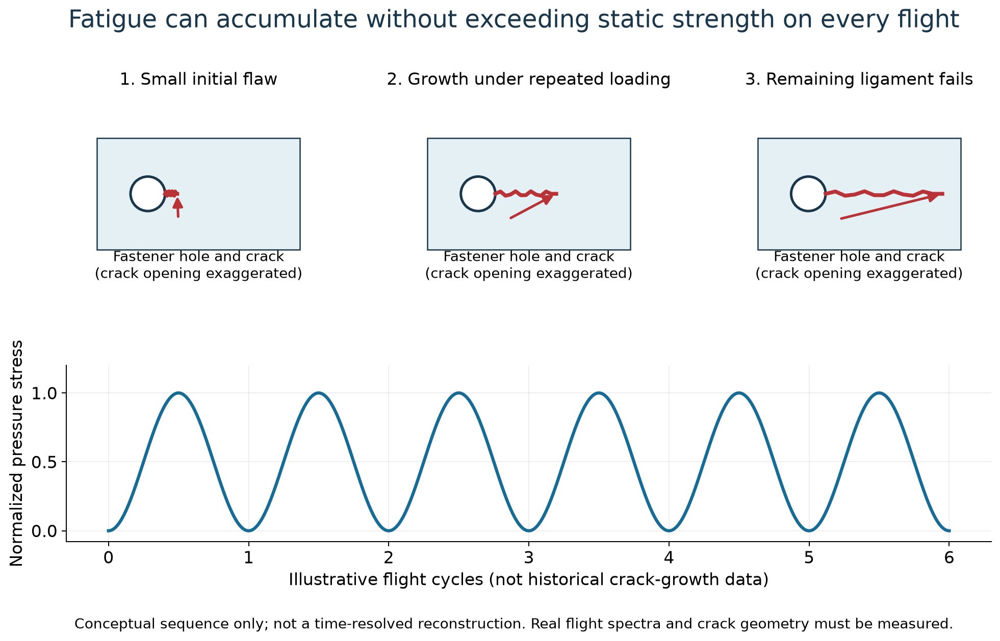
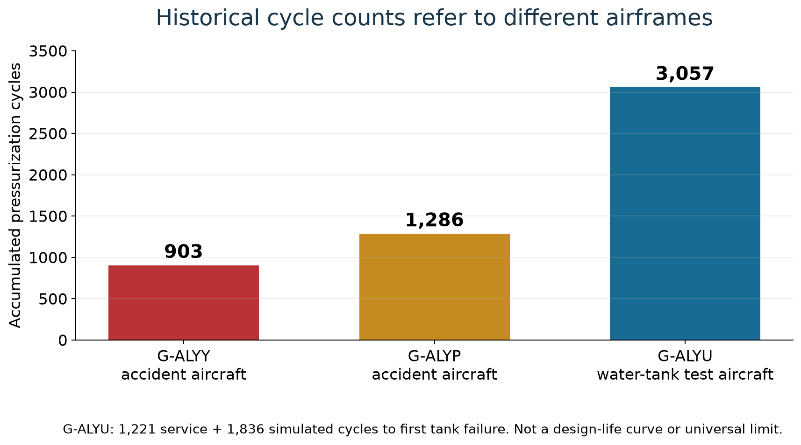

# Aircraft windows and the Comet fatigue failures

MIE 446 · Aerospace Structures · University of Massachusetts Amherst

[Course home](README.md) · [Wing structure and buckling lecture](notebooks/MIE446_Wing_Structure_Buckling_Materials_and_Flutter.ipynb) · [Boeing 747 mass balance and flutter](BOEING_747_MASS_BALANCE.md)

**Why do aircraft windows have rounded corners, and how can a fuselage fail under normal cabin pressure?** A window interrupts the load-carrying skin. Its shape, surrounding reinforcement and attachment holes create local stresses that can be much larger than the average membrane stress. Repeated flights can grow a small crack until the remaining structure cannot carry the load.

This independent English case study accompanies [Amir Abdolmaleki's Zoomit article, “Why are airplane windows rounded?”](https://www.zoomit.ir/aviation-aerospace/468504-why-airplane-windows-are-rounded/), published on October 8, 2026. It adds investigation evidence and reproducible calculations rather than translating the article. Historical estimates, original teaching diagrams and analytical examples are identified separately throughout.

## The two accidents involved two different aircraft



*Figure 1. A real Comet 1 with its early window layout. This is G-ALYX, not either of the two accident aircraft. Photograph by RuthAS, June 2, 1953; [source](https://commons.wikimedia.org/wiki/File:DH_Comet_1_BOAC_Heathrow_1953.jpg), [CC BY 3.0](https://creativecommons.org/licenses/by/3.0/). The downloaded Commons version is reproduced without further modification.*

| Aircraft and flight | Date and location | Fatalities |
|---|---|---:|
| Comet 1 G-ALYP, BOAC Flight 781 | January 10, 1954, near Elba, Mediterranean Sea | 35 |
| Comet 1 G-ALYY, South African Airways Flight 201 operated through BOAC | April 8, 1954, Mediterranean Sea near Naples | 21 |

Both broke up in flight. These were not two crashes of the same individual aircraft. The accident histories are summarized by the [FAA Comet case study](https://www.faa.gov/lessons_learned/transport_airplane/accidents/G-ALYV). A separate 1953 Comet breakup in a thunderstorm should not be presented as the same demonstrated cabin-fatigue mechanism.

## Start with the pressure load before discussing the window

At cruise, cabin pressure exceeds outside atmospheric pressure. That **pressure difference**, not absolute cabin pressure, loads the fuselage. The structure must carry it even without a window. Windows redirect an existing load path; they do not create the cabin pressure.



*Figure 2. Left: pressure acts outward around the shell. Right: a small patch carries circumferential hoop tension and longitudinal axial tension. The opening interrupts both. This is a thin-cylinder idealization, not a drawing of an actual Comet frame.*

Let **p** be differential pressure, **R** fuselage radius and **t** effective load-carrying thickness. For a thin cylindrical shell with closed ends:

**Hoop stress: σh = pR/t**

**Axial stress: σa = pR/(2t)**

To obtain the first expression, cut a cylinder along its length. Over a length ℓ, pressure produces a separating force p × 2Rℓ. The two cut skin edges carry 2σh tℓ. Equating the forces gives σh = pR/t. For the axial expression, balance the end-cap force pπR² against the wall force σa × 2πRt.

These are average membrane stresses away from openings. Frames, stringers, shell curvature, bending, joints and window frames make the real problem more complicated. A cabin window is therefore **not** a hole in a plate pulled in only one direction.

## Rounded corners help but do not eliminate stress concentration



*Figure 3. The yellow dots represent attachment holes, not measured crack origins. A generous radius can reduce corner severity, but the skin, frame, doubler and fasteners must be assessed together. No stress contours or quantitative comparison are implied by these sketches.*

Define the elastic stress concentration factor as:

**Kt = local peak stress / stated nominal stress**

Always state the nominal-stress convention. Stress based on the gross section and stress based on the smaller net section give different Kt values for the same physical peak. Also state which stress component is being compared.

The simplest check is surprising: **even a perfectly circular hole has Kt = 3 under uniaxial tension in an infinite isotropic plate.** A round hole is not stress-free. A smaller tip radius can make a notch more severe, but neither “round” nor “oval” guarantees safety under every loading direction. The [Jönköping University stress-concentration teaching chapter](https://mechanics.ju.se/SolidMechanics/StressConcentration.html) supplies the Kirsch and Inglis analytical benchmarks used below.

## What the investigation found and where the crack began



*Figure 4. Investigation imagery of G-ALYP's roof openings for automatic direction finding, or ADF, equipment. These are antenna openings, not passenger viewing windows. HM Stationery Office, 1955; [Commons source and attribution](https://commons.wikimedia.org/wiki/File:Comet_G-ALYP_ADF_windows.png), listed under [CC BY-SA 4.0](https://creativecommons.org/licenses/by-sa/4.0/). Reproduced without modification.*

Withey's detailed analysis places G-ALYP's fatigue origin at a **bolthole near the rear ADF roof opening**, rather than directly at the highest-stress window edge. It discusses approximately **70 MPa in the bolthole vicinity** versus **315 MPa around the window edge**. The 70 MPa is not a resolved maximum at the hole rim. Local hole geometry and an initial flaw remain important. His fracture-mechanics reconstruction estimates an initial flaw of about **100 micrometres**; that is a later estimate, not an observed measurement of the original flaw. [Withey, 1997, pp. 150–153](https://doi.org/10.1016/S1350-6307(97)00005-8); [university publication record](https://research.birmingham.ac.uk/en/publications/fatigue-failure-of-the-de-havilland-comet-i/).

The recovered wreckage supported a fatigue explanation for G-ALYP. The analogous explanation for G-ALYY was judged probable, but much less wreckage was available. Do not assign an independently verified identical crack origin to both aircraft. [Court of Inquiry, 1955](https://asn.flightsafety.org/reports/1954/19540408_COMT_G-ALYY.pdf).

**Engineering lesson:** The largest reported stress is not necessarily where the first damaging crack grows. Manufacturing quality, small notches, initial flaws and the ability of surrounding structure to arrest a crack matter too.

## Documented examples of high local stress

The following values are historical **estimates**, not outputs from a new finite-element model. The Court records strain-gauge measurements followed by extrapolation to the edge and warns against equating a spatial average with a point maximum.

| Quantity described in the inquiry | Original estimate | Converted value | Meaning |
|---|---:|---:|---|
| Manufacturer's stress averaged near a window corner | 28,000 psi | 193.1 MPa | Pressure only; spatial average |
| RAE estimated local window-edge stress | 43,000 psi | 296.5 MPa | Normal differential pressure only; extrapolated local peak |
| RAE estimate including additional known loads | 45,700 psi | 315.1 MPa | Local estimate including 2,700 psi from other loads |

Source: [Court of Inquiry, paragraphs 124–128, printed p. 27, PDF p. 47](https://asn.flightsafety.org/reports/1954/19540408_COMT_G-ALYY.pdf#page=47). Conversion: **1 psi = 0.006894757 MPa**. These values concern investigated Comet details, not a universal stress at every passenger window.



*Figure 5. The three bars differ in location/averaging or load combination. Their ratio is not an experimentally determined Kt. The Court also explains why simply doubling an elastic peak during an overload test can mislead: local plasticity can redistribute stress.*

## A worked example students can reproduce

**Scope:** This is an equivalent thin-shell patch followed by ideal infinite-plate cutouts. It is not a reconstruction of a Comet window, a safety assessment or a prediction of accident stresses.

Use differential pressure **8.25 psi = 56.882 kPa**, documented in the [Court report, paragraph 29](https://asn.flightsafety.org/reports/1954/19540408_COMT_G-ALYY.pdf#page=13). For the classroom calculation, choose **R = 1,600 mm** and **t = 1.42 mm**, consistent with the skin-plus-doubler discussion in Withey. Treating those layers as one membrane assumes full load sharing; it does not resolve the actual attachment load transfer.

Working in N and mm, pressure is **0.056882 N/mm²**, and 1 N/mm² equals 1 MPa:

**σh = (0.056882 × 1,600) / 1.42 = 64.1 MPa**

**σa = σh/2 = 32.0 MPa**

Set **x** along the fuselage and **y** circumferentially. The flat patch therefore has remote stresses **Sx = 32.0 MPa** and **Sy = 64.1 MPa**. At the rim of a traction-free circular hole, Kirsch's solution gives:

**σθθ = Sx + Sy − 2(Sx − Sy) cos(2θ)**

Here θ is measured from the x-axis; σθθ is tangent to the **hole**, not the fuselage hoop stress. At θ = 0 or 180 degrees:

**σθθ,max = 3Sy − Sx = 160.2 MPa = 2.5σh**

At θ = 90 or 270 degrees the rim stress is **3Sx − Sy = 32.0 MPa**. Biaxial loading changes both the value and location of the peak.



*Figure 6. Identical hole, identical reference stress S, different loading. The colors show maximum principal tensile stress divided by S. Left: Sx = S and Sy = 0, giving peak 3S. Right: Sx = S/2 and Sy = S, giving peak 2.5S. Both panels use the same color scale. These are computed analytical fields, not decorative heat maps or Comet FE results.*

### Compare three stated idealizations

| Model | Loading assumption | Peak stress for reference S = 64.1 MPa |
|---|---|---:|
| Circular hole | Uniaxial remote tension S | 3S = 192.3 MPa |
| Circular hole | Cabin-like biaxial tension: Sx = S/2, Sy = S | 2.5S = 160.2 MPa |
| Elliptical hole, a/b = 2 | Uniaxial remote tension perpendicular to the long axis | 5S = 320.5 MPa |

The ellipse uses Inglis's result **Kt = 1 + 2a/b**, where a and b are its semi-axes. Its tip radius is **ρ = b²/a**, so the same expression is **Kt = 1 + 2√(a/ρ)**. This is not a formula for a rounded rectangular window. Changing ellipse orientation changes the result.



*Figure 7. Blue arrows identify the loading direction. Increasing a/b sharpens the long-axis tips and increases the elastic peak for this particular load. A calculated 320.5 MPa that happens to resemble a historical estimate does not validate the model against the Comet accident.*

If an elastic result exceeds the alloy's applicable yield stress, do not treat it as a physically realized linear-elastic stress. Investigate plastic redistribution and fatigue using appropriate material data and models. Ultimate strength alone is not a fatigue-life criterion.

## Why repeated flights matter

**Fatigue** is damage and crack growth under repeated loading. A structure can pass a static load test and still develop a fatigue crack during service. Pressurization contributes one major stress cycle per flight; maneuvering, gusts, vibration and thermal changes add other variations.



*Figure 8. The red line is a crack, not a displacement curve. Its opening and lengths are exaggerated for visibility. The lower trace illustrates repeated loading, not measured Comet pressure records or a fitted crack-growth law.*

For a crack, the relevant elastic measure is a **stress intensity factor**, not just Kt:

**K = Yσ√(πa)**

Here a is the crack-size parameter for the chosen geometry and Y is a geometry factor. K has units MPa√m when a is in metres. As the crack grows, the remaining ligament and local load path change. Stable fatigue growth may eventually give way to fast fracture or another instability; a growing crack need not wait until the whole skin reaches ultimate tensile strength.

A common intermediate crack-growth model is **da/dN = C(ΔK)ᵐ**. It requires material/environment data, crack geometry, load ratio and a relevant range of validity. This report does **not** assign a generic C and m and claim a predicted Comet service life.

### Historical testing was not a single universal life limit

G-ALYU was pressure-cycled in a water tank with simulated wing loading. Its first failure followed **1,221 service plus 1,836 simulated cycles**, totaling **3,057**, at a rivet hole near an escape hatch. Water reduced the stored-energy hazard relative to compressed air. [RAF Museum, Comet Failure](https://www.rafmuseum.org.uk/research/archive-exhibitions/comet-the-worlds-first-jet-airliner/comet-failure).



*Figure 9. Withey reports 903 pressurizations for G-ALYY and 1,286 for G-ALYP; the museum documents the G-ALYU breakdown. These are different airframes, not points on an S–N curve or an allowable flight limit.*

A further lesson is test representativeness: prior overload, residual stress, local plastic deformation and the boundaries of a test section can change subsequent fatigue behavior. A successful test of one article is not automatically evidence for every production airframe. [FAA discussion of the Comet test sequence](https://www.faa.gov/lessons_learned/transport_airplane/accidents/G-ALYV).

## What modern design does beyond rounding the opening

Window design must address the complete structural detail:

- Smooth load paths and generous radii where practical.
- Local skin reinforcement and frames, with realistic stiffness and load transfer.
- Fastener-hole quality, countersinks, bonding and production defects.
- Representative repeated-load tests, including relevant load combinations.
- Crack-growth assessment, residual strength, inspectability and repair provisions.

US transport-aircraft rules require structural evaluation supported by test evidence, attention to fatigue and manufacturing defects, and maintenance provisions where necessary to avoid catastrophic failure. Consult the current [14 CFR 25.571](https://www.ecfr.gov/current/title-14/section-25.571) and [FAA AC 25.571-1D](https://www.faa.gov/airports/resources/advisory_circulars/index.cfm/go/document.information/documentNumber/25.571-1D). Rounded windows are one part of that strategy, not the strategy itself.

## Connect this case to our printed wing

Our student wings are not pressurized airliner fuselages. The transferable lesson is **detail design and evidence**, not importing Comet stresses or flight-life limits into a PLA model.

A rod hole, sharp sleeve junction or abrupt rib-to-skin connection can interrupt a wing load path. Identify the nominal load first, then the local geometry and likely failure mode. Add fillets where appropriate, check actual dimensions, and distinguish local stresses from averaged beam stresses. Printed polymers also require attention to layer orientation, voids and process variability. A metal fatigue model cannot be transferred unchanged to a printed polymer.

Student-built wings remain subject to the [course project's restrictions](PROJECT.md): they are not flown or tested to failure. This reading is not permission to pressurize, crack or destructively load a student specimen.

### Questions for class

1. Why is fuselage hoop stress twice axial stress in the ideal closed cylinder?
2. If a round hole has Kt = 3, what does “rounded corners improve the design” actually mean?
3. Why are 193.1 MPa as a spatial average and 296.5 MPa as a local peak not a valid direct error-factor comparison?
4. How could a bolthole in a lower-stress region initiate the fatal crack before the highest-stress edge?
5. Which extra evidence would you need before using a colorful stress plot to predict fatigue life?

*Short checks:* force equilibrium; the relevant baseline geometry/load must be specified; different averaging conventions; local notch/flaw and crack resistance; validated geometry, material/process data, loads, convergence, test evidence and a crack-growth model.

## Reproduce the calculations and figures

[Python source](scripts/build_comet_case_study.py) · [CSV results](docs/case-studies/comet-windows/analytical-results.csv) · [JSON inputs and results](docs/case-studies/comet-windows/analytical-results.json)

From a checkout of this repository, with NumPy and Matplotlib installed:

```bash
python scripts/build_comet_case_study.py
```

The script regenerates seven original figures and the numerical files. It checks zero radial/shear traction at the hole rim, the uniaxial/biaxial/equibiaxial peaks, the far-field stress tensor and the circular limit of the ellipse formula. It does not require an FE package or claim to reproduce an actual aircraft structure. The two licensed historical images are retained separately.

## Sources and image provenance

1. [Zoomit article](https://www.zoomit.ir/aviation-aerospace/468504-why-airplane-windows-are-rounded/), Amir Abdolmaleki, October 8, 2026. Motivation; not the source of the numerical analysis. Getty images from that article are not republished here.
2. [Court of Inquiry report, HMSO, 1955](https://asn.flightsafety.org/reports/1954/19540408_COMT_G-ALYY.pdf). Primary investigation; use paragraph numbers as well as PDF page numbers. Paragraphs 124–128 give the historical stress estimates and their limitations.
3. [FAA Comet lessons learned](https://www.faa.gov/lessons_learned/transport_airplane/accidents/G-ALYV). Accident chronology and test representativeness.
4. P. A. Withey, [Fatigue failure of the de Havilland Comet I](https://doi.org/10.1016/S1350-6307(97)00005-8), *Engineering Failure Analysis* 4(2), 147–154, 1997. [University record](https://research.birmingham.ac.uk/en/publications/fatigue-failure-of-the-de-havilland-comet-i/); [accessible collected-volume reprint, printed pp. 185–192](https://www.iqytechnicalcollege.com/Failure_Analysis_Case_Studies_II.pdf#page=198). The reprint's printed p. 189 corresponds to journal p. 151.
5. [RAF Museum, Comet Failure](https://www.rafmuseum.org.uk/research/archive-exhibitions/comet-the-worlds-first-jet-airliner/comet-failure). Water-tank test and reconstruction history.
6. [Jönköping University, Stress concentration](https://mechanics.ju.se/SolidMechanics/StressConcentration.html). Analytical benchmarks and nominal-stress conventions; includes original Kirsch and Inglis references.
7. [FAA AC 25.571-1D](https://www.faa.gov/airports/resources/advisory_circulars/index.cfm/go/document.information/documentNumber/25.571-1D) and [current 14 CFR 25.571](https://www.ecfr.gov/current/title-14/section-25.571). Modern fatigue and damage-tolerance framework.

Photograph and investigation-image licenses are linked in their captions and [asset provenance](docs/case-studies/comet-windows/ATTRIBUTION.md). All other diagrams are original educational illustrations or analytical plots produced by the accompanying source. None is a certified aircraft analysis.
