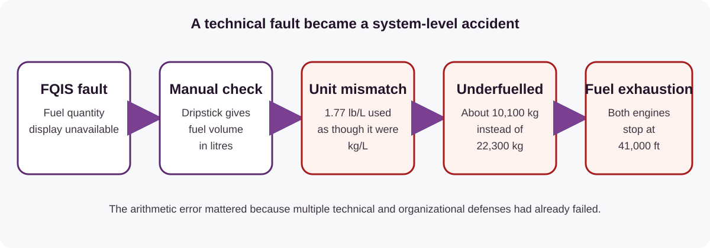
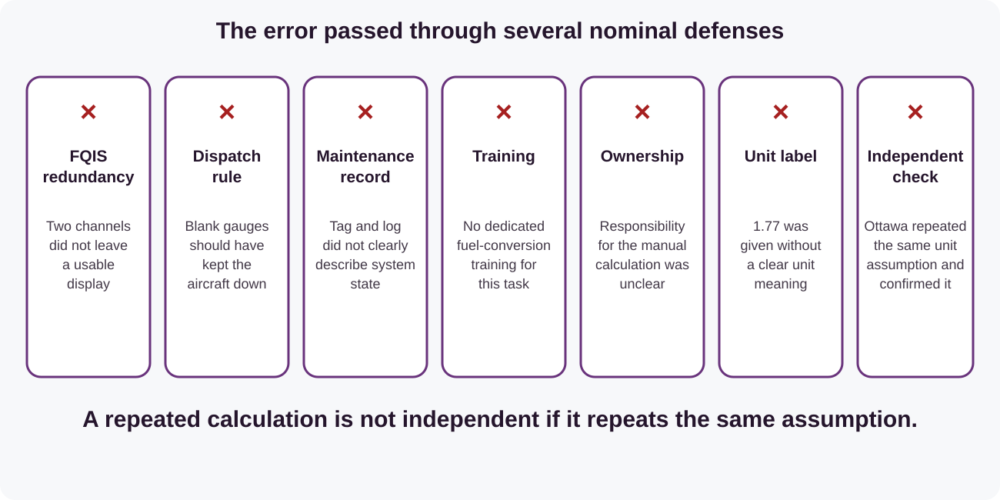
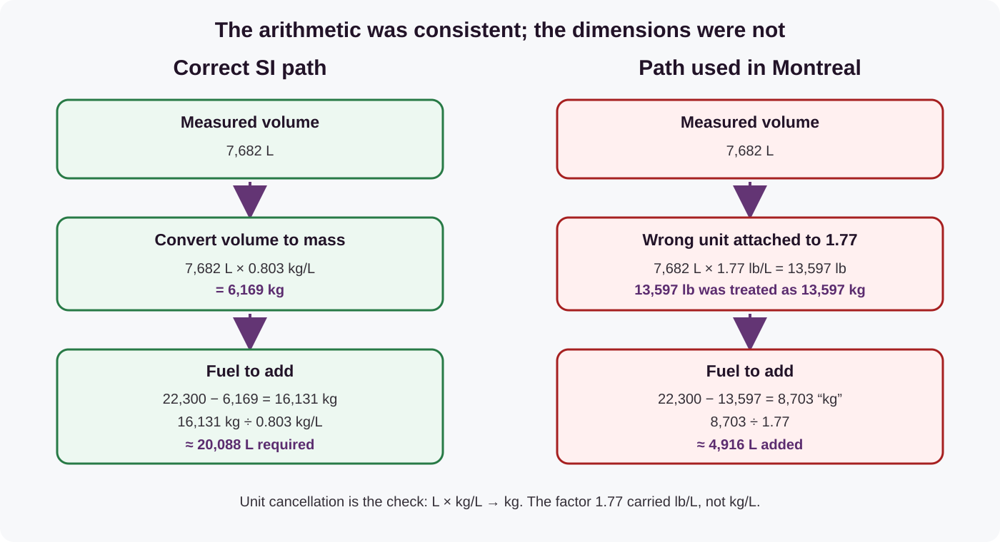
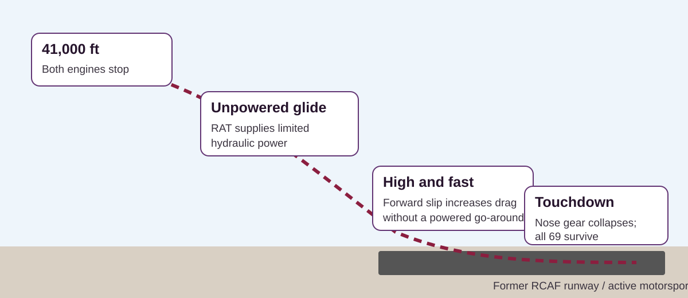
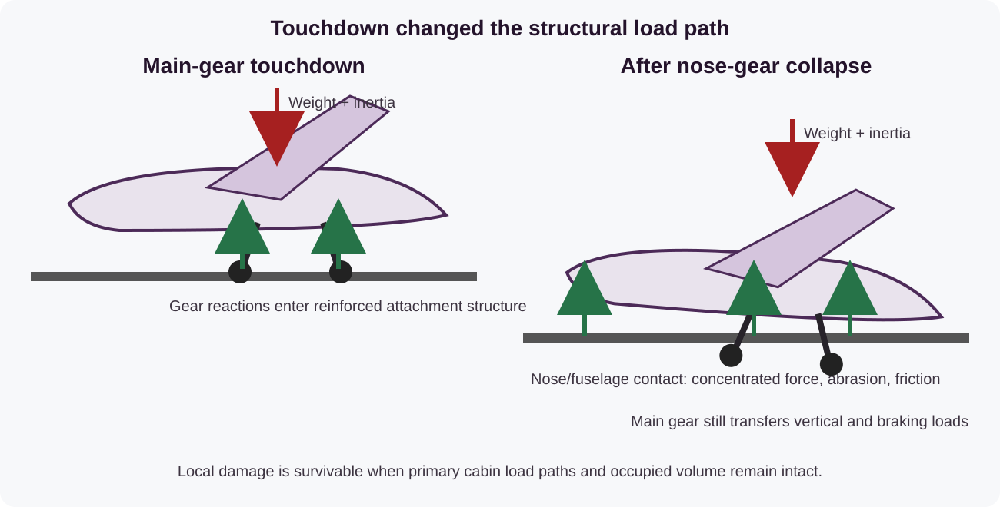

# The Gimli Glider: an aerospace-structures case study

**MIE 446 · Aerospace Structures · UMass Amherst**  
**Case:** Air Canada Flight 143 · Boeing 767-233, registration C-GAUN · 23 July 1983

On 23 July 1983, a nearly new Boeing 767 ran out of fuel at 41,000 ft during a scheduled flight from Montreal to Edmonton, with an intermediate stop in Ottawa. Both engines stopped. Most electronic displays went dark, normal hydraulic power was lost, and the crew had no checklist for gliding a transport-category jet with both engines inoperative. Seventeen minutes later, the aircraft stopped on a former military runway at Gimli, Manitoba. All 69 occupants survived.

The event is often presented as a story about a pounds-to-kilograms error and exceptional piloting. Both are true, but they are incomplete. For an aerospace-structures course, the more useful question is broader:

> **How did the aircraft remain controllable, transmit abnormal loads, protect its occupants, and come to rest after several layers of the intended system had failed?**

This reading is an original MIE 446 case study. It is not a translation or reproduction of the Zoomit article. The technical narrative is based primarily on the Canadian Board of Inquiry report, archived by the FAA, and the photographs are used under the licenses identified at the end of the page.

*C-GAUN four months before the accident. Photograph: Pierre Langlois, [Wikimedia Commons](https://commons.wikimedia.org/wiki/File:C-GAUN_Aircraft_(cropped).jpg), CC BY-SA 4.0.*

## Flight and aircraft at a glance

| Item | Flight 143 |
|---|---|
| Aircraft | Boeing 767-233, C-GAUN, line number 47 |
| Route | Montreal–Ottawa–Edmonton |
| Occupants | 61 passengers and 8 crew |
| Initial fuel-pressure warning | Shortly after 20:00 Central Daylight Time at 41,000 ft |
| State after the second engine stopped | Approximately 35,000 ft; about 65 mi from Winnipeg and 45 mi from Gimli |
| Emergency destination | Former Royal Canadian Air Force base at Gimli, then partly used as a motorsport facility |
| Outcome | Aircraft damaged but repairable; no fatalities and no serious injuries |

The table gives the endpoints, but the engineering value lies in the sequence. No single failure directly produced the landing. A fuel-indication fault was followed by ambiguous maintenance state, dispatch with blank gauges, a manual measurement, a unit error, repetition of the same error, fuel exhaustion, loss of normal power, a glide-range decision, an energy-management problem, and finally an abnormal ground-load path.

## 1. The aircraft and the first failed defense

C-GAUN was the 47th Boeing 767 produced and had entered Air Canada service only a few months earlier. The 767 represented a new generation of wide-body aircraft: electronic flight instruments, a two-person flight deck, and extensive automation replaced many functions and displays found in older three-crew aircraft.

Fuel quantity was normally calculated by the fuel-quantity indication system (FQIS). The system used two processing channels so that one channel could continue operating after the other failed. Before Flight 143, a fault had appeared in the system. Maintenance actions, changing crews, an ambiguous logbook entry, a circuit breaker that had been tagged but was no longer pulled, and the absence of a serviceable replacement unit eventually left the cockpit fuel gauges blank.

The important lesson is not that one component failed. Components fail, which is why redundancy exists. The accident developed because the redundancy, maintenance communication, dispatch rules, manual measurement, unit convention, and independent cross-check did not remain independent defenses.

The Fuel Quantity Indication System (FQIS) contained two processor channels, but redundancy at component level did not guarantee redundancy at system level. A maintenance action that reactivated the faulty channel blanked the displays. The circuit breaker remained tagged even though its physical state had changed, so the tag no longer communicated the actual configuration. The Minimum Equipment List (MEL) did not permit departure with blank fuel gauges, yet the crew believed a manual drip measurement could provide an acceptable substitute.

The official inquiry therefore treated the accident as a combination of human errors, corporate deficiencies, and equipment failures. Its findings included unclear assignment of responsibility, insufficient conversion training, confusing manuals, inadequate communication across departments, shortcomings in fuel procedures, and lack of spare parts. This layered interpretation is more useful than reducing the event to “a mechanic used the wrong number.”

## 2. The calculation that put too little fuel on board

With the fuel indication unavailable, the tanks were checked using drip sticks. The reading was a liquid level in centimetres. Aircraft-specific tables then converted that level into volume in litres. At Montreal, the two wing-tank readings were 64 and 62 cm, corresponding to 3,924 and 3,758 L. The measured total was therefore

$$
V_{\mathrm{onboard}}=3{,}924+3{,}758=7{,}682\ \mathrm{L}.
$$

That number was only a volume. The flight plan and the Boeing 767 fuel-management system required fuel mass in kilograms. Volume cannot be relabelled as mass; it must be multiplied by density. For Jet A under the conditions used in the report, the required density was approximately (0.80) to (0.803\ \mathrm{kg/L}). The minimum flight-plan requirement was 22,300 kg, excluding an additional estimated 300 kg for taxiing.

### The correct calculation

Using the correct density, approximately 0.803 kg/L:

$$
m_{\mathrm{onboard}}=(7{,}682\ \mathrm{L})(0.803\ \mathrm{kg/L})=6{,}169\ \mathrm{kg}
$$

$$
m_{\mathrm{add}}=22{,}300-6{,}169=16{,}131\ \mathrm{kg}
$$

$$
V_{\mathrm{add}}=\frac{16{,}131\ \mathrm{kg}}{0.803\ \mathrm{kg/L}}\approx20{,}088\ \mathrm{L}
$$

The inquiry reconstructed a nearly equivalent correct route using the supplied factor (1.77\ \mathrm{lb/L}), followed by the missing conversion from pounds to kilograms:

$$
7{,}682\ \mathrm{L}\left(1.77\ \frac{\mathrm{lb}}{\mathrm{L}}\right)
\left(\frac{1\ \mathrm{kg}}{2.2\ \mathrm{lb}}\right)
\approx 6{,}180\ \mathrm{kg}.
$$

Both routes are valid because their units cancel correctly. The small difference between 6,169 and 6,180 kg comes from using (0.803\ \mathrm{kg/L}) versus the rounded factors (1.77\ \mathrm{lb/L}) and (2.2\ \mathrm{lb/kg}).

### The calculation that was actually used

The fueller supplied the number 1.77. It was commonly called “specific gravity,” but this label was technically wrong. Specific gravity is a dimensionless ratio of a fluid density to a reference density. The number 1.77 carried units of pounds per litre: it was a mass-per-volume conversion factor for the predominantly non-metric Air Canada fleet.

The new 767 used kilograms. Nevertheless, (1.77\ \mathrm{lb/L}) was multiplied by litres and the numerical result was treated as kilograms:

$$
7{,}682\ \mathrm{L}\left(1.77\ \frac{\mathrm{lb}}{\mathrm{L}}\right)=13{,}597\ \mathrm{lb}.
$$

The arithmetic above is correct. The error occurred in the next, silent step:

$$
13{,}597\ \mathrm{lb}\quad\Longrightarrow\quad13{,}597\ \text{assumed kg}.
$$

This made the calculated fuel mass appear more than twice its actual value. The remaining calculation was internally consistent but physically meaningless:

$$
22{,}300-13{,}597=8{,}703\ \text{assumed kg to add},
$$

$$
\frac{8{,}703}{1.77}=4{,}916\ \text{assumed L to add}.
$$

The fueller rounded this to about 5,000 L. The correct uplift was approximately 20,000 L—about four times larger. After refuelling, the total mass was only about 10,100 kg rather than 22,300 kg.

### Why the number looked plausible

The mistake survived because each displayed number looked ordinary in isolation. A factor near 1.77 was familiar to personnel working with pounds; a result near 13,600 looked like a substantial fuel load; the subtraction and division were mathematically correct; and several people participated, creating the appearance of verification. No one forced the units to accompany each number through the calculation.

A quick order-of-magnitude check would have helped. Jet fuel is less dense than water, so one litre must have a mass below 1 kg. A value of (1.77\ \mathrm{kg/L}) would make jet fuel 77% denser than water, which is physically implausible. Conversely, (1.77\ \mathrm{lb/L}) equals about (0.803\ \mathrm{kg/L}), a reasonable density:

$$
1.77\ \frac{\mathrm{lb}}{\mathrm{L}}
\left(0.453592\ \frac{\mathrm{kg}}{\mathrm{lb}}\right)
=0.803\ \frac{\mathrm{kg}}{\mathrm{L}}.
$$

### Why the Ottawa check did not catch it

At Ottawa, the measured volume was approximately 11,430 L and a factor of 1.78 was supplied. Multiplication gave a number just above 20,000, which was again interpreted as kilograms rather than pounds. Because fuel had been burned since Montreal, the result decreased in the expected direction. The second calculation therefore seemed to corroborate the first.

It was not an independent check. Both calculations used the same hidden model: “multiply litres by about 1.77 to obtain kilograms.” Repetition reduced random arithmetic error but could not expose a shared systematic error. The same principle applies to structural verification: two finite-element models are not independent if they share the same incorrect boundary condition, load definition, unit convention, or material card.

Dimensional analysis would have exposed the inconsistency. Numbers are not measurements until their units travel with them. In structural work, the same class of mistake can affect pressure, force, stress, toughness, fastener strength, section properties, or material allowables. A finite-element result can be numerically converged and still be physically wrong if its unit system or input provenance is wrong.

## 3. From powered airliner to glider

Near Red Lake, Ontario, fuel-pressure warnings appeared. The left engine stopped, followed shortly by the right. Engine-driven generators and pumps were no longer available. Much of the electronic flight deck went dark, and the crew was left with limited battery-powered instrumentation.

The Boeing 767's primary control surfaces are too large to be moved directly by pilot muscle force. Hydraulic power is therefore essential. When both engines stopped, a ram air turbine (RAT) deployed into the airstream. The RAT converted the aircraft's forward motion into limited hydraulic power, preserving control of essential systems. It did not restore normal capability: hydraulic authority decreased as airspeed decreased, and the crew did not regain the normal high-lift and braking configuration of a powered approach.

The RAT illustrates an important distinction between **functional survival** and **normal operation**. Its purpose was not to operate every aircraft system. It preserved the minimum control authority needed to keep the airplane flyable. The power available from an airstream-driven device depends strongly on dynamic pressure and flow speed. In simplified form,

$$
P_{\mathrm{air}}\propto \tfrac12\rho V^3 A,
$$

where (
ho) is air density, (V) is airspeed, and (A) is the turbine capture area. The cubic dependence shows why available power falls rapidly as the aircraft slows. It also explains why disturbed inflow during the forward slip could reduce hydraulic performance. This equation is a scaling relation, not a performance model for the specific 767 installation.

The crew initially considered Winnipeg, but their measured altitude loss showed that it was beyond reach. First Officer Maurice Quintal suggested the former Royal Canadian Air Force base at Gimli, where he had once served. The pilots did not know that part of the runway had become a motorsport complex and that people, cars, campers, and cyclists were present.

Captain Robert Pearson, who had glider experience, held approximately 220 kt while the crew estimated the achievable range. The reported in-flight estimate was a loss of about 5,000 ft over 10 nautical miles, corresponding to a glide ratio near 12:1 under the actual conditions. The number should be understood as an operational estimate, not a clean-aircraft performance measurement.

### Glide theory in one page

During a steady, shallow, unpowered descent, the flight-path angle (gamma) is related approximately to aerodynamic efficiency:

$$
\tan |\gamma|\approx\frac{D}{L}=\frac{1}{L/D},
$$

where (L) and (D) are lift and drag. The horizontal range available from altitude (h), neglecting wind and assuming constant (L/D), is approximately

$$
R\approx h\left(\frac{L}{D}\right).
$$

The crew did not have a published all-engines-out glide table immediately available and lacked a vertical-speed indicator after the electrical loss. First Officer Quintal therefore estimated the descent profile from successive altitude readings and radar-derived distances. A loss of 5,000 ft over 10 nautical miles gives

$$
\frac{R}{\Delta h}=\frac{10(6{,}076\ \mathrm{ft})}{5{,}000\ \mathrm{ft}}\approx12.2.
$$

This estimate included the actual aircraft mass, trim, atmospheric conditions, pilot inputs, and configuration during the measurement. It should not be confused with the maximum aerodynamic (L/D) of a clean 767 under an idealized test condition.

Best glide is also not the same as minimum sink. Maximum range occurs near maximum (L/D); maximum time aloft occurs at minimum sink rate. In this emergency, range to a usable runway was initially the dominant requirement. Later, once Gimli was assured, the problem reversed: the airplane arrived with too much height and energy and needed additional drag.

### Why the engines could not simply windmill the airplane to safety

An unpowered transport aircraft continues to fly because its forward kinetic energy and loss of gravitational potential energy sustain airflow over the wings. The engines do not need to produce thrust for the wings to generate lift, but drag continuously removes mechanical energy. The energy rate balance may be written schematically as

$$
-\frac{d}{dt}\left(mgh+\frac12mV^2\right)=DV+P_{\mathrm{loss}},
$$

where (P_{\mathrm{loss}}) includes other dissipative demands. A stable glide trades altitude for the aerodynamic work required to overcome drag. It cannot continue indefinitely, and any configuration change that raises drag—landing gear, sideslip, control deflection—reduces the remaining range.

## 4. The approach: energy had to go somewhere

Approaching Gimli, the aircraft was too high and too fast. In normal powered flight, the crew could use thrust, flaps, slats, speed brakes, or a go-around to reshape the energy state. Here, the options were sharply restricted. The gear had been lowered by gravity; the main gear locked, but the nose gear did not. Normal flap and slat extension was unavailable.

Pearson used a forward slip: rudder and aileron inputs placed the aircraft in a cross-controlled attitude, increasing drag and steepening the descent without the same increase in forward speed. This is familiar in sailplanes and light aircraft but highly unusual in a large swept-wing transport. The slip also disturbed airflow through the RAT, reducing the already limited hydraulic power and making the recovery more difficult.

For structures students, the energy balance is central. At touchdown, the aircraft still carried kinetic and potential energy. With no powered go-around available, every joule had to be dissipated through aerodynamic drag, tire and brake work, landing-gear deformation, friction, local structural damage, or continued motion down the runway:

$$
E_{\mathrm{available}} \approx \frac{1}{2}mV^2 + mgh
$$

Because kinetic energy varies with the square of speed, even a modest increase in touchdown speed produces a much larger energy-management problem. Emergency design is therefore not simply a question of whether one member remains below yield. The aircraft is a system of competing load paths and energy absorbers.

For example, increasing speed by 15% changes kinetic energy by

$$
\frac{E_{k,2}}{E_{k,1}}=\left(\frac{1.15V}{V}\right)^2=1.3225.
$$

The aircraft would therefore carry about 32% more kinetic energy at the same mass. If average stopping force remained unchanged, the stopping distance associated with that energy would also increase by roughly 32%. Real braking is more complicated because tire friction, anti-skid behavior, brake temperature, aerodynamic drag, runway surface, and gear loading all change during deceleration, but the (V^2) scaling is an essential first check.

## 5. Touchdown, gear collapse, and load paths

The 767 touched down on the converted runway. Hard braking blew two tires. The unlocked nose gear folded back into its bay, and the nose contacted the pavement. The aircraft also encountered a central guardrail installed for the drag strip. The collapsed nose and the friction generated by the fuselage contact increased deceleration and helped the aircraft stop before reaching the largest concentration of people at the far end.

*Flight 143 after the emergency landing. The nose is down after the unlocked nose gear collapsed. Source: FAA, [Wikimedia Commons](https://commons.wikimedia.org/wiki/File:Air_Canada_Flight_143_after_emergency_landing_2.jpg), public domain.*

The event offers several structural observations:

1. **The main landing gear carried the first major impact and braking loads.** Those loads entered the airframe through reinforced attachment structure rather than through the thin fuselage skin alone.
2. **The failed nose-gear state changed the load path.** Once the nose contacted the runway, local fuselage structure and skin experienced abrasion, bending, and concentrated contact loads for which normal landing operation is not intended.
3. **Local damage did not become global collapse.** The pressure shell, floor structure, wing carry-through region, and major cabin load paths remained sufficiently intact to preserve survivable space.
4. **Controlled damage can dissipate energy.** The nose-gear collapse was not a desired design outcome, but deformation, tire failure, braking, and sliding converted motion into heat, fracture, and plastic work.
5. **Post-touchdown geometry affected evacuation.** With the nose down and the tail elevated, the rear evacuation slides did not reach the ground as intended, contributing to minor injuries. Structural deformation can therefore change the performance of systems that are not themselves damaged.

### From tire contact to the airframe

During a conventional landing, the vertical reaction at each main wheel travels through the axle, bogie, shock strut, trunnion, and reinforced gear-attachment structure into the wing or fuselage primary structure. Drag forces from tire spin-up and braking act horizontally and combine with vertical reactions to create bending moments at the attachments. If the left and right reactions are unequal, the airframe also sees roll and yaw moments.

The landing gear behaves as both a load-carrying structure and an energy absorber. A simplified work balance for vertical impact is

$$
E_{\mathrm{vertical}}\approx
\int_0^{s}F_{\mathrm{strut}}(x)\,dx
+E_{\mathrm{tire}}
+E_{\mathrm{structure}},
$$

where (s) is strut stroke and (F_{\mathrm{strut}}) is the nonlinear strut force. The integral represents energy absorbed during compression; the tire and airframe contribute additional elastic, damping, and possibly plastic work.

After the nose gear collapsed, the forward fuselage acquired a new ground-contact reaction. Instead of passing through the intended gear attachment, part of the deceleration load entered through local skin, frames, floor structure, and the nose-region substructure. The contact force was distributed over a changing scrape region, while friction produced both longitudinal deceleration and local heating. This was an abnormal and damaging load path, but it remained sufficiently localized that the occupied cabin volume and major global structure did not collapse.

### Failure is not one number

A complete assessment after such an event cannot rely only on maximum von Mises stress. Relevant modes include local skin tearing, frame deformation, fastener bearing and pull-through, joint slip, landing-gear attachment overload, floor-beam distortion, pressure-shell damage, residual misalignment, heat damage, and fatigue-life reduction. Some parts may remain elastic while adjacent sacrificial or secondary structure deforms permanently.

Because the aircraft was repaired and returned to service, engineers had to distinguish replaceable local damage from unacceptable damage to primary structure. A credible inspection plan would include dimensional surveys, gear-alignment checks, close visual inspection, eddy-current or ultrasonic inspection of metallic attachments and surrounding structure, crack checks near fastener holes and abrupt stiffness changes, assessment of floor and pressure-shell deformation, and verification of systems routed through the damaged nose region. The exact approved repair and inspection programme is aircraft-specific; this list identifies the engineering questions, not the historical maintenance record.

No serious injuries occurred. A small fire near the nose was extinguished by people at the track. The aircraft was repaired and returned to service, an outcome that also shows the difference between visible local damage and loss of primary structural integrity.

## 6. What this case does—and does not—prove

The safe outcome should not be interpreted as evidence that the aircraft was designed to glide routinely without engines or to land with an unlocked nose gear. The sequence depended on crew decisions, remaining control authority, weather and visibility, a reachable runway, and several fortunate details. A different speed, surface, obstacle distribution, crosswind, structural contact point, or delay could have produced a very different result.

Nor was the accident caused by a single person entering a wrong number. The official inquiry identified equipment, procedural, training, maintenance, documentation, and organizational deficiencies. Treating the event only as “human error” hides the engineering question: why was one incorrect unit factor able to pass through every available defense?

This is directly relevant to structural analysis. A trustworthy stress calculation also needs several independent defenses:

- a correct free-body diagram and load path;
- consistent units and sign conventions;
- verified geometry and section properties;
- realistic supports and load introduction;
- appropriate material allowables and failure modes;
- a second calculation, limiting case, experiment, or physical reasonableness check.

Redundancy is useful only when the redundant channels do not share the same hidden assumption. Two calculations using the same wrong density are not two independent checks.

### A practical unit-control method

For every hand calculation, spreadsheet, code input, or finite-element model, use the following sequence:

1. Write the physical quantity, numerical value, and unit in separate fields. Do not store `1.77` when the actual input is `1.77 lb/L`.
2. Convert inputs once at the boundary of the calculation into a declared working system, preferably SI for this course.
3. Carry units symbolically until they cancel to the required output dimension.
4. Estimate the expected order of magnitude before evaluating the detailed expression.
5. Perform an independent check that changes either the data source or the method—not merely the calculator.
6. State the final unit beside every reported value, including table headings and plot axes.

The same discipline catches common structures errors. If load is entered in pounds-force while geometry and modulus are SI, displacement may be wrong by a factor of 4.448. If millimetres are treated as metres, area changes by (10^6) and the second moment of area by (10^{12}). If pressure is entered in psi rather than pascals, the factor is 6,894.76. These errors can produce smooth contours and apparently converged results; visual polish is not validation.

### Safety recommendations that followed from the inquiry

The Board's recommendations extended well beyond teaching people to convert units. They addressed fleet standardization, flight-safety organization, crew and maintenance training, clearer manuals, the status and use of the MEL, independent confirmation of fuel load, improved drip procedures, assignment of responsibility, communication, spare parts, and equipment improvements. This matters because a robust corrective action should remove the conditions that allow an error to propagate, not simply warn future workers to “be more careful.”

## 7. Questions for MIE 446 discussion

1. Draw a qualitative free-body diagram for the aircraft immediately after main-gear touchdown but before the nose contacts the runway. Identify lift, weight, inertial effects, gear reactions, tire forces, and pitching moment.
2. Redraw the load path after the nose gear collapses. Which fuselage regions would you inspect first, and why?
3. If touchdown speed increases by 15%, by what percentage does kinetic energy increase? What does that imply for brakes, tires, gear stroke, and stopping distance?
4. Why are two manual calculations not independent verification if both use the same unit factor?
5. Which outcomes in this event are examples of designed resilience, and which are fortunate but should not be claimed as design features?
6. The airplane was repaired and returned to service. What nondestructive inspections and alignment checks would you request before accepting that decision?
7. Recalculate the Montreal uplift using only (1.77\ \mathrm{lb/L}) and (1\ \mathrm{kg}=2.20462\ \mathrm{lb}). Show every unit cancellation and compare with the calculation based on (0.803\ \mathrm{kg/L}).
8. If an aircraft at 35,000 ft achieves an effective glide ratio of 12:1 in still air, estimate its idealized horizontal range in nautical miles. Then explain why this estimate alone is insufficient for choosing a runway.
9. Identify three checks that are genuinely independent of one another for a landing-gear attachment analysis.

## 8. Watch and explore

- [Air Canada 604 “Gimli Glider” — aircraft footage on YouTube](https://www.youtube.com/watch?v=2MHy6yy3Z00) (short visual supplement; verify claims against the investigation report).
- [Air Disasters: “Gimli Glider” — Smithsonian Channel episode](https://tv.apple.com/us/episode/gimli-glider/umc.cmc.18nqsf7nrm48s3a2cxh1oj8zk) (45 min; availability may depend on region or subscription).
- [Gimli Glider video results on YouTube](https://www.youtube.com/results?search_query=Gimli+Glider+Air+Canada+Flight+143) (use the source-evaluation checklist below before relying on a retelling).

When watching a reconstruction, compare it with the official record. Check whether it distinguishes verified facts from dramatization, preserves the sequence of maintenance and dispatch decisions, reports units with every quantity, and avoids assigning the entire accident to one arithmetic mistake.

## 9. Sources and image licenses

The principal technical source is the **[Final Report of the Board of Inquiry into the Air Canada Boeing 767 accident at Gimli](https://www.faa.gov/sites/faa.gov/files/2024-12/AirCanada143_C-GAUN.pdf)**, hosted by the U.S. Federal Aviation Administration. Useful supplementary sources are the [Government of Canada account](https://www.canada.ca/en/department-national-defence/maple-leaf/rcaf/migration/2018/from-the-avro-arrow-to-the-gimli-glider.html), the [Aviation Safety Network occurrence record](https://aviation-safety.net/asndb/327590), and Merran Williams, *The 156-tonne Gimli Glider*, *Flight Safety Australia*, July–August 2003.

Image and diagram credits:

- Pre-accident photograph: Pierre Langlois, [Wikimedia Commons source page](https://commons.wikimedia.org/wiki/File:C-GAUN_Aircraft_(cropped).jpg), CC BY-SA 4.0.
- After-landing photograph: FAA, [Wikimedia Commons source page](https://commons.wikimedia.org/wiki/File:Air_Canada_Flight_143_after_emergency_landing_2.jpg), public domain.
- Retirement photograph: Akradecki, [Wikimedia Commons source page](https://commons.wikimedia.org/wiki/File:Aca-767-C-GAUN-604-080201-01-8.jpg), CC BY-SA 3.0/GFDL.
- `fuel-chain.svg`, `defense-layers.svg`, `unit-conversion.svg`, `glide-and-landing.svg`, and `landing-load-paths.svg`: original MIE 446 diagrams created for this case study.

## Epilogue

C-GAUN was repaired, returned to commercial service, and retired in 2008.

*The Gimli Glider after retirement at Mojave in 2008. Photograph: Akradecki, [Wikimedia Commons](https://commons.wikimedia.org/wiki/File:Aca-767-C-GAUN-604-080201-01-8.jpg), CC BY-SA 3.0/GFDL.*

The lasting engineering lesson is not simply that a skilled crew saved an aircraft. It is that technical systems fail through chains, while survivability comes from interacting layers: structural continuity, emergency control power, load-path redundancy, energy absorption, crew judgment, and disciplined verification.
