# How did OpenAI solve the Navier–Stokes problem in 88 hours?

**Full English translation of the supplied Zoomit article, with its illustrations and a supplementary technical section**  
Original author: **Pooyesh Pourmohammad** · Zoomit · 10 September 2026  
Course edition: MIE 446, Aerospace Structures, UMass Amherst · 23 September 2026

**Source:** [Zoomit: OpenAI چگونه مسئله ناویر-استوکس را در ۸۸ ساعت حل کرد؟](https://www.zoomit.ir/fundamental-science/466926-openai-navier-stokes-solution-featured/)

The translation below follows the complete article body in the supplied PDF and Markdown, including its section summaries, emphasized statements, figure captions and conclusion. Site navigation, advertisements, reader comments and unrelated recommendations are excluded. All article visuals are included: the seven diagrams containing Persian text have been redrawn with English titles, labels, legends and notes; the photographs, cover and video still are retained. The [supplement](#supplement-technical-clarifications-and-additional-resources) is editorial material added for this course; it also identifies statements in the article that need qualification or updating. The headline and historical claims below are translated as written, rather than presented as an independent certification of the proof.

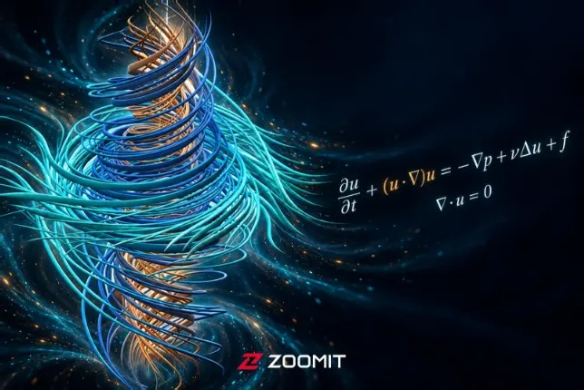

*Cover illustration from the supplied Zoomit article; Zoomit branding retained.*

## Translation of the Zoomit article

**OpenAI says its 10,000 AI agents have found a way to construct a singularity in the Navier–Stokes equations, a claim that has stirred debate and disagreement among mathematicians.**

Many mathematicians, both famous and little known, have spent years of their lives solving equations, making discoveries or developing theories. But on 1 September 2026, an experiment began whose scale and speed were unprecedented in the history of research, bearing little resemblance to the working methods of classical mathematicians.

It was neither a single person nor even a research team at a prestigious university. Instead, a group of approximately 10,000 AI agents from OpenAI worked simultaneously and in parallel on one of mathematics' most famous and difficult unsolved problems.

The agents were not simply executing code that the company's researchers had specified. [According to OpenAI, as reported by Zoomit](https://www.zoomit.ir/ai-articles/466816-openai-navier-stokes-millennium-prize-problem/), they operated like a vast, autonomous research organization, divided into clusters and groups. They explored different ideas, exchanged messages, wrote code, criticized one another's hypotheses and immediately passed promising findings from one group to others.

### Audio summary

[Listen to the original Persian audio summary](https://api2.zoomit.ir/media/6aa247c7420fe43083954feb). The source labels it as AI-generated.

The [figures reported for this operation](https://openai.com/index/navier-stokes-solution/) are astonishing enough on their own. In only 88 hours, these artificial researchers exchanged 2.7 million messages within their network and generated a remarkable 130 billion tokens, producing a [165-page proof](https://cdn.openai.com/pdf/32d9f210-8b73-45e0-91bc-82a30aef8a9a/navier-stokes.pdf).

Over the next 17 hours, the entire argument was checked in the Lean proof assistant and received its seal of approval. OpenAI says its agents have solved one of the seven Millennium Prize Problems, a puzzle that has frustrated some of humanity's brightest minds for decades.

But what exactly is the million-dollar Navier–Stokes problem, and why has the familiar behavior of fluids defeated so many mathematicians over the years? What problem, precisely, have the AI agents solved?

## The million-dollar problem: what is Navier–Stokes, really?

**Summary:** The Navier–Stokes equations describe the motion of liquids and gases. The million-dollar problem asks whether a flow that begins in a smooth state always remains smooth, or whether it can reach a singularity in finite time, meaning that fluid velocity in the mathematical model increases without bound. OpenAI says it has constructed an example showing that this can happen.

When you stir a cup of tea with a spoon and then remove it, the liquid continues to rotate for a few moments. But the small vortex gradually weakens, and the tea's surface soon becomes still because the liquid's internal friction, or viscosity, dissipates some of its kinetic energy.

Liquids and gases are constantly moving, rotating, colliding and changing speed. Yet their behavior is not always as simple as that of a cup of tea. In more complex flows, vortices can stretch one another, become thinner and rotate more intensely.

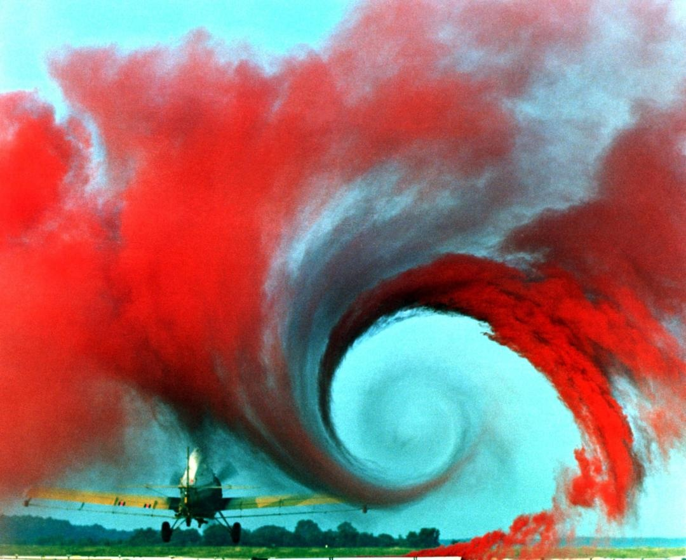

*Colored smoke reveals the vortex formed behind an aircraft wing, an example of the flows described by the Navier–Stokes equations. Credit in the source: NASA.*

Can viscosity always restrain this intensification of motion, or might the speed in a small region exceed every bound? This apparently simple question leads us to the Navier–Stokes problem, one of the seven Millennium Prize Problems for which OpenAI now says it has found a solution.

> Viscosity is the fluid's brake, but can it prevent infinite speed?

The Navier–Stokes equations describe how velocity and pressure at every point in a fluid change over time. Just as Newton's second law tells us how the forces acting on an object change its motion, these equations describe how pressure, viscosity and external forces change the motion of a fluid.

The fluid's own motion makes the calculation more difficult. For example, when a stream of water carries a vortex along, that vortex also changes the direction and speed of the surrounding water. The equations must describe this mutual interaction as well.

### What factors matter when solving the Navier–Stokes problem?

To investigate the Millennium Prize problem, mathematicians consider a three-dimensional, incompressible fluid: each portion retains its volume as it moves. The initial state must also be smooth, meaning that velocity and its variations are regular and continuous everywhere, with no singularity present at the outset.

Calling a fluid smooth does not mean that it must be at rest or contain no vortices. Even a turbulent and complex flow can sometimes satisfy these conditions.

Mathematicians must then determine how long that smoothness lasts. Do the equations continue to describe fluid velocity and pressure by smooth functions at any arbitrarily distant future time? Or can the flow reach a singularity in finite time, a state in which the speed in a small region grows beyond every bound?

A singularity does not simply mean a very high speed. Whatever number we choose as an upper limit, the speed exceeds it as the singularity time approaches.

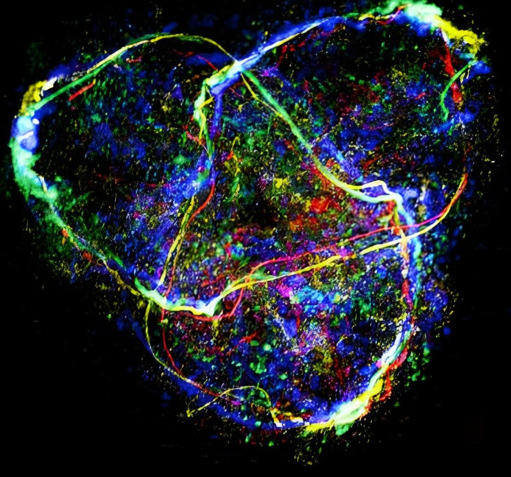

*A composite image of intertwined vortices at different scales; small bubbles reveal the flow structure. Credit in the source: ucmerced.edu.*

Viscosity acts like a brake, opposing large differences in the speeds at which neighboring portions of a liquid or gas move past one another. Yet the motion of the flow itself can stretch vortices and small rotating structures, making them spin more intensely and rapidly. Can viscosity always prevent a singularity?

> Mathematicians must begin with a three-dimensional, incompressible fluid whose initial flow is completely smooth.

As a fluid moves, it also carries other parts of the flow with it and changes their speed and direction. This effect is called nonlinear transport: the part of the equation in which the flow velocity multiplies its own spatial variation.

There are two possible routes to solving the problem. One is to prove that, in the absence of an external force, every smooth initial flow satisfying the problem's conditions remains smooth forever. The other is to construct a flow that begins smoothly but whose speed grows beyond every bound in finite time.

Even one flow with this behavior would be sufficient, provided all the conditions of the problem are satisfied. This second route allows an external force, but the force itself must remain smooth. One cannot apply an infinite force to the fluid and then attribute its unbounded speed to the behavior of the equations.

OpenAI took the second route. In its proposed model, the fluid is initially at rest and an external force sets it in motion. The flow then concentrates in a small region and its speed tends to infinity, while the external force remains smooth throughout.

## The mathematics of singularity: can fluid speed reach infinity?

**Summary:** OpenAI aims to make velocity grow to infinity without making the flow's energy infinite as well. It does this by concentrating very high speed in a small portion of the fluid and continually shrinking that portion. The speed can therefore keep increasing while total energy remains bounded.

Why should a flow approach infinity and a singularity at all? Imagine vortex tubes. When a vortex is stretched in a fluid, it becomes longer and thinner, and its rotation speeds up. This resembles an ice skater who spins much faster after pulling their arms toward their chest.

In a turbulent or complex flow, large structures stretch and amplify vortices and smaller fluctuations, transferring energy toward finer scales. Physical intuition alone, however, is not enough to prove a singularity. This process can concentrate velocity differences into smaller and smaller regions, but shrinking the vortex introduces a serious difficulty.

> As vortices are squeezed, the fluid's rotation becomes much faster.

Viscosity becomes far more influential precisely at these smaller scales. Simply making a vortex smaller and faster is therefore not enough to overcome it. How, then, can the maximum speed of a flow tend to infinity while its total energy remains bounded?

Energy also depends on how much fluid is moving at that speed. If the speed doubles, the energy of the same quantity of fluid quadruples. But if the volume involved simultaneously falls to one quarter, the energy does not change.

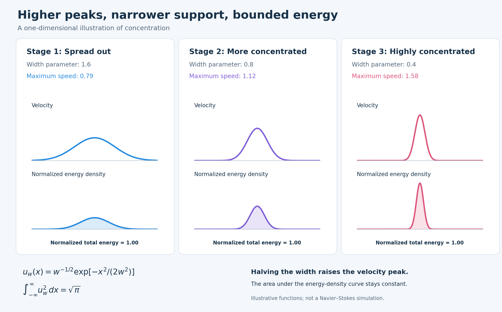

*As the flow becomes concentrated in a smaller volume, its maximum speed can increase without bound while total energy remains bounded. This one-dimensional example was designed to explain the idea; it is not a Navier–Stokes simulation.*

*English figure guide: “Stage 1 — spread out”: example width 1.6, maximum speed 0.79. “Stage 2 — more concentrated”: width 0.8, maximum speed 1.12. “Stage 3 — highly concentrated”: width 0.4, maximum speed 1.58. The upper row is “Velocity,” the lower row “Energy density,” and each panel gives “Normalized total energy: 1.00.” The example formula is u_w(x) = w^(-1/2) exp[−x²/(2w²)], with ∫u_w² dx = √π. The footer reads: “Halving the width raises the velocity peak; the area under the energy curve does not change.”*

A visual example may make this apparent contradiction easier to understand. Imagine a graph with a bump that is being squeezed, becoming taller and narrower at every instant. Its height can keep increasing and its width decreasing, while the area beneath the bump, representing energy, remains bounded.

Translated into fluid mechanics, the height represents the square of the fluid speed, while the width represents the volume of fluid involved.

> Intense concentration is the subtle mathematical device used to break through the historic Navier–Stokes impasse.

You may already know that kinetic energy is approximately proportional to speed squared multiplied by volume. If fluid motion becomes concentrated into an extremely small volume instead of spreading out, its speed can reach infinity without the system's total energy becoming mathematically infinite.

The volume tends to zero and the energy remains bounded, while the velocity exceeds all bounds. This intense concentration is the central mathematical device in OpenAI's argument and its claimed counterexample.

## The spaghetti vortex: examining a singularity

**Summary:** OpenAI designs a vortex that becomes progressively thinner and more elongated. As it narrows, its rotation speeds up and it approaches the conditions needed for a singularity. But the increasing influence of viscosity at small scales can still obstruct this process.

To make infinite fluid speed possible, OpenAI's AI designed a very particular physical structure. Imagine a cylindrical region with a vertical axis through its center and fluid rotating around that axis.

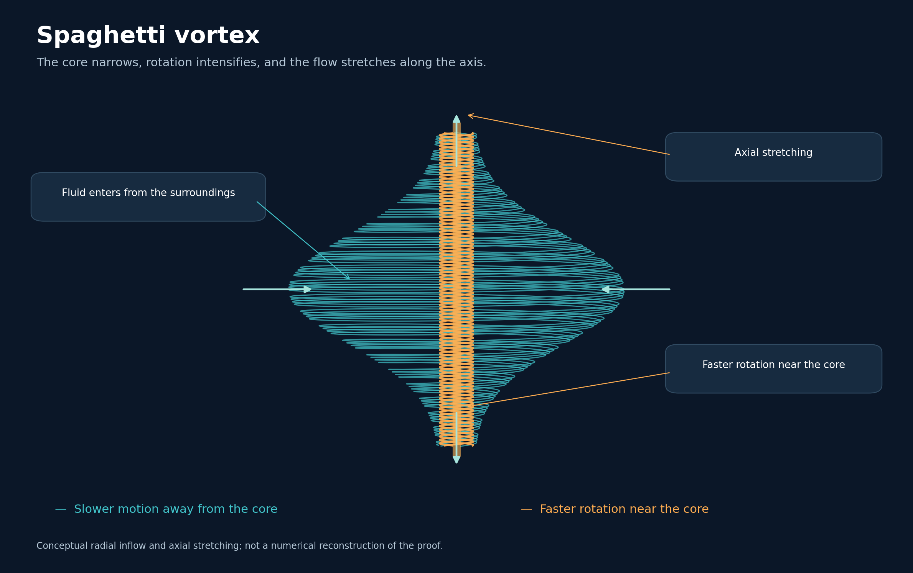

*Radial inflow draws the vortex toward its axis, while incompressibility drives fluid upward and downward along it. The result is a narrow, elongated filament that rotates faster as the singularity time approaches.*

*English figure guide: “Spaghetti vortex”; “The core narrows, its rotation intensifies, and the flow stretches along the axis.” Labels: “Fluid enters from the surroundings,” “Axial stretching,” and “Faster rotation near the core.” The cyan legend means “Slower motion away from the core,” and the orange legend means “Faster rotation near the core.” The footer identifies this as a conceptual illustration of radial flow and axial stretching, not a numerical reconstruction of the proof.*

Now suppose the surrounding fluid is drawn toward the central axis. We have already introduced incompressibility: the fluid cannot simply pile up and compress along that axis. When flow rushes inward from the sides, it must also move vertically along the axis, upward and downward.

This process forms a vortex that becomes progressively narrower in the radial direction and more elongated along the axis. A structure resembling a very long strand appears, hence the accessible “spaghetti” metaphor used to describe the research.

> The spaghetti-shaped structure rotates rapidly to overcome the restraining effect of viscosity.

A strong feedback loop then develops. Fluid is drawn inward, and that concentration increases its rate of rotation, just as with the ice skater.

But remember that viscosity, the restraining, frictional effect, becomes more influential at small scales and continues trying to halt the process. The spaghetti vortex alone is therefore insufficient to prove the result.

[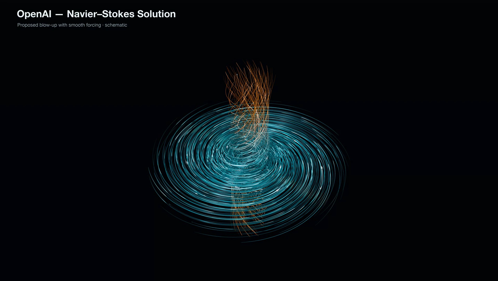](https://www.zoomit.ir/fundamental-science/466926-openai-navier-stokes-solution-featured/)

*Video in the original article: “OpenAI — Navier–Stokes Solution.” The supplied PDF preserves this still image; the supplied Markdown has a video placeholder without a playable media URL. Click the image to open the original article's player. Additional English video links appear in the supplement.*

## Battling the residual: tiny oscillations that outwitted the equation

**Summary:** Because the main vortex is not an exact solution of the Navier–Stokes equations and leaves a residual, OpenAI adds extremely fine oscillations to the flow. The equation's nonlinear character allows these oscillations to produce a real effect despite their zero mean, canceling the residual. The vortex can then continue toward a singularity without an unbounded external force.

The narrowing vortex seems like an ideal model for approaching infinite speed. Mathematically, however, inserting the proposed velocity field into the complete Navier–Stokes equations does not satisfy them exactly: the two sides are not equal. A residual appears, principally at the interface between the vortex core and the calm surrounding flow.

To cancel that residual, OpenAI introduces families of extremely small waves and loops around the vortex core. As time advances and the core narrows, these oscillations also become finer and their frequency increases.

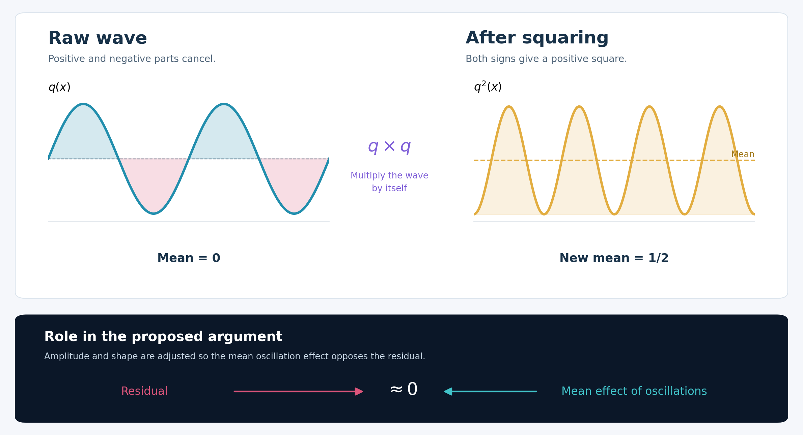

*Oscillations with zero mean produce a nonzero effect in the nonlinear part of the equation. In OpenAI's proposed construction, that effect is used to cancel the residual. This is a simple illustration of quadratic nonlinear terms.*

*English figure guide: left, “Raw wave”: “The positive and negative parts cancel each other,” with “Wave mean equals zero.” The center reads “Multiply the wave by itself.” Right, “After squaring”: “Both sides of the wave become positive,” with “New mean equals one half.” Lower panel, “Application in the proposed argument”: “The amplitude and shape of the oscillations are adjusted so that their mean effect opposes the residual.” The labels “Residual” and “Mean effect of oscillations” point toward approximately zero.*

These oscillations work because the Navier–Stokes equations are nonlinear. Suppose an oscillation alternates between +1 and −1. Its mean is clearly zero. But in a nonlinear equation, quantities are raised to powers or multiplied by one another.

The squares of +1 and −1 both equal 1. Thus an oscillation whose mean appears to be zero produces a real, nonzero effect when it enters the equation's nonlinear structure.

> Small waves exploit the equations' nonlinear nature to delicately restore balance to the system.

That nonzero effect is used to cancel the residual produced by the vortex core. Imagine a balance with the core's residual on one side and the effective flow contribution generated by these fine oscillations on the other.

The residual grows as the singularity time approaches. Meanwhile, the fine oscillations produce an opposing effect through the nonlinear part of the equation. Their parameters are adjusted so that the two contributions cancel with very high precision.

This cancellation allows the external force required to satisfy the equation to remain smooth and bounded, even as the vortex core continues to narrow and its speed tends to infinity.

## Countdown to singularity, τ: when the remaining time tends to zero

**Summary:** As the singularity approaches and the remaining time, τ, decreases, the vortex core becomes more concentrated and narrower while the speed inside rises sharply. This process ultimately permits unbounded velocity growth without violating the system's bounded total energy.

Now that we have seen how the vortex works, let us examine its mathematical structure over time. First, we need a key variable called tau, τ. It represents the time remaining until the singularity forms:

$$\tau=T-t,$$

where T is the singularity time and t is the current time. As the singularity approaches, τ becomes smaller and ultimately tends to zero.

In OpenAI's proposed construction, the vortex-core radius decreases in proportion to τ¹ᐟ². Its extent along the axis also shrinks, but more slowly, in proportion to τ¹ᐟ²⁻ʰ, where h is a small positive number less than one hundredth.

> As the singularity time approaches, the vortex-core radius decreases much faster than its length.

As τ decreases, both the radius and the length shrink. The radius, however, decreases faster, so the core becomes more elongated and filament-like even while it is getting smaller. At the same time, the principal flow speeds increase. The rotational speed around the axis and the speed along it grow approximately in proportion to τ⁻¹ᐟ²⁻ʰ.

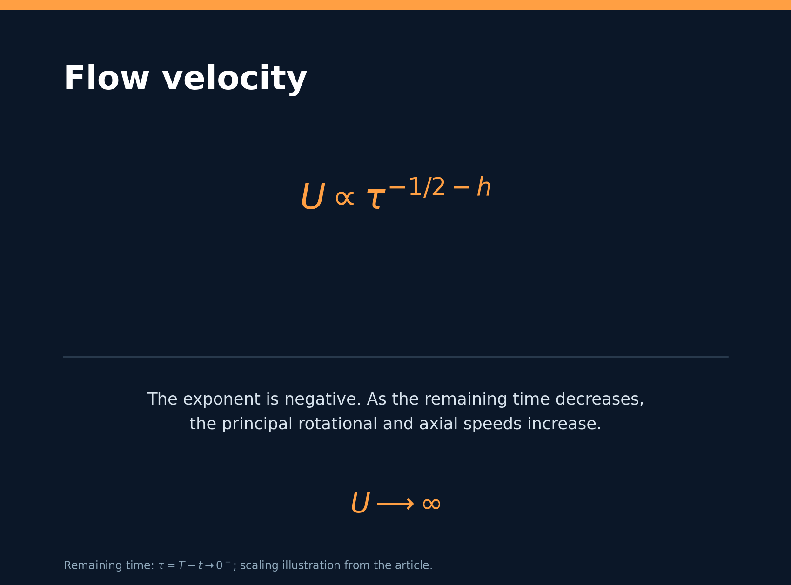

*Card explanation: “Flow velocity.” The negative exponent makes the velocity grow as τ approaches zero; this scaling describes the principal rotational and axial speeds. U → ∞.*

$$U\propto\tau^{-1/2-h}.$$

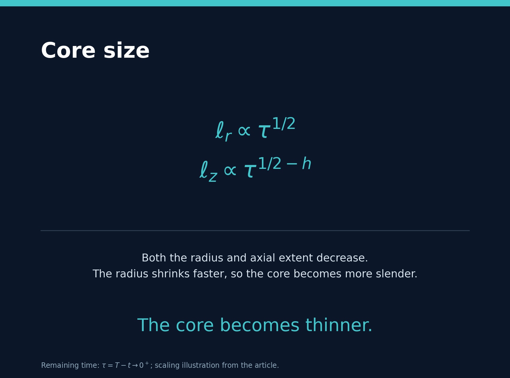

*Card explanation: “Core size.” Both dimensions shrink, but the radial dimension shrinks faster. “The core becomes thinner.”*

$$\ell_r\propto\tau^{1/2},\qquad\ell_z\propto\tau^{1/2-h}.$$

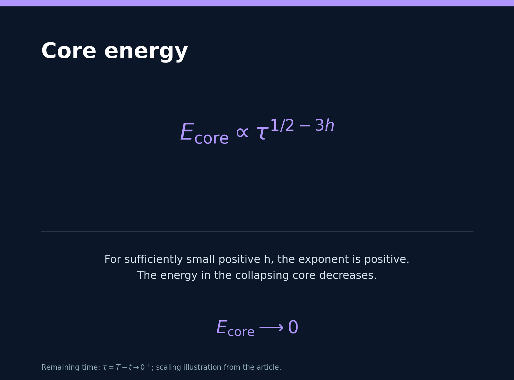

*Card explanation: “Core energy.” For sufficiently small h, the exponent remains positive and the collapsing core's energy decreases. Ecore → 0.*

$$E_{\mathrm{core}}\propto\tau^{1/2-3h}.$$

Because the velocity exponent is negative, the speeds increase as τ approaches zero and ultimately grow without bound. In contrast, the core's total kinetic energy, which depends on its volume and the square of its speed, varies in proportion to τ¹ᐟ²⁻³ʰ.

When h is sufficiently small, this energy exponent remains positive. The core's energy therefore stays bounded as τ approaches zero, even while the speed reaches infinity. This is the same idea as squeezing a graph into an infinitesimally small region.

## The Euler prelude: why did the agents start with an ideal fluid?

**Summary:** The agents first tackled the Euler equations, the version of Navier–Stokes without viscosity. They constructed a chain in which each oscillation strengthened the next, smaller one, and the process repeated at an accelerating rate. Success with this simpler model supplied key insights and tools for the main Navier–Stokes project.

Solving Navier–Stokes directly, with viscosity stubbornly present, was like climbing a cliff without a hook or handhold. The AI team therefore chose an easier starting point: what would happen if friction were removed from the system?

Removing the viscous term from the Navier–Stokes equations gives the Euler equations, which describe an ideal fluid with no internal friction. Without viscosity, constructing a mechanism that drives speed toward infinity becomes more straightforward computationally.

> Removing viscosity makes it easier to construct a mechanism that drives velocity to infinity.

According to the project documentation, a group of nearly 100 OpenAI agents worked on Euler alongside the effort on the Millennium Prize Problems. Once that group succeeded, OpenAI allocated more resources to Navier–Stokes.

The proposed Euler mechanism uses a multistage chain. The agents began with a large shear flow, in which layers slide past one another, and placed a small oscillation on top of it.

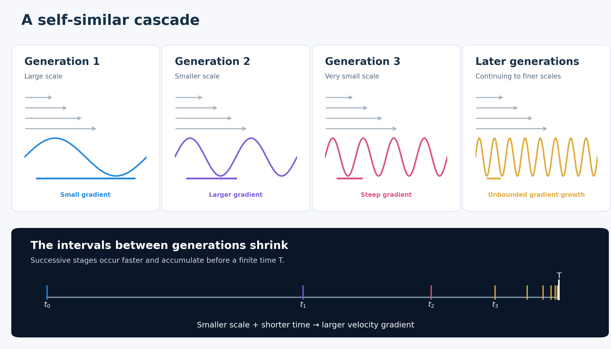

*In a self-similar cascade, each generation of flow amplifies a smaller, faster oscillation. The intervals between generations continually decrease, and the velocity gradient grows without bound in finite time.*

*English figure guide: “Generation 1 — large scale — small gradient”; “Generation 2 — smaller scale — larger gradient”; “Generation 3 — very small scale — steep gradient”; “Later generations — continuing to finer scales — unbounded growth.” The lower panel reads: “The time between generations is compressed. Successive stages occur faster and accumulate before a specified time.” T is the “accumulation time,” and the bottom summary is “Smaller scale + shorter time → larger velocity gradient.”*

The large main flow stretches the small oscillation and strengthens its velocity gradient. After a time, the amplified oscillation itself plays the role of a shear flow for an even smaller oscillation.

The second oscillation is strengthened in turn and acts on a third. This repeats, with each stage smaller and faster than the previous one, preparing the conditions for the next. Such a chain is called a self-similar cascade.

The time intervals between generations keep decreasing until infinitely many stages of the cascade occur within a finite time interval. Meanwhile, velocity variations concentrate at smaller and smaller scales. Under this compression of time, the maximum velocity gradient must tend to infinity.

The smaller group's Euler result was subsequently transferred to the larger Navier–Stokes project. Ideas and techniques from this stage formed part of the foundation for the work of the approximately 10,000 agents tackling Navier–Stokes.

## The Lean proof assistant checks the logic

After the agents completed their reasoning, formalization began. In Lean, every mathematical argument is converted into a sequence of fully formal, precise steps. The system checks whether each conclusion really follows from the preceding premises under the rules of logic.

> Lean verified the proof's logic in 17 hours.

Formalizing 165 pages of proof in 17 hours and obtaining verification is itself a remarkable achievement, minimizing the likelihood of the ordinary human errors that can appear in a long chain of calculations. But machine verification of the code's logical structure is not the same as acceptance of the proof by the mathematical community.

Lean tells us whether the reasoning follows logically from the stated assumptions. It does not tell us whether the starting assumptions and definitions correspond exactly to the Clay Institute's problem. For example, are the AI's definitions of smoothness, domain and initial conditions precisely those required for the million-dollar prize?

**Related reading linked by Zoomit:**

- [Solving the equation of the century: how is Google unraveling the 200-year-old Navier–Stokes puzzle?](https://www.zoomit.ir/science/443567-solving-navier-stokes-problem-featured/)
- [The hardest unsolved mathematical problems: from the Riemann hypothesis to P versus NP](https://www.zoomit.ir/science/147715-math-unsolved-easy-open-problem/)

## It remains unclear whether the Clay Institute will accept the proof

As soon as OpenAI announced its claim, skepticism and debate spread through mathematicians' social networks. While the public awaited a historic victory, the relevant institutions adopted a cautious position. At present, the Clay Institute still lists Navier–Stokes among its unsolved problems.

For a proof to be recognized as a solution to a Millennium Prize Problem, it must pass through several stages, including formal publication in a qualifying scientific journal, a prescribed period for scrutiny by mathematicians and, ultimately, broad acceptance within the mathematical community.

Some academics and mathematicians have also questioned the originality of the ideas. Did the neural network produce genuinely new mathematical insight, or did its extraordinary processing speed simply assemble existing human papers, techniques and achievements into a formal framework?

## Who found the solution first?

The path to the current Navier–Stokes proof began between 2023 and 2025 with the work of two prominent Spanish mathematicians, Diego Córdoba and Luis Martínez-Zoroa. They developed a method for constructing singularities through a cascade of vortices, although they could not make the external force satisfy the Millennium Prize problem's stringent conditions.

Later, Tristan Buckmaster of New York University and Levent Alpöge of Anthropic continued along this research path with the help of language models. They obtained results for the Euler equations and a version close to the Navier–Stokes problem. News of their progress reached OpenAI and, according to the company, motivated the project that eventually produced its Navier–Stokes proof.

Almost simultaneously with OpenAI's announcement, [Buckmaster published an account of his joint work with Alpöge](https://cims.nyu.edu/~tristanb/statement.pdf), raising questions about the origin of the new solution. He argued that choosing the version of Navier–Stokes with smooth external forcing was not an obvious route that everyone would naturally pursue.

Buckmaster and Alpöge had entered drafts and ideas into Codex and Claude while developing their research. Buckmaster asked whether their research data might somehow have influenced the new model or the company's solution. He emphasized, however, that he had no evidence for the suggestion and could not conclusively rule it out either.

OpenAI responded that its researchers and agents had not seen Buckmaster and Alpöge's work before it was made public and had not accessed any specific user's data to solve the problem. The company [did not rule out the possibility that the pair's Codex data had influenced improvements to its models](https://openai.com/index/navier-stokes-solution/), although it considered that unlikely.

The uncertainties surrounding the origins of OpenAI's achievement opened a wider debate about scientific credit. When researchers entrust unpublished ideas to AI tools, how should the company behind those tools establish the independence of a solution, the origin of its ideas and each researcher's contribution?

> If the mathematical community confirms OpenAI's proof, what the company's agents accomplished in 88 hours will mark a point of no return in the history of science.

Perhaps the real significance of this achievement will ultimately be determined neither by the million-dollar prize nor by formulas describing fluid singularities. AI has shown that it can reproduce the cycle of collaborative scientific research: dividing work, generating initial ideas, criticizing hypotheses, transferring insights between research clusters and finally producing a unified result.

**End of the translated article.**

---

## Supplement: technical clarifications and additional resources

**The material below is added for this course and is not part of Zoomit's article.** It preserves the historical translation while clarifying its mathematics and providing links for further study.

### 1. Axial stretching and a shrinking core are compatible

The source uses “longer” and “more elongated” in its physical description, then states that both core dimensions shrink. These are compatible if “more elongated” describes the aspect ratio, not an increasing absolute core length. Using the article's scaling,

$$\frac{\ell_z}{\ell_r}\propto\tau^{-h}\longrightarrow\infty.$$

For positive h smaller than 1/2, both dimensions tend to zero, but the radial dimension shrinks faster. Also, a characteristic core length and the separation of particular material particles are different quantities. The relative geometry should not be confused with the motion of a fixed group of particles.

### 2. Deriving the energy exponent

This is a scaling calculation from the relationships printed in the supplied article, not an independent proof of its flow construction. For a roughly cylindrical core at constant density,

$$V_{\mathrm{core}}\sim\ell_r^2\ell_z
\sim\tau^{3/2-h},\qquad U^2\sim\tau^{-1-2h}.$$

Consequently,

$$E_{\mathrm{core}}\sim\rho U^2V_{\mathrm{core}}
\sim\tau^{1/2-3h}.$$

The exponent is positive when h < 1/6; the article's smaller range 0 < h < 0.01 satisfies that condition. Thus this scaling gives core energy tending to zero while the maximum speed grows. It says nothing by itself about the energy in the entire surrounding flow. For h = 0.005, reducing τ by a factor of 100 multiplies the characteristic speed by about 10.23, the radial scale by 0.10, the axial scale by 0.1023 and the core energy by about 0.107.

### 3. Zero mean is not zero nonlinear effect

For the simple periodic function q(x) = a sin(kx), its mean over one period is zero, while the mean of q² is a²/2. In a vector momentum equation, the relevant quadratic object is a tensor such as the average of **w** ⊗ **w**, not just a scalar square. Its divergence can contribute to the averaged momentum balance. The sine-wave example explains how a nonzero quadratic effect is possible; it does not demonstrate that a prescribed residual can be canceled while maintaining incompressibility and all required estimates.

### 4. Velocity blowup and gradient blowup must be distinguished

The translation retains the Euler section's language about infinite velocity. The [released Lean repository](https://github.com/openai/NavierStokesAndEuler) describes its unforced Euler result more specifically: the velocity's C¹ norm becomes unbounded, and the time integral of the vorticity's L∞ norm diverges. That statement should not be paraphrased automatically as pointwise velocity becoming infinite. The same repository describes its Navier–Stokes results separately for the whole space and the periodic torus. Exact theorem statements matter when comparing the two equations.

### 5. A dated correction to the data-use paragraph

The supplied Zoomit text says that OpenAI did not rule out influence through training. OpenAI's [announcement, with an update dated 10 September 2026](https://openai.com/index/navier-stokes-solution/), now states that its investigation found Buckmaster's Codex prompts could not have influenced the internal system, including through training. This is OpenAI's stated finding; it is not an independent audit conducted for this course. The historical translation remains unchanged above so readers can distinguish the supplied article from this update.

The [Clay page](https://www.claymath.org/millennium/navier-stokes-equation/) was still marked “Active” when checked on 23 September 2026. OpenAI also states that it does not intend to claim the Millennium Prize. Consult [Clay's rules](https://www.claymath.org/millennium-problems/rules/) for the official recognition process.

### 6. Implications for aerospace engineering

A mathematical counterexample concerns the precise continuum equations, domain, initial data and forcing in its theorem. It does not supply a new pressure distribution for a real wing or demonstrate a failure of a particular aircraft. Practical load prediction still requires a suitable flow model, convergence evidence, sensible boundary conditions and appropriate validation. Pressure and shear loads must then be transferred into structural bending, torsion and stress calculations.

For a course exercise, distinguish three questions: Is a mathematical statement logically established? Does the mathematical model describe the physical situation of interest? Is a particular numerical calculation an accurate approximation to that model? Lean, physical validation and mesh/time-step studies address different parts of that assessment.

### 7. Videos and primary references

| Resource | What to use it for |
|---|---|
| [Original Zoomit article and embedded player](https://www.zoomit.ir/fundamental-science/466926-openai-navier-stokes-solution-featured/) | Original Persian presentation and the video represented by the still above |
| [OpenAI's announcement and visualization](https://openai.com/index/navier-stokes-solution/) | The team's account of the construction and research process |
| [Javier Gómez-Serrano: Navier–Stokes Existence or Breakdown — YouTube](https://www.youtube.com/watch?v=3j1VW9REm7s) · [Clay lecture page](https://www.claymath.org/lectures/navier-stokes-existence-or-breakdown/) | A lecture given at Harvard on 11 March 2026, before the announcement, explaining the underlying mathematical problem |
| [Peter Constantin: On the Navier–Stokes Equations — Clay video page](https://www.claymath.org/lectures/on-the-navier-stokes-equations/) | Further mathematical background |
| [Full Navier–Stokes proof PDF](https://cdn.openai.com/pdf/32d9f210-8b73-45e0-91bc-82a30aef8a9a/navier-stokes.pdf) | Exact theorem, physical description and proof; the PDF has 166 physical pages, with references beginning at printed page 165 |
| [Lean formalizations and checking instructions](https://github.com/openai/NavierStokesAndEuler) | Formal theorem statements and instructions for checking the certificates |
| [Fefferman's official problem formulation](https://www.claymath.org/wp-content/uploads/2022/02/MPPc.pdf) | The assumptions and alternatives in the Millennium Prize problem |
| [Buckmaster's statement](https://cims.nyu.edu/~tristanb/statement.pdf) | His account of the concurrent research and priority questions |

### Image provenance

The cover, two photographs and video still were extracted from the supplied Zoomit PDF. The seven scientific diagrams containing Persian text were redrawn for this English edition: energy concentration, the spaghetti vortex, nonlinear oscillations, three scaling cards and the Euler cascade. Their scientific relationships, numerical examples and explanatory content follow the supplied article; all titles, labels, legends and notes inside the new diagrams are English. The Gaussian and sine-wave curves are plotted from their illustrative equations. The vortex and cascade remain conceptual schematics, not numerical reconstructions of the proof.

Source credit “NASA” is retained for the wing-vortex photograph, and “ucmerced.edu” for the vortex image. The English diagrams are adaptations of the figures in Pooyesh Pourmohammad's Zoomit article, credited above. The [figure-generation script](scripts/render_navier_stokes_english_figures.py) and [vector SVG versions](docs/case-studies/navier-stokes/english/) are included. The video itself was not included in either supplied file; its original player and related English lectures are linked.

## Computational companion: executed notebook and related code

*Added 23 September 2026. This section is supplementary course material, separate from the translated Zoomit article.*

### 1. Christov's collapsing-vortex notebook: code and execution

Ivan C. Christov's [original notebook](https://github.com/ichristov/intermediate-fluid-mechanics/blob/0f93a34750531e42e8806e5a11c46ac56769e669/extras/NS_blowup_vortex.ipynb) provides an educational visualization of a prescribed, axisymmetric, incompressible velocity field. Its swirl and axial velocities are chosen analytically; radial velocity follows from continuity. Particle trajectories are integrated with SciPy. **It does not solve the Navier–Stokes momentum equations, reconstruct the claimed proof, or establish finite-time blowup.**

The full [course notebook](computational/navier-stokes/NS_blowup_vortex.ipynb), [execution script](computational/navier-stokes/run_notebook.py), [reproduction instructions](computational/navier-stokes/README.md) and [GPL-3.0 license](computational/navier-stokes/LICENSE) are included in this repository. [Open the notebook in Google Colab](https://colab.research.google.com/github/Ehsan-Roohi/Aerospace-Structures/blob/main/computational/navier-stokes/NS_blowup_vortex.ipynb).

All scientific cells were executed headlessly in a shared Python namespace. Only unused widget imports, IPython setup and rich display were omitted; plot size and output export were adapted. The scientific formulas and parameters were retained. Four figures and a 50-frame animation were generated from this execution, rather than copied from upstream outputs.

| Check or diagnostic | Result from this run |
|---|---:|
| Illustrative parameter, h | 0.05 |
| Symbolic velocity divergence | Exactly 0 |
| Successful particle integrations | 8 of 8 |
| Fitted maximum-swirl exponent versus remaining time, τ | −0.550000 |
| Expected exponent for this prescribed field | −0.55 |
| Diagnostic interval, τ | 0.3 to 0.0001 |
| Maximum swirl over that interval | 1.32597 to 108.38039 |
| Energy inside the selected shrinking core | 7.71934 to 0.37473 |
| Fitted core-energy exponent over that interval | 0.377775 |
| Leading asymptotic core-energy exponent | 0.35 |

The fitted energy exponent need not equal 0.35 over a finite interval: this field's core energy contains contributions proportional to τ^0.35 and τ^0.45. These checks establish consistency with the prescribed model, not validation of the Navier–Stokes equations. The notebook deliberately uses h = 0.05, whereas the discussed construction specifies a much smaller range, h < 0.01. Its finite, shrinking-core energy must not be mistaken for finite whole-space energy: the toy field lacks the necessary axial localization.

The run used Python 3.12.14, NumPy 2.3.5, SciPy 1.17.0, SymPy 1.14.0 and Matplotlib 3.10.8. Full [execution metrics](computational/navier-stokes/results/run_metrics.json) and [diagnostic data as CSV](computational/navier-stokes/results/scaling_data.csv) are available for inspection.

#### Swirl profiles

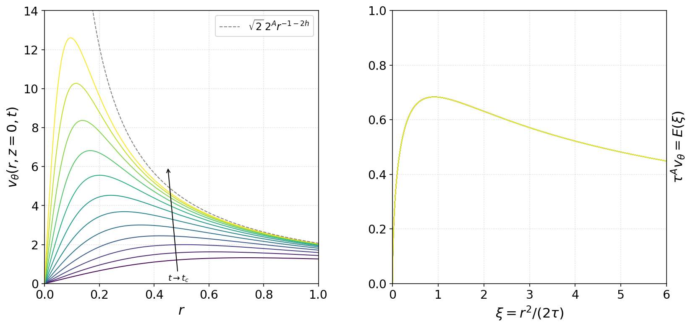

*Physical profiles narrow and grow as the remaining time decreases; the rescaled profiles reveal the imposed similarity structure. These are samples of an analytical velocity field.*

#### Meridional flow

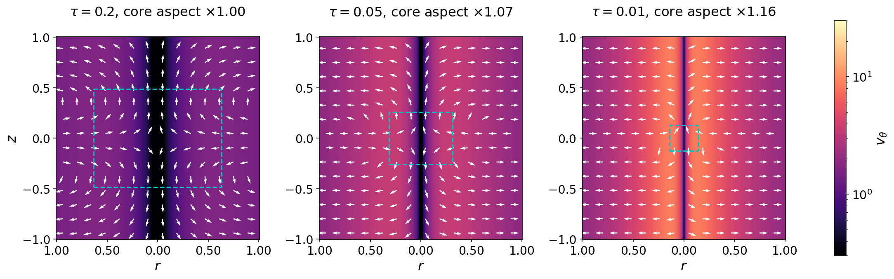

*The radial and axial components illustrate inward motion and axial stretching. Symbolic cancellation in the divergence verifies incompressibility, which alone is insufficient to satisfy momentum balance.*

#### Particle trajectories

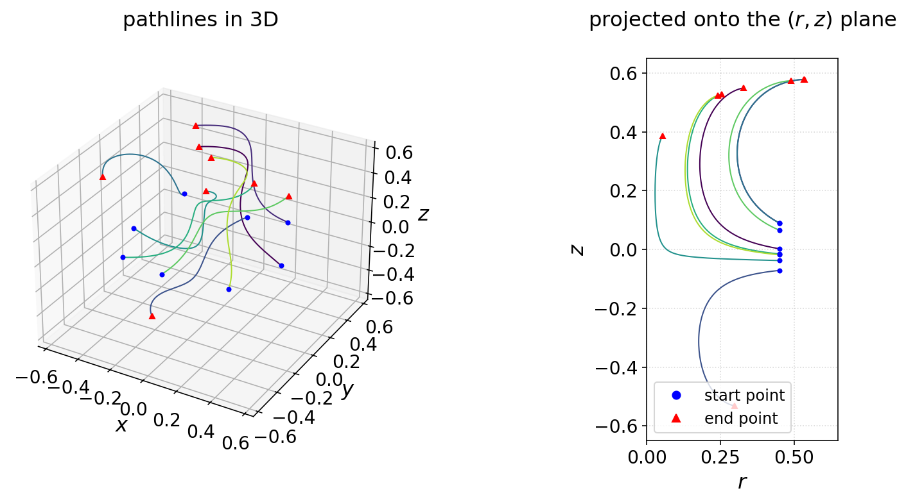

*Eight trajectories obtained by integrating the prescribed velocity field. All eight numerical integrations reported success; this is an ODE calculation, not a fluid PDE simulation.*

#### Speed and core energy

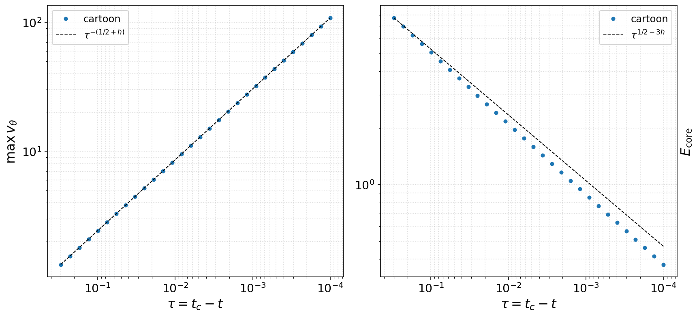

*Increasing pointwise speed can coexist with decreasing energy in a shrinking region. The energy curve here concerns only the selected core.*

#### Animated core collapse

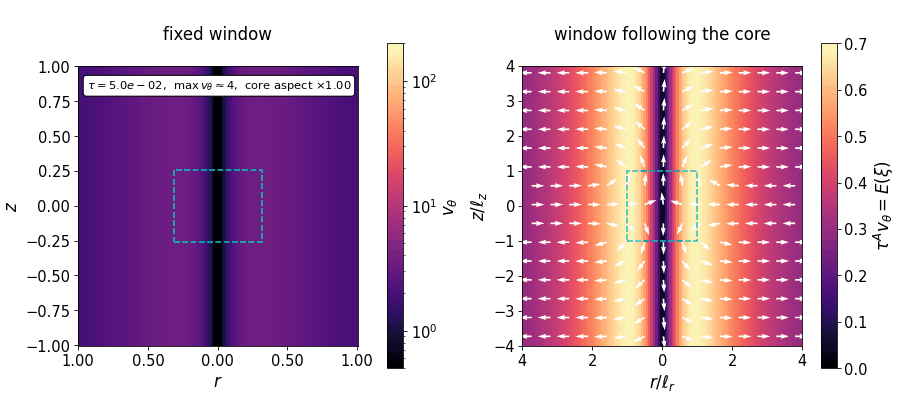

*Fifty frames from τ = 0.05 to 10^−6. The fixed physical plotting grid under-resolves the narrow core at late times (roughly τ below 5 × 10^−5); the rescaled panel remains useful for interpreting its structure. The animation never reaches τ = 0 and cannot demonstrate a singularity.*

### 2. Related public GitHub implementations

The repositories below were found through GitHub search and reviewed at the README and relevant source-code level on 23 September 2026. **Only Christov's notebook was executed for this report.** The other projects are linked to their original code; their results and build instructions have not been independently reproduced here. Repository descriptions are not evidence that a mathematical proof is correct.

| Project and source code | What the code implements | How it relates to this report |
|---|---|---|
| [pmocz/euler-blowup-viz](https://github.com/pmocz/euler-blowup-viz) — [amplification.py](https://github.com/pmocz/euler-blowup-viz/blob/main/sim/amplification.py) | Idealized ray/transverse-amplitude ODE integration and its scalar reduction, alongside finite-stage cascade and flow visualizations. The source includes a consistency check between the full and scalar ODE formulations. | Useful for the related **Euler** amplification mechanism. It is not a full Euler direct numerical simulation or a blowup proof. |
| [james-coder/navier-stokes-blowup](https://github.com/james-coder/navier-stokes-blowup) — [observatory.py](https://github.com/james-coder/navier-stokes-blowup/blob/main/src/ns_blowup/observatory.py) | A Python/JAX research package with periodic-flow solvers and a separate observatory for similarity scales and selected components, including outer heat-flow diagnostics. | The repository explicitly distinguishes implemented components from the incomplete blowup construction. Periodic solver tests do not validate the proposed whole-space singular solution. |
| [minfx-ai/navier-stokes-blowup](https://github.com/minfx-ai/navier-stokes-blowup) — [shader.wgsl](https://github.com/minfx-ai/navier-stokes-blowup/blob/master/src/shader.wgsl) | Rust/egui/WGPU visualization with procedural particle motion, core scaling, annular pulses and an exterior region. | Useful as an interactive conceptual illustration. Procedural profiles and animation choices are not reconstructed solution fields or momentum-equation verification. |
| [nagamachia/navier-stokes-blowup-reproduction](https://github.com/nagamachia/navier-stokes-blowup-reproduction) — [similarity_coordinates.hpp](https://github.com/nagamachia/navier-stokes-blowup-reproduction/blob/main/include/similarity_coordinates.hpp) | C++20/FFTW work on selected construction components and periodic spectral benchmarks. The linked code solves the implicit similarity-coordinate equation by bisection. | A partial computational reproduction effort; the README identifies missing constructive profiles and does not provide a complete numerical realization of the blowup solution. |

For a focused follow-up exercise, Mocz's [amplification code](https://github.com/pmocz/euler-blowup-viz/blob/main/sim/amplification.py) is a useful complement: it integrates an idealized amplitude system and compares it with the scalar equation

$$
\frac{d}{dx}\left[(1+x^4)\frac{dV}{dx}\right]
=\left(\frac{2}{\beta}-2x^2\right)V.
$$

This tests a mechanism within an idealized Euler model. It should be presented separately from Christov's prescribed Navier–Stokes-inspired vortex and from any claim about a complete PDE solution.

The [OpenAI NavierStokesAndEuler repository](https://github.com/openai/NavierStokesAndEuler) remains the primary source for the proposed mathematical constructions. It serves a different purpose from the educational notebooks and numerical demonstrations listed here.

### 3. Additional repositories: visualization, reduced models and formal code

*Extended source review, 23 September 2026.* Four additional repositories broaden the comparison beyond the four projects above. The README and the specific source file linked in each row were inspected. These projects were **not executed or compiled for this report**; numerical performance and formal-build claims made upstream remain attributed to their authors.

| Additional repository | Source inspected and what it does | Relevance and limits |
|---|---|---|
| [emerardd/ns-blowup-atlas](https://github.com/emerardd/ns-blowup-atlas) | [src/physics.js](https://github.com/emerardd/ns-blowup-atlas/blob/main/src/physics.js) computes normalized core radius, axial length, speed, volume and energy, plus an illustrative pulse and scalar cancellation example. The README describes six interactive Three.js chapters and an English interface. | Closest to a classroom visual companion for the article. The [English exhibit linked by the project](https://ns.emerard.com/en/) lets readers explore the proposed scaling. Its streamlines and particle motion are illustrative; its residual reduction is prescribed, not measured from the PDE. The hosted exhibit was not browser-tested in this review. |
| [ravanova/blowup-search](https://github.com/ravanova/blowup-search) | [solver/gclm.py](https://github.com/ravanova/blowup-search/blob/main/solver/gclm.py) implements a periodic, one-dimensional generalized Constantin–Lax–Majda model using Fourier differentiation, quadratic dealiasing, RK4 for nonlinear terms and a separate exact diffusion step. It records amplitude, timestep and conservation diagnostics. | A useful numerical comparison with Christov's prescribed field: this file evolves a reduced PDE. The reduced model is not three-dimensional Navier–Stokes. The source's `blowup_candidate` label is triggered by a finite amplification threshold; it is not a proof of a singularity. |
| [Dibyakanti/PINNs-Solving-Burgers-Near-Finite-Time-Blow-Up](https://github.com/Dibyakanti/PINNs-Solving-Burgers-Near-Finite-Time-Blow-Up) | [models/burgers1d.py](https://github.com/Dibyakanti/PINNs-Solving-Burgers-Near-Finite-Time-Blow-Up/blob/main/models/burgers1d.py) defines a PyTorch tanh network and uses automatic differentiation to form the inviscid Burgers residual. The README supplies training commands and links the authors' [2024 paper](https://doi.org/10.1088/2632-2153/ad51cd). | A related scientific-machine-learning exercise on approximation near a singular time, rather than a reproduction of the 2026 construction. It makes the distinction between minimizing a sampled PDE residual and establishing a continuum result concrete. Training and paper results were not reproduced here. |
| [mathzhuonichi/blowup_density](https://github.com/mathzhuonichi/blowup_density) | [PeriodicDensityDichotomy.lean](https://github.com/mathzhuonichi/blowup_density/blob/main/formalization/NSFormalization/Paper1/PeriodicDensityDichotomy.lean) contains formal statements and proofs concerning nearby singular forces, local-flow witnesses and lifespan bounds. The repository accompanies *Density of Forces Producing Navier–Stokes Blowup*. | Relevant to the forcing and formal-verification discussion. This is mathematical source code, not a flow simulator. The inspected module distinguishes statements with a supplied local-flow hypothesis from a zero-initial-data construction. The README's claims about complete theorem closure and successful Lean checking have not been independently established by this review. |

#### What the inspected code makes explicit

In NS Atlas, the normalization sets the proportionality coefficients to one and uses

$$
r_c=\tau^{1/2},\qquad
\ell_z=\tau^{1/2-h},\qquad
U=\tau^{-1/2-h},\qquad
E_c=U^2r_c^2\ell_z=\tau^{1/2-3h}.
$$

The default in the inspected JavaScript is $h=0.006$. Its pulse is a teaching function, $a(v)=\sin^2(\pi v)\exp(-\nu v^2)$, and its cancellation example explicitly assigns a residual $0.4\,10^{-3k}$. That final expression is a chosen visual progression, not a numerical convergence result. These details help students interpret the animation without confusing it with a solved velocity field.

The gCLM solver evolves the reduced equation

$$
\omega_t+a u\omega_x=\omega u_x+\nu\omega_{xx},
\qquad u_x=H(\omega),
$$

where $H$ is the periodic Hilbert transform. Its diffusion substep is exact for pure diffusion, but that fact does not make the combined nonlinear time integration exact. A classroom reproduction should compare against the included CLM analytical solution and vary both resolution and timestep before interpreting rapid growth. Reaching the configured final time with the label `no_blowup` only describes that numerical run.

The inspected Burgers network minimizes a sampled residual based on

$$
f_\theta=\partial_t u_\theta+u_\theta\partial_x u_\theta.
$$

There is no viscous second-derivative term in this implementation. An appropriate exercise would compare prediction error and derivative error with an independent reference as the evaluation time approaches the singular time, rather than treating a small training loss as sufficient evidence of accuracy.

For the present course, NS Atlas is the most direct additional visual resource; the gCLM solver provides a reduced-PDE experiment, and the Burgers PINN provides an AI-focused extension. The Lean repository is best used for a separate discussion of theorem statements, hypotheses and what a successful proof-assistant build actually checks. No new simulation outputs from these four repositories are included in the report.
