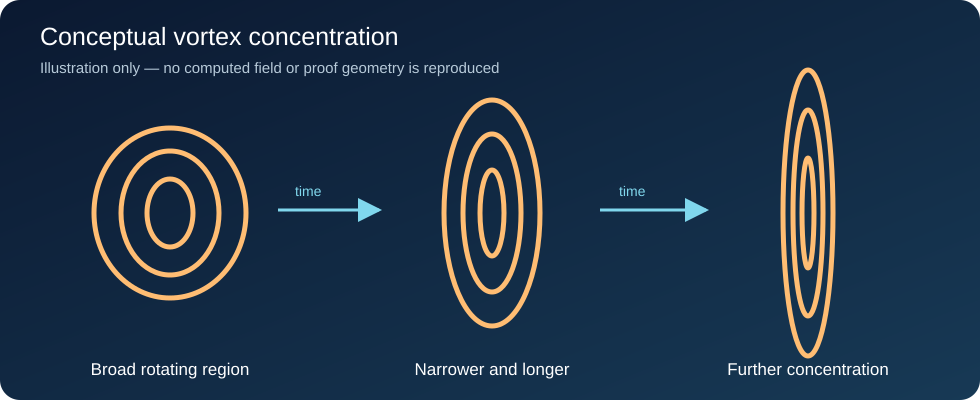
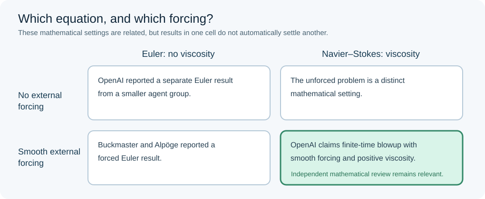

# Navier–Stokes, finite-time blowup, and an AI-assisted proof: a guided reading

**MIE 446 · Aerospace Structures · UMass Amherst · 23 September 2026**

This original English reading accompanies [Zoomit's Persian feature](https://www.zoomit.ir/fundamental-science/466926-openai-navier-stokes-solution-featured/). It is written for our class; it is **not a translation or reproduction** of the article or its photographs. The primary sources are the [OpenAI announcement and paper](https://openai.com/index/navier-stokes-solution/) and the [Clay Mathematics Institute's problem page](https://www.claymath.org/millennium/navier-stokes-equation/). Links to lectures and the formal proof appear below.

> **The engineering question:** What does a mathematical breakdown in a continuum model tell us about the limits of that model, and what would it *not* tell us about the safety or structure of an aircraft?



*Figure 1. An original, conceptual illustration of a rotating region becoming narrower and longer. It is not a numerical solution, a faithful rendering of the OpenAI construction, or a visualization of an aircraft flow.*

## 1. Why this problem belongs in an aerospace course

Air flowing over a wing exerts pressure and viscous forces. Those forces become distributed structural loads, then bending, shear and torsion in the wing. A useful calculation therefore has two links: a **flow model** that estimates aerodynamic loading and a **structural model** that transmits that loading through the airframe. Both links require assumptions about scale, material behavior, boundary conditions and uncertainty.

The Navier–Stokes equations are central to the continuum description of fluid motion. A mathematical question about their solutions is not the same as a routine CFD run. CFD approximates a particular flow on a finite mesh and over a finite time. The Millennium Prize problem asks whether certain three-dimensional solutions that begin smoothly can remain smooth for all time, or whether a counterexample can be rigorously constructed. A converged simulation would not prove either universal statement.

For an aircraft wing, a singular mathematical solution would not mean that ordinary flow past a wing suddenly reaches infinite speed. It would show that a set of continuum equations admits a particular breakdown under specified initial conditions and forcing. Real gas behavior, compressibility, molecular scales and the way a physical force could be applied are separate questions. The result matters to how we understand model limits; it is not a revised design load factor.

## 2. What the equations actually say

For a fluid of constant density ρ with zero divergence of velocity, a useful form is

```text
∂u/∂t + (u · ∇)u = -∇p/ρ + ν∇²u + f,
∇ · u = 0.
```

Here **u** is velocity, **p** is pressure, **ν** is kinematic viscosity, and **f** is an applied force per unit mass. The left side describes local acceleration and transport of momentum by the flow. Pressure redistributes momentum. Viscosity acts on velocity gradients; in ordinary situations it tends to smooth small-scale variations. An external force can add momentum without being itself singular.

This incompressible, constant-density setting should not be confused with the compressible flows we study near shocks, nor with a full model of an aircraft and its flexible structure. The Millennium Prize formulation by Charles Fefferman spells out several permitted settings and outcomes. In particular, its alternatives **C and D** describe a breakdown construction involving a smooth force. Read the [official formulation](https://www.claymath.org/wp-content/uploads/2022/02/MPPc.pdf) before judging whether a claimed counterexample fits the stated problem.

A **smooth initial condition** has no singularity built into it at the start. A **finite-time blowup** means a specified quantity becomes unbounded as time approaches a finite limit in the mathematical model. In the OpenAI paper, the claim is unbounded velocity while total kinetic energy remains bounded. Finite energy does not imply that velocity is bounded at every point: energy is an integral over space, and an increasingly narrow high-speed region can have a bounded integral.

## 3. What OpenAI reported

On 8 September 2026, OpenAI released [*Finite Time Blowup for Navier–Stokes*](https://cdn.openai.com/pdf/32d9f210-8b73-45e0-91bc-82a30aef8a9a/navier-stokes.pdf), together with a [Lean formalization](https://github.com/openai/). The paper states that, for every positive viscosity, it constructs a three-dimensional incompressible solution that starts **from rest**, is driven by a **smooth force compactly supported in space and time**, and develops unbounded velocity in finite time while kinetic energy stays bounded. “For every positive viscosity” is a mathematical quantifier in this construction; it does not turn the example into every physically occurring flow.

The reported mechanism involves a rotating region that concentrates while extending along its axis. Viscosity resists gradients, so constructing a blowup while keeping the force smooth and the energy finite is the difficult part. The 166-page PDF contains a theorem, a proof outline, a leading-order flow, successive corrections, a forcing construction and appendices. A classroom sketch cannot establish those steps. Consult the paper for the exact domains, regularity conditions and estimates.

OpenAI says a coordinated system of approximately **10,000 agents** worked on its Navier–Stokes effort, reaching the proposed result about **88 hours** after launch. It reports **2.7 million messages** and around **130 billion output tokens** for that effort, followed by approximately **17 hours** of Lean formalization and verification using GPT-6 Astra. These are OpenAI's reported process figures, not independently measured fluid-mechanics data.



*Figure 2. Original teaching diagram. Euler removes viscosity; adding a smooth external force changes the mathematical setting. A result for one cell cannot be transferred automatically to another.*

## 4. Why the Euler result is part of the story

The Euler equations can be viewed formally as the inviscid version of the momentum equation above: set viscosity to zero. OpenAI reports that a smaller group of nearly 100 agents first obtained an **unforced Euler** blowup result over roughly 50 hours. The team then shifted more resources to Navier–Stokes and used insights from the Euler work. The fact that a related inviscid problem admits a construction does not automatically solve the viscous problem: a term that vanishes in Euler remains present in Navier–Stokes, often becoming consequential near steep gradients.

There is also concurrent human research. In his [public statement](https://cims.nyu.edu/~tristanb/statement.pdf), mathematician Tristan Buckmaster describes work with Levent Alpöge on **forced Euler**, building on ideas developed by Diego Córdoba and Luis Martínez-Zoroa. OpenAI acknowledges priority for Buckmaster and Alpöge's forced Euler result and says its agents did not see the pair's unpublished work before public release. Buckmaster raises questions about the chronology and possible use of private Codex inputs while saying he does not know whether their data was used. OpenAI later stated that an investigation found those Codex prompts could not have influenced its internal model, including through training. These are different parties' accounts; avoid presenting an unresolved accusation as an established finding.

## 5. What Lean verifies, and what still needs scrutiny

Lean is a proof assistant. A successful formal check means that encoded statements follow from their encoded assumptions and the mathematical foundations used by the formalization. That is a substantial check against gaps in a long argument. It does not, by itself, decide whether a theorem's hypotheses match the precise Clay formulation or whether every physical interpretation in a press account is justified. Mathematicians must inspect both the formal statement and its relationship to the published theorem and official problem.

As of this reading's date, [Clay still lists Navier–Stokes as an active problem](https://www.claymath.org/millennium/navier-stokes-equation/). OpenAI says it does **not intend to claim the Millennium Prize** for this result. Independent scrutiny, dissemination and the prize's [formal rules](https://www.claymath.org/millennium-problems/rules/) are separate from the announcement. Thus “OpenAI published a proposed proof” is a careful description of the public record; “Clay awarded the prize” would be false.

| Statement | What the sources support | What it does not establish |
|---|---|---|
| A proof PDF and Lean project were released | A public mathematical claim and machine-checked formalization | Automatic acceptance by Clay |
| A smooth forced flow is claimed to blow up | One constructed setting under exact assumptions | Every unforced or practical flow blows up |
| Kinetic energy remains bounded | An integral quantity stays finite | Speed stays bounded at every point |
| AI agents produced the reported work | OpenAI's account of its process | Independence of every idea without examining provenance |

## 6. Class connection: from fluid result to structural judgment

Imagine that a team obtains CFD pressure coefficients for a wing. We must ask how pressure was integrated into loads, whether the pressure field is resolved, whether a relevant flow regime and boundary conditions were used, and whether structural stress and deflection were checked independently. A mathematically elegant result about Navier–Stokes regularity does not replace these checks.

Conversely, the story is a useful reminder that computer output requires layers of verification. A green CFD residual, a smooth contour plot and an AI-written derivation each answer a different question. For our course, a defensible load claim requires traceable assumptions, units, grid or model sensitivity as appropriate, and a load path that can be inspected. A formal proof checks logic for a mathematical statement. Neither substitutes for the other.

**Discussion prompts**

1. Which term in the equation distinguishes Euler from Navier–Stokes? Why might that term matter more as a vortex becomes narrower?
2. How can the speed at a point grow without bound while the spatial integral of kinetic energy remains finite?
3. Give one question you would ask about the mathematical theorem, one about its formalization, and one about its physical interpretation.
4. A CFD package predicts a new wing pressure peak. What checks would you perform before using that peak to size the spar?
5. Compare the sentence “a proposed proof has been formalized” with “the prize has been awarded.” What extra evidence is needed for the second?

## Figures, animations and video

The two figures above were drawn for this course and may be reused with attribution to **MIE 446, UMass Amherst**. They are *schematic*: they do not reconstruct the published solution. The following media remain on their creators' sites; no third-party photo or video has been copied into this repository.

- **Research visualization:** [OpenAI's announcement](https://openai.com/index/navier-stokes-solution/) includes a visualization of local incompressible motion, a link to its PDF and a link to the specific Lean repository. View the animation alongside the paper's physical-description section. The image is the author's interpretation of its construction, not experimental footage.
- **Introductory lecture:** [Javier Gómez-Serrano, “Navier-Stokes Existence or Breakdown” (Clay Mathematics Institute, March 2026)](https://www.claymath.org/lectures/navier-stokes-existence-or-breakdown/) — a pre-announcement explanation of the mathematical question. [Watch on YouTube](https://www.youtube.com/watch?v=3j1VW9REm7s).
- **Further lecture:** [Peter Constantin, “On the Navier-Stokes Equations” (Clay Mathematics Institute)](https://www.claymath.org/lectures/on-the-navier-stokes-equations/).
- **Contemporary reporting:** [Nature, “AI cracked the Navier–Stokes challenge. What does that mean for physics?”](https://www.nature.com/articles/d41586-026-02922-6) may require institutional access.

## Sources and attribution

- [Zoomit, “How did OpenAI solve the Navier–Stokes problem in 88 hours?” (Persian, 10 September 2026)](https://www.zoomit.ir/fundamental-science/466926-openai-navier-stokes-solution-featured/) — related journalism; this reading is independently written.
- [OpenAI, “On the Navier–Stokes Millennium Prize Problem” (8 September 2026; concurrent-work update dated 10 September)](https://openai.com/index/navier-stokes-solution/).
- [OpenAI, *Finite Time Blowup for Navier–Stokes* (full paper)](https://cdn.openai.com/pdf/32d9f210-8b73-45e0-91bc-82a30aef8a9a/navier-stokes.pdf).
- [Clay Mathematics Institute, active Navier–Stokes problem page](https://www.claymath.org/millennium/navier-stokes-equation/) and [Fefferman's official problem statement](https://www.claymath.org/wp-content/uploads/2022/02/MPPc.pdf).
- [Tristan Buckmaster, statement on work with Levent Alpöge](https://cims.nyu.edu/~tristanb/statement.pdf).

*Prepared as an original course reading. Source and status checked 23 September 2026.*
