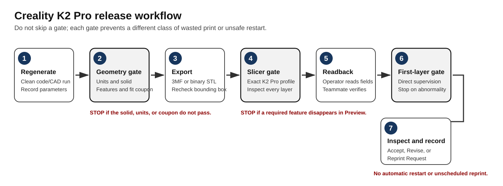

# Creality K2 Pro 3D printing guide

[Course home](README.md) · [Wing project](PROJECT.md) · [Download Word guide](docs/MIE_446_3D_Printing_Quick_Start_Guide_Fall_2026.docx) · [Download PDF guide](docs/MIE_446_3D_Printing_Quick_Start_Guide_Fall_2026.pdf)

This page is the public, quick-reference version of the MIE 446 student guide for the **Creality K2 Pro + CFS**, a **0.4 mm nozzle**, and course-issued regular **1.75 mm PLA Pro**. Read the downloadable guide before fabrication. Canvas, current lab signage, machine-specific SOPs, and direct instructions from authorized staff supersede this page when they differ.

The printer room is **Engineering Laboratory, Room 104 / 104A**. The door code, reservations, assigned machines, and restricted operating information are issued privately after training and are never published in this repository.

## Software and official help

- **[Download Creality Print from Creality](https://www.creality.com/download)** — use the current course-approved release for Windows, macOS, or Linux. Creality listed version 7.2.2.5483 on September 6, 2026; confirm the permitted version in Canvas before updating a lab computer.
- **[Creality Print Quick Start Guide](https://wiki.creality.com/en/software/update-released/Basic-introduction/Quick-Start)** — official overview of importing, preparing, slicing, and exporting.
- **[Creality Print 6 and 7 workflow](https://wiki.creality.com/en/software/6-0/Quick-Start)** — official interface and slicing reference.
- **[Creality K2 Pro and CFS multicolor guide](https://wiki.creality.com/en/k2-flagship-series/k2-pro/multi-color-printing-guide)** — official CFS workflow; course material and slot rules still control.
- **[Creality K2 series information](https://www.creality.com/products/k2-series)** — manufacturer product information. Do not use a K2 or K2 Plus profile as a substitute for the assigned K2 Pro profile.

## Required authorization

Before working in the Print and Inspection Lab, each student must:

- complete and sign the current lab-use agreement;
- complete orientation and any machine-specific training;
- use a valid Canvas reservation and the assigned printer;
- complete the course print-release gate; and
- work with the required supervision—never alone.

Do not bring food or drink into the lab. Do not wear headphones or earbuds while operating equipment. Secure long hair, jewelry, loose clothing, sleeves, and lanyards. Never bypass guards, alarms, interlocks, or calibration steps, and never attempt to repair or modify a printer.

## Course machine and material baseline

| Item | Required baseline |
|---|---|
| Printer | Assigned Creality K2 Pro + CFS |
| Nozzle | Exact 0.4 mm machine profile |
| Material | Course-issued regular 1.75 mm PLA Pro |
| Slicer | Current staff-approved Creality Print configuration |
| Typical starting process | Staff-approved standard PLA profile; 0.20 mm layer height unless another setting is approved |
| Scale | 100%; correct unit errors in CAD/export rather than scaling an engineering part to fit |

Do not substitute personal filament. Air PLA, Aero PLA, LW-PLA, foaming filament, or another specialty material requires written approval. If approved, use only the material path specified by staff; brittle or incompatible filament must not be routed through the CFS.

## Improved release workflow

The following sequence reduces wrong-file, wrong-profile, wasted-material, and late-print failures.

1. **Regenerate the geometry.** Run the code/CAD model cleanly and record the design revision and input parameters.
2. **Verify the solid.** Confirm millimetres, bounding-box dimensions, closed watertight bodies, printable wall/rib thickness, spar sockets, module interfaces, and the assigned build envelope.
3. **Pass the fit-coupon gate.** Print and physically inspect the approved coupon before releasing the full wing when the project workflow requires it. Record the fit result and revision.
4. **Export intentionally.** Preserve the native model, then export each independently oriented component as 3MF or binary STL. Reopen the export and compare X, Y, and Z dimensions with the source model.
5. **Slice for the exact machine.** Select the assigned K2 Pro, 0.4 mm nozzle, approved PLA Pro profile, and correct CFS slot or authorized external-spool path. Never reuse G-code from another machine, nozzle, material, or revision.
6. **Inspect every layer.** Check first, middle, and final layers—not only the 3D preview. Confirm closed walls, ribs, sockets, interfaces, support, adhesion, and the absence of unsupported islands or vanished thin features.
7. **Perform a two-person readback.** Before release, the operator reads aloud the team, component, revision, printer ID, nozzle, material/slot, scale, estimated mass, and estimated time. A teammate verifies these against the release record.
8. **Start under supervision.** Let all approved machine preflight and calibration steps finish. Observe the first layers directly; a remote camera does not replace required first-layer supervision.
9. **Inspect and document.** Cool and remove the part only as trained. Label it, record actual mass and defects, dry-fit interfaces, photograph the result, and select **Accept**, **Revise**, or **Reprint Request**.

*Figure 1. The improved MIE 446 release sequence. A failed gate returns the team to evidence and revision; it does not authorize an automatic restart.*

## CAD and mesh release checklist

- [ ] A clean run regenerates the intended geometry.
- [ ] Team, component, revision, and design inputs are recorded.
- [ ] All dimensions are in millimetres and agree with the approved design.
- [ ] Each printable component is a closed, watertight solid.
- [ ] Duplicate bodies, self-intersections, internal faces, and zero-thickness surfaces are absent.
- [ ] Shells, ribs, holes, interfaces, and spar sockets have printable physical thickness.
- [ ] Modules fit the build envelope at 100% scale.
- [ ] Support locations and print orientation have been reviewed.
- [ ] The required fit coupon has passed and its physical result is recorded.
- [ ] Native code/CAD and the exported 3MF/STL are saved with traceable filenames.

Suggested filename: `MIE446_Team##_Wing_[Component]_R##_YYYYMMDD.3mf`.

## Creality Print checklist

- [ ] Start a new project or import geometry only; do not inherit an unverified third-party printer configuration.
- [ ] Select **Creality K2 Pro**, the exact **0.4 mm nozzle**, and the assigned material profile.
- [ ] Map the software filament to the physical CFS slot or approved external spool.
- [ ] Verify X, Y, and Z dimensions before changing orientation or process settings.
- [ ] Place every body on the plate and inside the printable boundary.
- [ ] Review orientation, walls, top/bottom layers, infill, supports, brim, and adhesion.
- [ ] Move the preview slider from the first layer through the final layer.
- [ ] Confirm that required thin features remain continuous after slicing.
- [ ] Record estimated material mass and print time.
- [ ] Save the complete slicer project as `.3mf` before generating machine-specific G-code.

### Why layer preview matters

The two department examples below show the same component sliced without infill and with light infill. The change is visible in internal toolpaths and in the material estimate. These screenshots are examples for learning—not settings to copy into a different wing.

| Preview without infill | Preview with light infill |
|---|---|
|  |  |
| **44.57 g** in the departmental example | **52.30 g** in the departmental example |

*Figures 2–3. Department slicer-preview examples retained from the MIE printer-support notes. Interface labels may differ in the current Creality Print release.*

## At-printer verification

Before pressing Start, verify the filename and revision, destination printer, nozzle, filament source, thumbnail, estimated time, and scale. Confirm that the build plate is correctly seated and clear, the nozzle area is unobstructed, and the selected spool is correctly labeled, feeds freely, and shows no visible damage. Use only the staff-approved cleaning and adhesion method.

Do not touch the nozzle or build plate when hot. Keep hands, tools, hair, and clothing away from moving parts. Treat an automatic leveling, calibration, filament, or machine warning as a stop-and-escalate condition unless authorized staff directs otherwise.

## Stop-work conditions

Stop the print immediately and notify the instructor, TA, or lab staff if:

- the first layer does not adhere or begins to lift;
- the nozzle drags, the part shifts, or a collision occurs;
- filament stops feeding, breaks in the path, or extrudes abnormally;
- an intended wall, rib, socket, or interface is missing;
- the machine reports a calibration, leveling, temperature, or motion fault;
- a guard or interlock is missing; or
- there is smoke, an unusual odor, abnormal noise, or equipment damage.

Preserve the slicer project, exact warning, layer view, printer/revision information, and photographs. Do not attempt a repair, restart, or unscheduled reprint.

In an emergency, call **911** or **UMPD 413-545-3111**, report **ELab 1, Room 104A**, and direct responders to the ELab 1 loading dock.

## Diagnose before changing settings

Classify the problem before proposing a correction.

| Failure class | Typical evidence | First response |
|---|---|---|
| CAD or mesh | Open body, self-intersection, zero layers, missing feature | Repair the source model, regenerate, and re-export. |
| Units or placement | Tiny/huge model, body outside or below the plate | Compare bounding boxes, correct export units once, and use Drop to Bed. |
| Slicer or profile | Wrong printer opens, unexpected estimate, missing paths | Import geometry only and reselect the exact approved machine/material/process. |
| Material or feed | CFS mismatch, brittle filament, under-extrusion | Stop and verify the authorized spool, slot mapping, and material path with staff. |
| Adhesion or stability | Lifting edge, nozzle drag, shifted tall part | Stop; preserve evidence; review orientation, brim, and approved adhesion controls. |
| Assembly fit | Rod binds, socket misalignment, module gap | Do not force or enlarge the part; compare the coupon, CAD dimensions, and revision. |

When the cause is unclear, return to a clean Creality Print project with the exact K2 Pro/0.4 mm/approved-material profile and one repaired component. Change **one controlled factor at a time**. If the problem remains, give the instructor or TA the native model, exported 3MF/STL, slicer `.3mf`, warning screenshot, and print photographs—not only the G-code.

## Reprint control and required evidence

A failed print is engineering evidence, not permission to consume more material. Label and preserve the failed part. Record one plausible cause, the evidence supporting it, the smallest proposed correction, and the new revision. Obtain approval before reprinting.

For every attempt, preserve:

- the clean code/native CAD model and parameter record;
- exported STL/3MF and saved slicer `.3mf`;
- screenshots showing dimensions, printer/profile, and representative first/middle/final layers;
- the two-person release check, estimated mass/time, and actual mass/time;
- first-layer and completed-part photographs;
- visible defects, fit results, outcome, and corrective action; and
- a revision note linking any failed attempt to the approved next attempt.

Passing this fabrication checklist documents file, process, dimensional, and visible-quality evidence. It does **not** by itself certify aerodynamic performance, structural strength, flight safety, or suitability for use.
