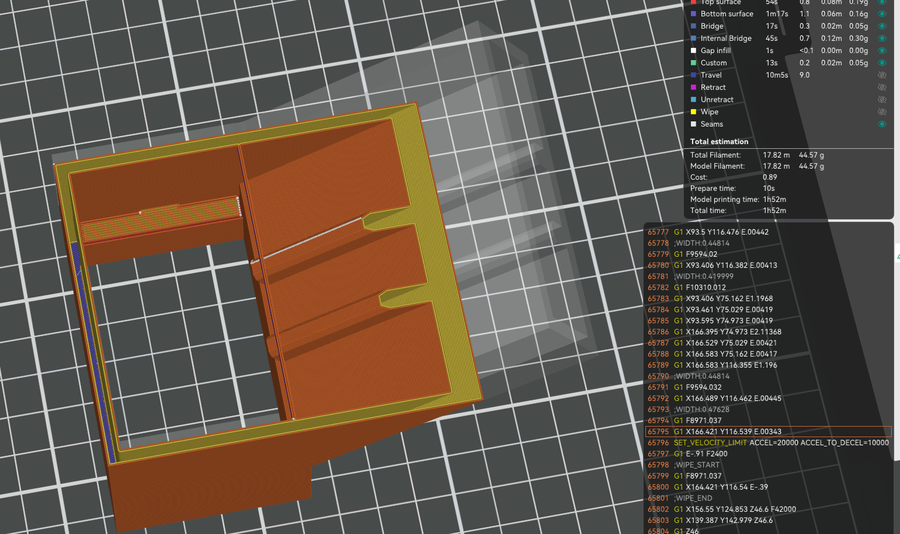
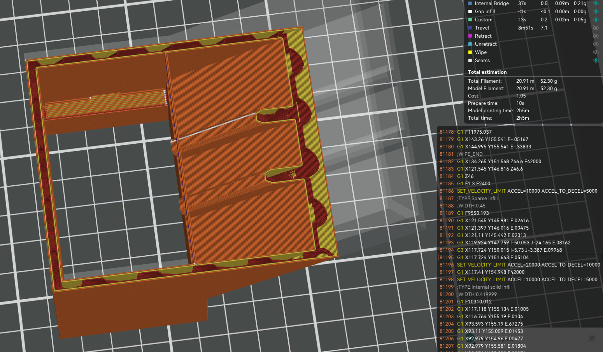

# Offline 3D printing guide — OrcaSlicer + USB

[Course home](README.md) · [Wing project](PROJECT.md) · [Download Word guide](docs/MIE_446_3D_Printing_Quick_Start_Guide_Fall_2026.docx) · [Download PDF guide](docs/MIE_446_3D_Printing_Quick_Start_Guide_Fall_2026.pdf)

This is the public quick-reference guide for the MIE 446 **offline** workflow:

> Tinkercad or checked wing model → STL/3MF → **OrcaSlicer** → layer review → G-code → **USB drive** → assigned **Creality K2 Pro**

The printer is not connected to a course server. This course therefore uses **local G-code export and USB transfer only**. Do not use Send Print, cloud printing, LAN printing, or a Device tab. Canvas, current laboratory signage, the approved profile/template file, and direct instructions from authorized staff supersede this page when they differ.

The printer-room location, access instructions, door code, reservations, assigned machines, and other restricted operating information are issued privately after training and are never published here.

## Required software and files

- **[Download OrcaSlicer](https://github.com/OrcaSlicer/OrcaSlicer/releases)** — install the stable course-approved release from the official GitHub project.
- **[OrcaSlicer official project and documentation](https://github.com/OrcaSlicer/OrcaSlicer)** — use this source rather than an unofficial download site.
- **Course-approved K2 Pro template/profile** — open the validated course `.3mf` template or import the profile supplied in Canvas. It must identify **Creality K2 Pro**, **0.4 mm nozzle**, firmware-compatible machine G-code, and approved regular PLA Pro. Do not build a profile by guessing and do not substitute K2, K2 Plus, Ender, Bambu, or a generic printer.
- **USB drive** — use the course-approved format/capacity. Keep a local copy of the slicer project and G-code before safely ejecting the drive.

Before slicing, the selected configuration must identify `Creality K2 Pro` and `Creality K2 Pro 0.4 nozzle`. If either identifier is missing or different, stop and obtain the validated course template/profile.

## What AI may and may not do

ChatGPT, including GPT-6 Astra, may help a team understand the geometry, repair code, check units, compare dimensions, explain a warning, or build a review checklist. It may not replace the approved slicer profile, inspect the physical printer, confirm the loaded material, or guarantee safe machine motion.

**Never ask AI to write or patch the final printer G-code directly.** Generate it in OrcaSlicer from the validated K2 Pro profile, inspect the sliced toolpaths, and complete the human release check. The team remains responsible for every file sent to the printer.

## Authorization and baseline

Before printing, each student must complete the lab-use agreement, orientation, machine-specific training, Canvas reservation, and course print-release gate. Work with required supervision and never alone.

| Item | Required baseline |
|---|---|
| Printer | Assigned Creality K2 Pro + CFS |
| Nozzle | Exact 0.4 mm approved machine profile |
| Material | Course-issued regular 1.75 mm PLA Pro |
| Slicer | OrcaSlicer with the validated K2 Pro 0.4 mm course profile/template |
| Transfer | Export G-code locally, copy to USB, safely eject, then select it at the printer |
| Scale | 100%; correct unit errors in CAD/export rather than scaling an engineering part to fit |

Do not substitute personal filament. Air PLA, Aero PLA, LW-PLA, foaming filament, or another specialty material requires written approval. Settings from an older Bambu/PLA Aero guide - including its temperatures, flow ratio, fan limits, spiral-vase mode, speeds, and retraction values - **do not apply** to this year's K2 Pro/regular-PLA workflow.

## Complete offline workflow

1. **Regenerate the model.** Run the notebook/code cleanly. Record team, component, revision, and design inputs.
2. **Verify geometry.** Check millimetres, bounding-box dimensions, closed watertight solids, shell/rib thickness, spar sockets, module interfaces, and the build envelope.
3. **Pass the coupon gate.** When required, print and physically inspect the approved fit coupon before releasing a full wing component.
4. **Export intentionally.** Preserve the native model, export each component as 3MF or binary STL, reopen it, and compare X/Y/Z dimensions with the source record.
5. **Open the approved OrcaSlicer template.** Start with the validated course `.3mf` or imported profile. Then use **File → Import → Import 3MF/STL/STEP/SVG/OBJ/AMF** (wording may vary by version) to add the geometry. If OrcaSlicer asks whether to load a project or geometry, preserve the approved course printer settings and import the new part as geometry.
6. **Verify the machine strip before doing anything else.** Confirm **Creality K2 Pro**, **0.4 mm nozzle**, the approved regular PLA profile, and 100% scale. If the exact course profile is missing, stop and ask the instructor/TA; do not create a substitute profile.
7. **Orient and prepare.** Put the approved face on the build plate, confirm that every body is inside the printable boundary, and apply only the approved process settings. Do not rescale an engineering part merely to make it fit.
8. **Inspect every layer.** Move the preview slider from the first to final layer. Confirm closed walls, ribs, sockets, interfaces, support, adhesion, and no vanished thin features or unsupported islands. Record estimated mass and time.
9. **Two-person release check.** One student reads aloud the filename, revision, printer/profile, nozzle, material, scale, dimensions, estimated mass, and time; a teammate verifies the record.
10. **Slice the plate.** Click **Slice plate**. When slicing completes, open **Preview** and scan the complete layer range. Save the full OrcaSlicer project as `.3mf` so the chosen profile and placement can be audited.
11. **Export the G-code locally.** From Preview, click **Export G-code file** (or use **File → Export → Export G-code**, depending on the OrcaSlicer version). Save first to the team folder using the approved name. Do not choose a network-send command.
12. **Copy to USB.** Copy the exported `.gcode` file to the course USB drive. Confirm that the filename, extension, and file size on the USB match the local file; then safely eject the drive.
13. **Verify at the printer.** Insert the USB drive. On the K2 Pro screen, select the exact file and verify filename/revision, thumbnail if available, estimated time, and material. If anything differs, cancel and return to OrcaSlicer.
14. **Start under supervision.** Let approved machine checks finish and observe the first layers directly. Stop for poor adhesion, nozzle drag, missing extrusion, part shift, collision, smoke, unusual odor/noise, or any machine warning.
15. **Inspect and document.** After cooling, remove the part as trained, label it, record actual mass and defects, dry-fit interfaces, photograph it, and choose **Accept**, **Revise**, or **Reprint Request**.

*Figure 1. The MIE 446 offline release sequence. A failed gate returns the team to evidence and revision; it does not authorize an automatic restart.*

## OrcaSlicer checklist

- [ ] Start a new project and import the STL/3MF geometry.
- [ ] Select **Creality K2 Pro / 0.4 mm / approved regular PLA**.
- [ ] Confirm X/Y/Z dimensions and 100% scale before changing orientation.
- [ ] Keep every body on the plate and inside the approved build envelope.
- [ ] Use only the assigned orientation and approved walls, top/bottom layers, infill, support, brim, temperature, cooling, speed, acceleration, and retraction settings.
- [ ] Review the first, middle, and final layers and scan the entire layer range.
- [ ] Confirm that shells, ribs, holes, rod sleeves, and interfaces remain continuous.
- [ ] Record material mass and print-time estimates.
- [ ] Save the OrcaSlicer project `.3mf` before exporting machine-specific G-code.
- [ ] Confirm the G-code filename includes team, component, and revision.

Suggested names:

- Source geometry: `MIE446_Team##_Wing_[Component]_R##_YYYYMMDD.3mf`
- Printer file: `MIE446_Team##_Wing_[Component]_R##_K2PRO_04.gcode`

## Course files

- **[Reference OrcaSlicer/K2 Pro G-code](docs/printing/examples/reference-k2pro-orcaslicer.gcode)** — provided only for inspecting file structure and profile identifiers. Its SHA-256 is `7c6b491ecef6f1c900149f7e8c0183ea1a13d74038cc1b1dcffcf69e2f7447c3`.
- **[Current MIE 446 wing-design notebook](notebooks/MIE446_Code_to_Print_Wing.ipynb)** — the editable course code students use to generate their own geometry, if that notebook is assigned in Canvas.

The reference G-code is **not a print-ready course file**. It is specific to one geometry, machine, nozzle, material profile, firmware configuration, and slicer setup. Students may inspect its header, but must not run, rename, copy, submit, or edit it. Each team must generate new G-code from its own checked geometry and the current approved profile.

### Why layer preview matters

The examples below are OrcaSlicer-compatible layer-preview examples. They demonstrate how infill changes internal toolpaths and material estimate; they are **not** settings to copy for this year's wing.

| Preview without infill | Preview with light infill |
|---|---|
|  |  |
| **44.57 g** in the illustrative case | **52.30 g** in the illustrative case |

*Figures 2-3. Departmental slicer previews. The examples teach layer inspection; confirm the current OrcaSlicer course profile before generating G-code.*

## USB transfer and at-printer verification

1. Export G-code only after the slicer review and two-person readback pass.
2. Save first to the team folder; do not make the USB drive the only copy.
3. Copy only the approved revision to the USB drive and confirm that the copy completed.
4. Safely eject the USB drive before removing it from the computer.
5. Insert it in the printer and select the exact filename on the local screen.
6. Compare the screen information with the release record. Never run a file merely because its name looks familiar.
7. If the printer rejects the file or shows an unexpected warning, stop. Do not rename, hand-edit, or ask AI to patch the G-code.

## Stop-work conditions

Stop the print and notify the instructor, TA, or lab staff if the first layer lifts; filament stops feeding; the nozzle drags; the part shifts; a collision occurs; a required feature is missing; the machine reports a calibration, leveling, temperature, or motion fault; a guard/interlock is missing; or there is smoke, unusual odor/noise, or equipment damage.

Preserve the slicer project, exact warning, preview, G-code filename, printer/revision information, and photographs. Do not attempt a repair, restart, or unscheduled reprint.

In an emergency, call **911** or **UMPD 413-545-3111**, report **ELab 1, Room 104A**, and direct responders to the ELab 1 loading dock.

## Diagnose before changing settings

| Failure class | Typical evidence | First response |
|---|---|---|
| CAD or mesh | Open body, self-intersection, zero layers, missing feature | Repair the source model, regenerate, and re-export. |
| Units or placement | Tiny/huge model, body outside or below the plate | Compare bounding boxes, correct export units once, and place on bed. |
| Wrong/absent profile | Wrong printer name, wrong nozzle, unexpected start sequence | Stop; select the exact Creality K2 Pro 0.4 mm profile. Do not generate G-code. |
| Missing sliced feature | Rib, wall, socket, or hole disappears in Preview | Increase real feature thickness in the source model and obtain approval. |
| USB/file issue | File absent, truncated, wrong revision, or rejected by printer | Return to the saved slicer project; re-export and recopy after approval. Never edit G-code manually. |
| Material or feed | Slot mismatch, brittle filament, under-extrusion | Stop and verify the authorized spool and material path with staff. |
| Adhesion or stability | Lifting edge, nozzle drag, shifted tall part | Stop; preserve evidence; review orientation and approved adhesion controls. |
| Assembly fit | Rod binds, socket misalignment, module gap | Do not force or enlarge the part; compare coupon, CAD dimensions, and revision. |

Change **one controlled factor at a time** and obtain approval before any reprint. Provide the native model, exported 3MF/STL, OrcaSlicer `.3mf`, exact profile identifier, screenshots, and photographs—not only the G-code.

## Evidence to preserve

- clean code/native CAD model and parameter record;
- exported STL/3MF and saved OrcaSlicer `.3mf`;
- screenshots showing dimensions, profile identifier, and representative first/middle/final layers;
- final G-code filename and USB-transfer verification;
- estimated and actual mass/time;
- first-layer and completed-part photographs;
- defects, fit results, disposition, and revision note; and
- completed two-person release record.

Passing this checklist documents file, process, dimensional, and visible-quality evidence. It does **not** certify aerodynamic performance, structural strength, flight safety, or suitability for use.
