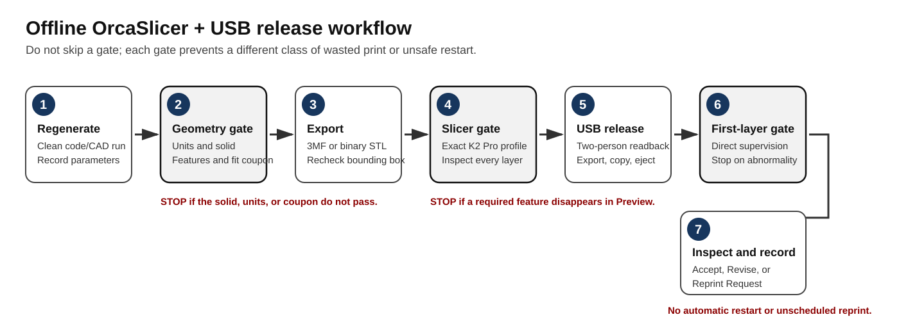
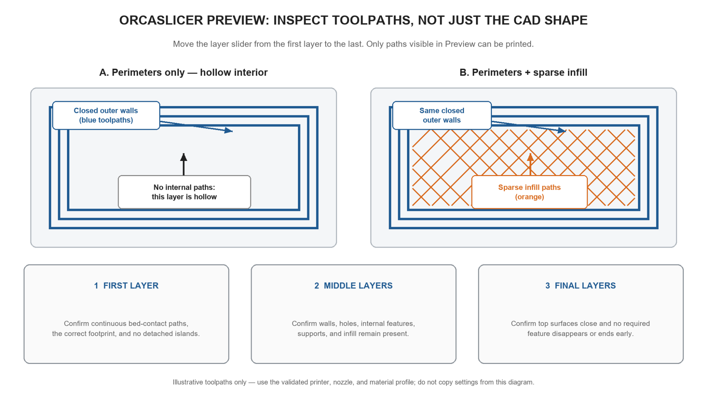

# Offline 3D printing with OrcaSlicer and USB

[Course repository](README.md) · [Download Word guide](docs/OrcaSlicer_Offline_USB_3D_Printing_Guide.docx) · [Download PDF guide](docs/OrcaSlicer_Offline_USB_3D_Printing_Guide.pdf)

This guide explains a general offline workflow for preparing an FDM model in **OrcaSlicer**, generating machine-specific G-code, transferring it by **USB drive**, and supervising the print. It can be used for any suitable model; it is not tied to a particular course or project.

> CAD or modeling software → STL/3MF → OrcaSlicer → sliced-toolpath review → G-code → USB drive → assigned printer

Machine-specific training, posted laboratory rules, the printer manufacturer's documentation, and instructions from the equipment owner or laboratory supervisor take priority over this guide.

## Before starting

- Obtain authorization and machine-specific training.
- Identify the exact printer model, nozzle diameter, firmware requirements, and approved material.
- Obtain a validated OrcaSlicer printer, filament, and process profile from the equipment owner.
- Confirm the printer is available, undamaged, and approved for use.
- Use a compatible USB drive and know the site's file-transfer procedure.
- Never publish or share room-access codes, passwords, or restricted operating information.

Do not guess a printer profile or copy settings from a visually similar machine. G-code is specific to the printer, nozzle, material, firmware configuration, geometry, and slicer settings.

## Install OrcaSlicer

- **[Official OrcaSlicer releases](https://github.com/OrcaSlicer/OrcaSlicer/releases)** — download the stable version approved by the equipment owner.
- **[Official OrcaSlicer project and documentation](https://github.com/OrcaSlicer/OrcaSlicer)** — use this source rather than an unofficial download site.
- **[Creality K2 series information](https://www.creality.com/products/k2-series)** — manufacturer information for K2-series hardware.

Complete the operating-system installation normally. Cloud sign-in and printer networking are not required for the offline workflow described here.

## Prepare the model

1. Save the editable source model in its native CAD or modeling format.
2. Confirm the intended units, overall dimensions, and orientation.
3. Check that every printable body is a closed, watertight solid without self-intersections, duplicate faces, internal surfaces, or zero-thickness features.
4. Confirm that walls, holes, clearances, and interfaces are large enough for the selected nozzle and process.
5. Export the model as **3MF** or **binary STL**. Prefer 3MF when units, multiple objects, or richer project data must be preserved.
6. Reopen the exported file and compare its X, Y, and Z dimensions with the source model.

Do not send a native CAD file directly to the printer. The printable geometry must first be sliced for the exact machine configuration.

## Configure OrcaSlicer

1. Open the validated OrcaSlicer template supplied for the printer, or import the approved configuration bundle.
2. Verify the exact printer model and nozzle diameter. For the equipment described in this repository, the required identifiers are **Creality K2 Pro** and **0.4 mm nozzle**.
3. Select the material profile that matches the physical filament loaded in the printer or material system.
4. Select the approved process profile. Do not invent nozzle temperature, bed temperature, flow, speed, acceleration, cooling, retraction, or machine-start commands.
5. If the required profile is absent or its origin cannot be verified, stop and contact the equipment owner.

## Import and arrange the geometry

1. Use **File → Import** or the **Add** command to import the STL/3MF model. Menu wording may vary slightly by OrcaSlicer version.
2. If an imported 3MF contains an unrelated printer configuration, import the geometry only and retain the validated machine profile.
3. Confirm X, Y, and Z dimensions and 100% scale before changing orientation.
4. Place an appropriate stable face on the build plate using **Place on Face** or **Drop to Bed**.
5. Keep every object on the plate and inside the printable boundary.
6. Rotate, split, or redesign an oversized part. Do not rescale an engineering part merely to make it fit unless the changed scale is intentional and documented.

## Select process settings

Start from the validated process profile. Review these settings according to the geometry and intended use:

- layer height;
- wall/perimeter count;
- top and bottom layers;
- infill percentage and pattern;
- support placement and accessibility;
- brim or other approved bed-adhesion features;
- seam position;
- material temperatures and cooling; and
- speed, acceleration, flow, and retraction.

Change only settings you understand and are authorized to modify. When troubleshooting, change one controlled factor at a time.

## Slice and inspect every layer

1. Click **Slice plate**.
2. Open **Preview** after slicing completes.
3. Move the layer slider from the first layer to the final layer.
4. Confirm a continuous first layer, closed perimeters, intended internal features, supported islands, accessible supports, and reasonable travel paths.
5. Look for thin walls, holes, text, ribs, or interfaces that disappear after slicing.
6. Review estimated print time and material use.
7. Save the complete OrcaSlicer project as `.3mf` so the geometry, placement, and selected profiles can be audited.

### Why Preview matters

The **Prepare** view shows the shape of the imported model. **Preview** shows the toolpaths the printer will actually attempt to deposit after OrcaSlicer has converted that model into layers. A feature can look correct in CAD or Prepare and still disappear after slicing because it is too thin for the selected nozzle and process profile, lies outside the build area, intersects another body incorrectly, or requires support. **Only features that appear as toolpaths in Preview can be printed.**

In the diagram, the blue lines are perimeter toolpaths. Panel A has closed walls but an intentionally hollow interior. Panel B has the same walls plus orange sparse-infill paths. Infill changes the internal structure and material use, but it cannot repair a missing, open, or undersized perimeter.

Use the layer slider to inspect the **entire print**, not just one attractive middle layer:

- **First layer:** confirm the correct footprint, continuous bed-contact paths, and no detached islands.
- **Middle layers:** confirm that walls, holes, internal features, supports, and infill remain present and continuous.
- **Final layers:** confirm that top surfaces close and no required feature disappears or ends early.
- **Across all layers:** watch for unexpected gaps, floating paths, missing thin walls, support that cannot be removed, and travel moves that indicate a slicing problem.

If a required feature is missing in Preview, return to the model or the validated slicer profile and correct the cause before exporting G-code. Do not assume the printer will create geometry that the Preview does not show.

## Generate the G-code

1. Complete the geometry, profile, placement, settings, and Preview checks.
2. In Preview, select **Export G-code file**. In some versions the same command appears under **File → Export → Export G-code**.
3. Save the file to a normal local folder before copying it to USB.
4. Use a traceable filename such as `Project_Part_Revision_PrinterNozzle.gcode`.
5. Confirm that the file extension is `.gcode` and that the export completed without an error.
6. Do not open and manually edit the generated G-code.

Example filename: `Bracket_R03_K2PRO_04.gcode`

## Transfer the file by USB

1. Insert the approved USB drive into the computer.
2. Copy only the intended `.gcode` revision to the drive.
3. Compare the filename and file size on the USB drive with the local file.
4. Keep the local OrcaSlicer `.3mf` project and G-code as the primary archive; the USB drive should not be the only copy.
5. Use the operating system's **Eject** or **Safely Remove Hardware** command before disconnecting the drive.
6. Insert the USB drive into the assigned printer.
7. On the printer screen, select the exact file and verify the filename, revision, thumbnail, material, and estimated time before starting.

This workflow does not require Send Print, cloud printing, LAN printing, or a connected Device tab.

## Start and supervise the print

- Confirm that the build plate is correctly seated and clear.
- Confirm that the nozzle area is unobstructed and the approved filament is loaded from the correct source.
- Allow required machine checks, leveling, and calibration to finish.
- Start the print only under the supervision required by the equipment owner.
- Observe the first layers directly. A camera does not replace required first-layer supervision.
- Stop the print for poor adhesion, missing extrusion, nozzle drag, a shifted or lifting part, collision, smoke, unusual odor or noise, or any machine warning.

Do not attempt an unauthorized repair, restart, or reprint. Preserve the OrcaSlicer project, warning message, filename, screenshots, and photographs for diagnosis.

## Remove and inspect the part

1. Allow the part and build plate to cool.
2. Remove the part using the approved method and tools.
3. Inspect overall dimensions, warping, cracks, layer separation, missing features, support damage, holes, and mating interfaces.
4. Compare actual material use and print time with the slicer estimates when useful.
5. Record the outcome as **Accept**, **Revise**, or **Reprint Request**.
6. Restore the work area and leave the printer ready for the next authorized user.

## Troubleshooting

| Symptom | Likely cause | First response |
|---|---|---|
| Model is tiny or enormous | Unit mismatch | Compare the bounding box with the source model and correct export units. |
| Nothing slices or zero layers appear | Open body, invalid mesh, or object off the plate | Repair the source geometry, re-export, and place it on the bed. |
| A wall, hole, or feature disappears | Feature is below printable width or has zero thickness | Increase its physical size in the source model and re-slice. |
| Wrong printer appears after opening 3MF | Foreign profile embedded in the project | Import geometry only and reselect the validated printer profile. |
| Part is outside the build area | Geometry or placement exceeds the envelope | Rotate, split, or redesign the part; do not apply an accidental scale change. |
| File does not appear on the printer | USB, extension, filename, or copy problem | Re-export from the saved project, recopy, verify size, and safely eject. |
| First layer lifts | Plate condition, orientation, or adhesion issue | Stop; preserve evidence; review the approved cleaning and adhesion procedure. |
| Nozzle drags or the part shifts | Lifting, collision, or unstable geometry | Stop immediately and preserve the file and photographs. |
| Material does not feed correctly | Wrong material path, spool problem, or profile mismatch | Stop and verify the approved filament, material path, and profile. |

## Use of AI tools

AI tools may help explain slicer settings, check units, diagnose a warning, review geometry code, or build a checklist. They cannot verify the physical printer, loaded material, firmware state, clearances, or safe machine motion.

Do not ask an AI system to write, repair, or adapt final printer G-code. Generate the printer file in OrcaSlicer from a validated profile and inspect the resulting toolpaths yourself.

## Sample files

- **[Sample parametric wing-generation notebook](notebooks/MIE446_Code_to_Print_Wing.ipynb)** — an executable Python/CadQuery example that generates printable geometry and exports model files.
- **[Reference OrcaSlicer/K2 Pro G-code](docs/printing/examples/reference-k2pro-orcaslicer.gcode)** — a complete slicer output for inspecting the file header, printer/profile identifiers, and G-code structure.

These files are learning examples. The reference G-code is **not approved for printing or reuse**, and it should not be assumed to correspond to a newly generated model. Every model requires new G-code for its exact geometry, printer, nozzle, material, firmware configuration, orientation, and slicer settings.
