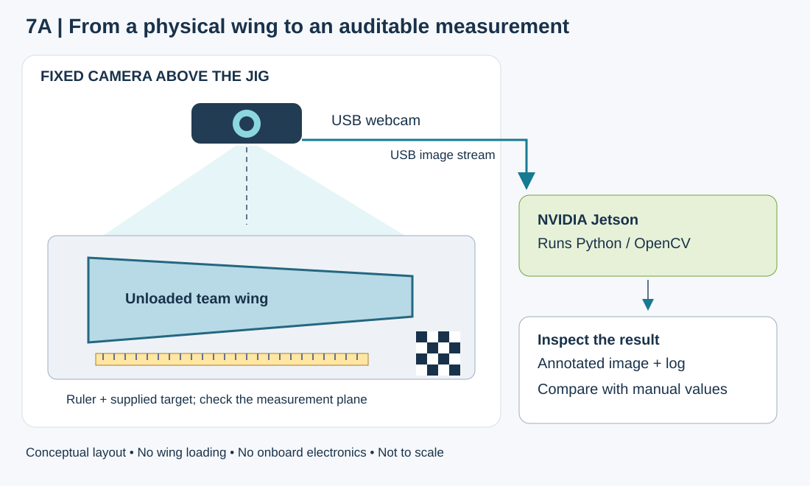
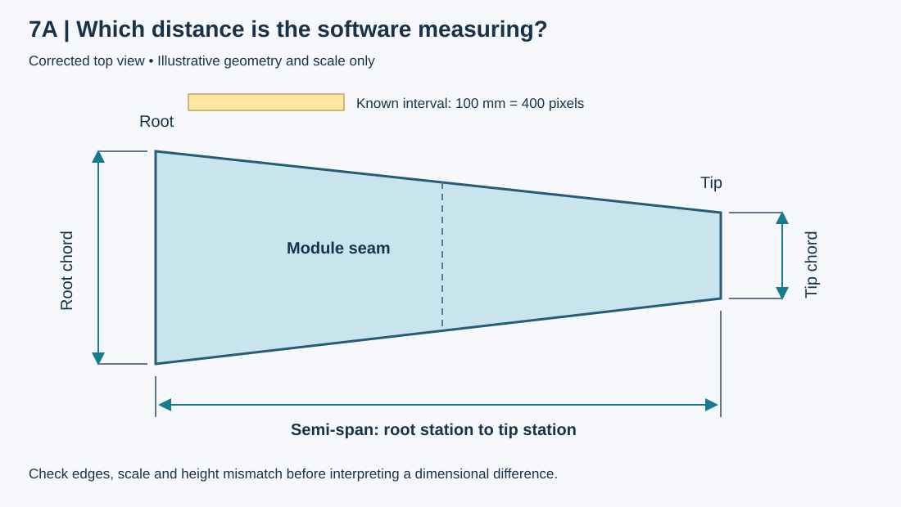

# Code-to-Print Wing, Machine Vision, and Damage Diagnostics

**MIE 446 Aerospace Structures · Fall 2026 · Student project guide**

[Course home](README.md) · [Syllabus](SYLLABUS.md) · [Homework](ASSIGNMENTS.md) · [Offline OrcaSlicer + USB guide](PRINTING.md) · [Printable PDF guide](docs/MIE_446_3D_Printing_Quick_Start_Guide_Fall_2026.pdf)

> Web edition aligned with the updated September 3, 2026 syllabus. Canvas carries authoritative deadlines, submission links, team assignments, printer reservations, calibration files, shared diagnostic data and private access information.

## Project at a glance

| Team | Course weight | Artifact | Course release |
|---|---:|---|---|
| 3 students | 30% | Non-flying semi-wing | v1.1.1 |

**Your task** — Use the guided notebook to define and understand a parametric wing, make a prediction before seeing the comparison, print and test a rod-fit coupon, generate a validated 3D semi-wing, print and inspect the modules, perform an unloaded Jetson-camera dimensional cross-check, analyze shared before/after damage data from a separate sacrificial specimen, and defend the team's decisions. You configure instructor-provided workflows; you are not expected to write CAD, vision, or data-acquisition software from scratch.

Shared inspection computer: **NVIDIA Jetson Orin Nano Super Developer Kit**. [Official NVIDIA product page and image source](https://developer.nvidia.com/embedded/jetson-developer-kits).

Open in Google Colab: [stable course notebook (v1.1.1)](https://colab.research.google.com/github/Ehsan-Roohi/Aerospace-Structures/blob/v1.1.1/notebooks/MIE446_Code_to_Print_Wing.ipynb)

Course repository: [Aerospace Structures on GitHub](https://github.com/Ehsan-Roohi/Aerospace-Structures)

First action: choose File > Save a copy in Drive. Work only in your saved copy so the team inputs and written responses persist.

## 1. What you will learn and produce

This is an analytical aerospace-structures project connected to a physical build. The notebook reduces routine coding so that the team can focus on engineering meaning, verification, fabrication judgment, collaboration, and communication. A successful project is not simply a clean-looking print.

- Read a NACA four-digit designation and relate airfoil geometry to a manufacturable section.
- Connect semi-span, root chord, tip chord, taper, area, mean aerodynamic chord, and aspect ratio.
- Predict the direction of a design change before the code reveals the result, then explain any mismatch.
- Use a physical fit coupon to choose a rod-hole clearance from evidence rather than assumption.
- Trace one input through plots, CAD geometry, printable modules, validation records, and the final archive.
- Use AI responsibly for coding or critique while independently checking and explaining the result.
- Work in a three-person team, inspect the physical artifact honestly, interpret multiple damage indicators critically, and communicate uncertainty and limitations.

**Project boundary** — The team artifact is a non-flying fabrication demonstrator. Each submitted team wing remains unloaded and undamaged. It is not flown, cracked, or tested to failure and does not certify structural capacity, aerodynamic performance, flight safety, or airworthiness. Controlled damage is introduced only by the instructor/TA on a designated sacrificial wing-box specimen behind the prescribed safety controls.

## 2. Inputs, fixed settings, and design limits

Your team chooses the airfoil and the principal wing dimensions in the form. Safety-, interface-, and course-standard settings remain fixed so that all teams work within a common manufacturing envelope.

| Type | Requirement |
| --- | --- |
| Team chooses | NACA code; semi-span; root and tip chord; skin and rib thickness; 2 or 3 modules; one of the coupon-tested clearances |
| Course fixed | Two 4 mm rods at x/c = 0.30 and 0.60; 1.2 mm sleeve wall; 1.2 mm trailing edge; three interior ribs |
| Material/profile | Regular course-issued 1.75 mm PLA Pro; assigned Creality K2 Pro; 0.4 mm nozzle; current staff-approved profile |
| Mass limit | Calculated CAD mass of the final printed set must be at or below 300 g |
| Physical artifact | One semi-wing; any full-wing area, span, or aspect ratio is an analytical symmetric-wing equivalent only |

| Check | Accepted range or convention |
| --- | --- |
| Units | All length inputs are millimetres; x/c and module count are dimensionless. |
| Chord | 0 < tip chord <= root chord <= 300 mm. |
| Printer envelope | Semi-span / module count <= 300 mm. |
| Wall features | Skin thickness and rib thickness must each be >= 0.8 mm. |
| Modules | Select 2 or 3 modules. |
| Rod measurement | For the course 4 mm rod, the recorded diameter must be between 3.5 and 4.5 mm. |

## 3. The two-run workflow

The project intentionally requires two separate notebook runs. Do not try to generate the final wing before testing the physical coupon.

| Run | What the team does | Result |
| --- | --- | --- |
| Run 1 - Coupon Only | Use revision R01. Enter the team/design values and make the comparison prediction. Run all cells. Download the coupon ZIP, print the coupon, measure the rod, and record which hole gives the appropriate fit. The 3D wing is intentionally skipped. | Coupon ZIP + physical fit evidence |
| Run 2 - Final Wing | Change the workflow to Final Wing. Increment the design revision (for example R02), keep COUPON_REVISION as R01, complete the physical coupon record, engineering responses, and AI declaration, then run all cells again. | Validated final ZIP + printable wing modules |

**Revision rule** — The final-wing `REVISION` must differ from `COUPON_REVISION`. A normal sequence is coupon R01 followed by final wing R02. This creates an auditable record of the physical test and the design released after that test.

## 4. Complete the single student input form

Step 2 is the only notebook cell that students normally edit. Complete every field honestly. If you change the form after a downstream cell has run, rerun the form and all affected later steps so that the outputs match the current inputs.

| Form group | Fields | What is expected |
| --- | --- | --- |
| A. Team and workflow | WORKFLOW_STAGE; TEAM_ID; TEAM_MEMBERS; REVISION | Use the assigned team ID, list all three members, and maintain revision control. |
| B. Airfoil and geometry | NACA_CODE; SEMI_SPAN_MM; ROOT_CHORD_MM; TIP_CHORD_MM; SKIN_THICKNESS_MM; RIB_THICKNESS_MM; MODULE_COUNT | These values define the analytical model and printable geometry. |
| C. Coupon record | SELECTED_RADIAL_CLEARANCE_MM; COUPON_CONFIRMED; COUPON_REVISION; MEASURED_ROD_DIAMETER_MM; COUPON_FIT_RESULT; COUPON_TESTER; COUPON_DATE | Leave incomplete during Coupon Only. In Final Wing, enter the actual physical test record; date format is YYYY-MM-DD. |
| D. Engineering understanding | Airfoil reason; comparison tip chord; predicted changes; prediction explanation; result interpretation; undetectable print defect | Make the prediction before revealing the comparison. Write in the team's own words. |
| E. AI use | AI declaration; tool; purpose; affected item; student change; independent check; error/limitation; verdict | Choose No material AI use or Material AI used. If AI materially affected the work, provide a concise verification record. |

### How to write the engineering responses

| Response | Evidence of understanding |
| --- | --- |
| Airfoil choice | Refer to the NACA digits, camber and thickness; connect the choice to geometry or manufacturing. Do not claim performance the project did not test. |
| Prediction | State what should happen to planform area and aspect ratio when only the comparison tip chord changes. Give a short equation-based or geometric reason before running Step 3. |
| Interpretation | Compare prediction and calculation. If they disagree, explain what assumption or definition was missed. |
| Undetectable print defect | Name a real physical defect that CAD validation cannot observe, such as poor layer adhesion, warping, under-extrusion, or an obstructed rod sleeve. |

## 5. Use the notebook: six numbered steps

### Step 1. Start the design tool

Run the setup cell or use Runtime > Run all. It installs the fixed v1.1.1 course release and confirms that CadQuery works. A green 'Design tool ready' message means the environment is ready.

### Step 2. Enter your wing design

Complete the one student form. A green 'Form accepted' message means the basic constraints passed. A red message identifies the input that must be corrected.

### Step 3. Preview and understand the design

The tool interprets the NACA code, calculates area, taper ratio, aspect ratio and mean aerodynamic chord, and plots the root airfoil and planform with rods, ribs, and module cuts. It then compares the requested tip-chord case with the current design.

Before the comparison is revealed, select the predicted direction for area and aspect ratio and write the reasoning.

Check the span convention: the printed model is a semi-wing, while the full-wing quantities assume a mirrored symmetric wing.

Read the units and ask whether the magnitudes and trends are physically reasonable. A green notebook check is not a substitute for engineering judgment.

### Step 4. Print and record the rod-fit coupon

In Coupon Only mode, the tool creates a horizontal three-hole test coupon and downloads a ZIP. Stop the final-wing workflow until the physical coupon has been printed and tested.

| Hole | Physical marker | Meaning |
| --- | --- | --- |
| Hole 1 | One top dimple | 0.15 mm radial clearance |
| Hole 2 | Two top dimples | 0.25 mm radial clearance |
| Hole 3 | Three top dimples | 0.35 mm radial clearance |

Print with the assigned K2 Pro / 0.4 mm / regular PLA Pro profile and the required supervision.

Measure the actual course-issued rod. Test each hole by hand without forcing, bending, cracking, sanding, drilling, or enlarging the hole.

Select the documented Free/slip or Snug fit according to the instructor's criterion. Record the tester, date, measured rod diameter, selected clearance, and coupon revision.

Keep the coupon and photograph the result; it is physical evidence behind the final interface choice.

**The message in the screenshot is expected.** “Final Wing is waiting for the physical coupon record” is not a software failure. It is an intentional project gate. Return to Step 2; check `COUPON_CONFIRMED`, choose the tested `COUPON_FIT_RESULT`, enter `COUPON_TESTER` and an ISO date, keep `COUPON_REVISION` as the coupon run, and change `REVISION` to a different final-wing revision. Then rerun Steps 2–4. When Step 4 says “Coupon record accepted,” continue to Steps 5–6.

### Step 5. Build and verify the 3D wing

After the coupon gate is accepted, CadQuery creates the complete semi-wing, adds the shell, ribs and two rod sleeves, cuts the rod holes, divides the geometry into printable modules, and displays the modules. This step normally takes about one minute.

| Automatic check | What it means |
| --- | --- |
| Geometry | Valid solids, connected features, sleeves/ribs present, and requested dimensions represented |
| Manufacturing envelope | Each module fits the course size rule and the selected module count is 2 or 3 |
| Mass | Calculated CAD mass for regular PLA Pro remains at or below 300 g |
| Segmentation | All printable modules are created and mapped to the same input parameter set |
| Limit | The code cannot see real print adhesion, warping, surface defects, blocked holes, material condition, or slicer mistakes |

If a validation fails, do not bypass the check or edit the hidden code. Correct the form or document the full error and ask for help. The team remains responsible for a slicer review and physical inspection even when all automatic checks pass.

### Step 6. Export and download the submission

The tool verifies the required written responses and AI declaration, then downloads a final ZIP. Keep this ZIP unchanged as the traceable course archive; extract a working copy for slicing and inspection.

| ZIP group | Contents |
| --- | --- |
| Manufacturing geometry | STEP model plus STL and 3MF files for every module |
| Inputs and calculations | Wing parameters, analytical metrics, comparison results, and coupon mapping/record |
| Verification | Geometry validation and module/build records |
| Student evidence | Engineering responses, team/revision data, and AI-use declaration/log |
| Readable summaries | Design_Summary.md and interactive Design_Overview.html |
| Integrity | Manifest with SHA-256 hashes for the packaged artifacts |

## 6. From final ZIP to the 3D printer

- Extract a working copy of the final ZIP. Do not rename files so aggressively that team and revision traceability is lost.
- Open the validated course template in **OrcaSlicer** and import every STL/3MF module as geometry. Verify the exact **Creality K2 Pro**, 0.4 mm nozzle, and approved regular PLA profile. Do not substitute or guess another machine profile.
- Confirm millimetres and 100% scale. Compare the slicer X/Y/Z dimensions with the notebook's bounding-box record.
- Choose the approved orientation and inspect every layer. Confirm that shells, ribs, rod sleeves, holes, trailing edge, and module interfaces remain present and continuous.
- Check estimated mass and print time. Do not release a build above the 300 g course limit or a build that exceeds the assigned reservation.
- Complete the staff/course print-release gate. Export the machine-specific G-code locally, copy it to the course-approved USB drive, safely eject the drive, and select the exact file at the printer. The printer is not connected to a course server; do not use Send Print, cloud, or LAN printing. Never reuse G-code from another printer or nozzle.
- Supervise the first layers. Stop and notify staff for adhesion loss, failed extrusion, nozzle drag, part shift, collision, smoke, unusual odor/noise, or any unsafe condition.
- After cooling, remove and label parts safely. Record actual mass, inspect dimensions and defects, and dry-fit rods/modules before any authorized assembly.

Use the [MIE 446 offline OrcaSlicer + USB guide](PRINTING.md), the [downloadable Word guide](docs/MIE_446_3D_Printing_Quick_Start_Guide_Fall_2026.docx), and the current machine-specific SOP for detailed operation. Canvas is authoritative for the approved K2 Pro OrcaSlicer profile/template, training, reservations, assigned machines, tolerances, and staff supervision.

## 7. Physical inspection and build acceptance

The team wing is evaluated through reproducibility, dimensional and fit evidence, fabrication quality, calibrated manual/machine-vision agreement, traceability, and engineering explanation. Appearance alone is not enough.

| Inspection | Evidence required |
| --- | --- |
| Traceability | Team, component, and revision match the final notebook archive and slicer project. |
| Completeness | All modules, shell/ribs, rod sleeves, holes, and required interfaces are present. |
| Dimensions | Overall semi-span, root/tip chords, interfaces, and module dimensions satisfy the current Canvas tolerance sheet. |
| Mass | The completed printed set is at or below 300 g; failed-print mass is logged separately. |
| Fit | Course rods and module interfaces seat by hand without forced bending, cracking, or damaging looseness. |
| Alignment | No obvious gross twist or joint misalignment is present on the approved flat reference. |
| Print quality | No major crack, layer separation, severe warping, loose section, missing feature, or sharp hazardous defect remains. |
| Disposition | The team records Accept, Revise, or Reprint Request and supports it with photographs, measurements, and limitations. |

**A failed print can still show strong engineering.** Preserve the evidence, identify a plausible cause, distinguish CAD/slicer/physical causes, change one controlled feature, and obtain authorization before reprinting. Do not hide failed attempts or fabricate measurements.

### 7A. Unloaded Jetson machine-vision inspection of every team wing

**The question:** Does the wing you assembled match the dimensions you released for printing? At this station, you photograph your unloaded wing, convert image distances into millimetres, and compare those measurements with the design and your manual inspection.

The **NVIDIA Jetson Orin Nano Super is the station computer**. The Logitech USB webcam captures the image; the instructor-provided Python workflow uses **OpenCV**, a computer-vision library, to process it. The Jetson stays beside the jig. Nothing is installed on the wing. You use the prepared workflow and explain its results; you do not need to train an AI model or write vision software.

#### What the station looks like

*Figure 7A-1. Course schematic, not a photograph of the installed equipment. Keep the complete wing and references in view. The camera measures visible geometry; the wing remains unloaded.*

Identify the real Jetson connectors — official NVIDIA diagram

*Source: [NVIDIA developer-kit hardware layout](https://docs.nvidia.com/jetson/orin-nano-devkit/user-guide/latest/hardware_layout.html). In this diagram, **6** identifies the USB Type-A ports for the webcam, **7** the DisplayPort monitor connection, and **8** the power jack. The shared station is prepared by course staff.*

#### What you will measure

| Item | Where to look | Independent check |
| --- | --- | --- |
| Semi-span | Root station to tip station, along the span direction | 600 mm ruler and the same endpoints |
| Root and tip chord | Leading edge to trailing edge at each end station | Ruler or caliper where its range permits |
| Module seams | The joints between printed modules | Close visual inspection and manual gap/offset checks |
| Gross alignment | Discontinuities in the outline or marker positions | Approved jig and manual inspection |

Use matching endpoints and directions in the image, design, and manual measurement. An oblique edge length is not the semi-span. A top view can flag a suspicious joint, but cannot establish three-dimensional twist, hidden layer adhesion, internal cracks, or load capacity.

#### At the station: six steps

1. **Identify and position the wing.** Bring the final design dimensions and signed manual inspection. Record team ID and revision. Seat the unloaded assembly in the approved flat reference or alignment jig without forcing it straight. Add removable paper markers at the root, seams, and tip without hiding the edges you need to measure.
2. **Set the reference.** Include the 600 mm ruler and the staff-supplied ArUco/checkerboard target. An ArUco marker is a coded square whose corners the software can locate; a checkerboard provides a grid of known points. Use the supplied target dimensions and calibration file. A resized printout changes the scale. Follow the staff arrangement so reference points and measured features lie as close as practical to the same measurement plane. The curved wing surface is not all in one plane; record any remaining height mismatch.
3. **Check the camera image.** Use the fixed stand, even lighting, and a clear background. Keep the whole wing and target visible and sharply focused. Staff will provide the launch instructions and compatible camera/calibration settings on Canvas. Check the camera identity, image resolution, and calibration file before capture. Changes in focus, zoom, resolution, or camera pose may require staff to recheck the lens calibration or plane mapping.
4. **Check scale before measuring the wing.** Load the lens calibration and follow the prepared workflow for the reference-plane correction. Lens correction addresses optical distortion; plane correction addresses the tilted view of a flat reference. Neither removes errors caused by features at a different height. Verify a known ruler interval that was **not** used to set the scale, preferably in another part of the image. If that check fails the station criterion, correct the setup before trusting wing dimensions. See [OpenCV's calibration explanation](https://docs.opencv.org/4.13.0/dc/dbb/tutorial_py_calibration.html) and [marker-detection illustrations](https://docs.opencv.org/4.13.0/d5/dae/tutorial_aruco_detection.html).
5. **Audit the overlay and compare.** Confirm that measurement endpoints sit on the intended wing edges, not on a shadow, marker, or ruler. Compare vision with manual values and compare the physical dimensions with the released design. Repeat a capture to check stability. Discuss perspective/height mismatch, calibration, lighting, pixel resolution, and edge selection as possible uncertainty sources. Use the current Canvas tolerances; close agreement between two methods does not by itself mean the build meets its design tolerance.
6. **Save the evidence and make a decision.** Save a calibration/reference image, an annotated inspection image, and a concise comma-separated-values (CSV) file or log with the same team and revision as the released geometry. Record the measurement comparison, uncertainty, at least one failure mode, and your supported disposition: **Accept, Revise, or Reprint Request**. Preserve failed captures when they explain a limitation or correction.

#### How pixels become millimetres

*Figure 7A-2. Simplified measurement overlay. The arrows identify measurement directions; the drawing is not to scale and is not experimental data. The scale relation below applies to a lens-corrected, rectified plane.*

Suppose a **100 mm reference interval** spans **400 pixels** in the corrected image. The scale is 100 / 400 = **0.25 mm per pixel**. If the wing's root-to-tip span covers 1,600 pixels, the estimated semi-span is 1,600 × 0.25 = **400 mm**. The software performs this calculation; your job is to check that its reference and endpoints are right.

**Illustrative comparison only — replace these values with your measurements:**

| Quantity | Released design (mm) | Manual (mm) | Vision (mm) | Vision − manual (mm) |
| --- | ---: | ---: | ---: | ---: |
| Semi-span | 400.0 | 399.5 | 400.0 | +0.5 |
| Root chord | 200.0 | 199.8 | 200.3 | +0.5 |
| Tip chord | 120.0 | 119.7 | 119.5 | −0.2 |

A positive difference means vision reads larger than manual measurement. These numbers alone do not justify acceptance: state the uncertainty of each method and apply the course tolerance sheet. At 0.25 mm per pixel, a two-pixel error in the **measured distance** already changes the answer by 0.5 mm. Repeated images help assess repeatability, but cannot reveal a shared scale bias by themselves.

Your log should include team/revision, image names, camera/settings and calibration identifier, quantity/endpoints, design/manual/vision values in mm, signed difference, uncertainty estimate and basis, observed defects, and disposition. Record only the precision your measurement supports.

**Before leaving, explain:** If every dimension reads too large, would you first suspect printing or image scale? If only one seam looks wrong, what would you inspect manually? Which important structural defects could this camera miss?

The manual measurement and instructor judgment remain authoritative. Keep 7A focused on unloaded dimensional inspection; the force, vibration, and crack evidence belong to the separate sacrificial-specimen demonstration in 7B.

### 7B. Shared structural-health-monitoring demonstration

The instructor/TA performs this demonstration on a **separate sacrificial 3D-printed wing-box specimen**. Students analyze the supplied data; they do not damage their team wing or operate inside the protected loading area.

| Evidence channel | Hardware / data | Student interpretation |
| --- | --- | --- |
| Static response | 10 kg load cell + HX711 and camera-based tip deflection | Compare the before/after force–deflection slope as a stiffness indicator; check zero, units, linear range, and repeatability. |
| Dynamic response | ADXL343 accelerometer time history | Estimate or interpret the dominant natural frequency; check sampling rate, duration, windowing, and whether the change exceeds uncertainty. |
| Visible damage | USB-microscope images before and after controlled damage | Identify and compare crack location/extent qualitatively; distinguish real change from focus, lighting, scale, and registration artifacts. |

The required engineering decision is not “the AI found a crack.” It is: **Which indicator or combination of indicators supports a credible damage claim, with what confidence and limitations?** A single noisy change is insufficient. Teams reconcile mechanics expectations, sensor checks, before/after evidence, and uncertainty.

Safety controls are mandatory: slow loading, a secured clamp/fixture, clear polycarbonate shielding, eye protection, and instructor/TA control of damage introduction. No submitted team wing is loaded or tested to failure.

## 8. AI use, coding, and individual understanding

**AI use is permitted for the coding part.** Teams may use generative AI for brainstorming, explanation, code generation, debugging, test development, documentation, and critique. AI use does not reduce the grade when it is disclosed, understood, and independently verified.

| Required AI record | What to write |
| --- | --- |
| Tool and purpose | Name the tool and the problem it helped address. |
| Affected item | Identify the code, calculation, explanation, or decision materially influenced. |
| Student change | State what the team changed, rejected, or clarified instead of copying blindly. |
| Independent check | Use a hand calculation, limiting case, dimensional check, second method, plot inspection, CAD check, slicer check, or physical measurement. |
| Error or limitation | Record at least one relevant limitation or say what was checked and not established. |
| Verdict | Choose Accept, Accept with Limitations, or Reject. |

### What every student must be able to explain

- What the four NACA digits mean and why the team selected that airfoil.
- How semi-span, chord distribution, taper, area, aspect ratio, and mean aerodynamic chord are related.
- Why the area/aspect-ratio prediction was correct or incorrect when the tip chord changed.
- Why a physical coupon was needed and how the selected radial clearance was determined.
- How a chosen form value appears in the plots, CAD model, module files, and printed part.
- What the automatic checks establish, what they do not establish, and what independent check the team performed.
- What AI contributed, what the team changed, and why the final verdict was Accept, Accept with Limitations, or Reject.
- Why Jetson measurements may differ from manual measurements and whether the difference is credible within uncertainty.
- How stiffness, dominant frequency, and microscope crack evidence should change with damage—and what alternative explanation could create a false indication.

For the normal project workflow, do not edit the hidden notebook cells. Students are not expected to write a CAD kernel. If the team proposes an optional code extension, keep it separate from the released workflow, obtain approval, test it, disclose any AI assistance, and be prepared to explain it.

## 9. Team roles and required submission evidence

| Rotating role | Primary responsibility |
| --- | --- |
| Analysis and verification | Form values, equations, predictions, independent checks, clean-run evidence, AI validation |
| Design for additive manufacturing | CAD/module review, interfaces, orientation, layer inspection, mass/time budget |
| Fabrication, inspection, and data | Reservation readiness, print log, photographs, manual/Jetson measurements, calibration, diagnostic interpretation, archive |

Roles rotate so that no student remains only the analyst, only the computer operator, or only the printer operator. Each artifact must be cross-checked by a teammate who did not create it.

- The unchanged final verified ZIP downloaded by the notebook and a readable extracted copy.
- Saved slicer project and the requested screenshots showing printer/profile, dimensions, mass/time estimate, orientation, and every-layer inspection.
- Print log: machine/profile/material, start/end information, first-layer result, actual mass, defects, corrective actions, and any reprint authorization.
- Photographs of team/revision identification, coupon test, first layer, completed modules, dimensions/fit, and final assembly.
- Build Acceptance Checklist with the team's disposition: Accept, Revise, or Reprint Request.
- Calibration target image, one annotated Jetson/OpenCV image, manual measurement comparison, and concise inspection CSV/log.
- Assigned before/after force–deflection, acceleration, and microscope-crack analysis from the shared sacrificial-specimen demonstration.
- Final technical report, concise team presentation, and one individual technical response from every student.

## 10. Grading rubric (30% of course)

| Category | Weight | What earns credit |
| --- | --- | --- |
| Milestones and design reviews | 5% | On-time gates; requirements and decisions; role/contribution evidence; inspection/calibration plan; response to feedback |
| Reproducible workflow and design rationale | 8% | Correct form use; analysis; predictions; clean run; traceability; independent verification; AI validation |
| Fabrication, inspection, and build acceptance | 8% | Coupon evidence; print readiness; safe process; dimensional/fit checks; calibrated vision-to-manual comparison; annotated image/CSV; honest revision evidence |
| Final technical report | 5% | Clear claim-evidence-check-confidence-limitation argument integrating geometry, manufacturing, inspection uncertainty, stiffness/frequency trends, and crack evidence |
| Team presentation | 1.5% | Concise engineering story, readable visuals, coordinated explanation, evidence-based diagnostic conclusions |
| Individual defense | 2.5% | Explains inputs, calculations, validation, sensor evidence and AI use; predicts a controlled change; identifies limitations |

A polished print with weak understanding, undisclosed AI use, missing evidence, or non-reproducible results earns limited credit. The goal is a defensible engineering process, not syntax memorization or a flawless first print.

## 11. Troubleshooting the guided notebook

| Message or symptom | What to do |
| --- | --- |
| First setup cell fails | Use the stable v1.1.1 link. In Colab choose Runtime > Disconnect and delete runtime, reopen the link, then Run all. v1.1.1 supports Python 3.11-3.13. If it still fails, copy the entire error including the pip lines above the final message. |
| Form rejected | Correct the named field. Check positive lengths, tip <= root <= 300 mm, module length <= 300 mm, thicknesses >= 0.8 mm, and module count 2 or 3. |
| Prediction not yet recorded | Return to Step 2, select both prediction directions, write the explanation, rerun Step 2, then rerun Step 3. |
| Final Wing waiting for coupon record | This is the expected physical gate. Complete all coupon fields, use YYYY-MM-DD, and make REVISION different from COUPON_REVISION; rerun Steps 2-4. |
| Step 5 skipped | Replace Team00 with the assigned ID, list team members, and confirm Step 4 accepted the coupon record. |
| Submission is not complete | Fill every field named in the warning, including the engineering responses and explicit AI declaration; rerun Steps 2-6. |
| Form changed after build | The current form and the built model no longer match. Rerun Steps 2-6 before export. |
| Download not visible | Check the browser download permission and Colab Files panel. Do not continue until the correct team/revision ZIP is saved locally. |

**When asking for help**, send the course release, team/revision, workflow stage, the full error text, and the step that failed. Do not send only a cropped final line, and do not delete the evidence of the failed run.

## 12. Final team release checklist

- [ ] The team used the v1.1.1 notebook, saved its own Drive copy, and did not silently modify hidden cells.
- [ ] Coupon Only was completed first; the coupon was physically printed/tested and its evidence was preserved.
- [ ] Final Wing uses a later `REVISION` than `COUPON_REVISION` and every coupon field is factual and complete.
- [ ] The prediction was recorded before the comparison and the team interpreted the result in its own words.
- [ ] All automatic build and export checks passed; at least one important result has an independent check.
- [ ] AI use is explicitly declared; material use includes the affected item, student change, independent check, limitation, and verdict.
- [ ] Every module was opened in the correct K2 Pro / 0.4 mm / regular PLA Pro profile at millimetres and 100% scale, and every layer was inspected.
- [ ] The unloaded team wing was measured manually and with the calibrated Jetson-camera workflow; the annotated image, CSV/log, uncertainty, defects, and failed attempts were documented honestly.
- [ ] The team analyzed the assigned before/after force–deflection, acceleration, and microscope-crack evidence from the separate sacrificial specimen without claiming more than the data support.
- [ ] The notebook ZIP, slicer file, inspection/diagnostic logs, photographs, report, presentation, and physical parts use consistent team/revision identifiers.
- [ ] Every team member can explain the airfoil, wing quantities, coupon choice, validation limits, manual/vision disagreement, diagnostic indicators, AI contribution, and one controlled design change.
- [ ] All final files open correctly and the Canvas submission was checked before the posted deadline.

Success: reproduce, explain, verify, fabricate safely, inspect honestly, diagnose cautiously, and show how evidence changed the engineering decision. Understanding and judgment matter more than a flawless print.
