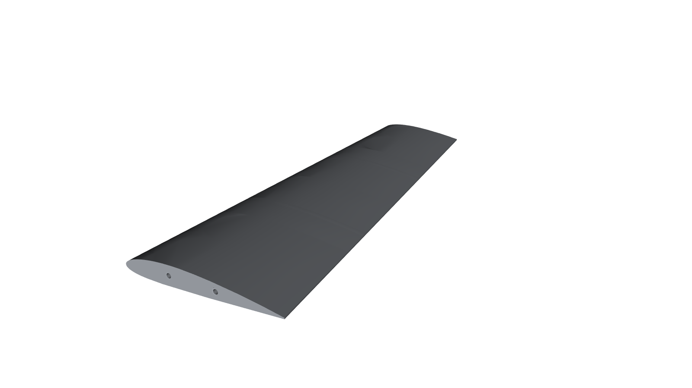
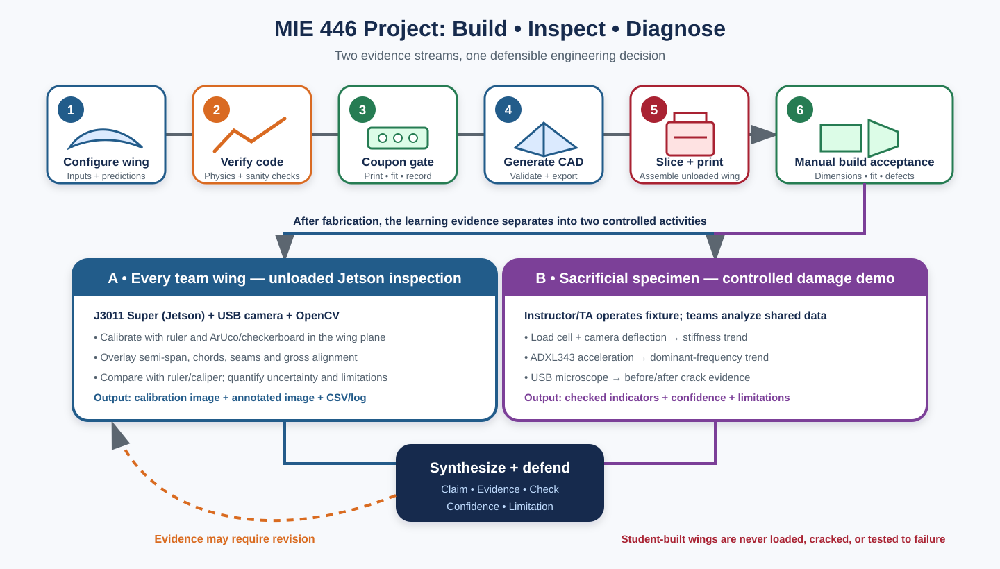

# MIE 446 · Aerospace Structures

**University of Massachusetts Amherst · Fall 2026** 
Tuesday & Thursday · 11:30 a.m.–12:45 p.m. · ELAB 323 
Dr. Ehsan Roohi Golkhatmi · Gunness Laboratory, Room 1 · [roohie@umass.edu](mailto:roohie@umass.edu)

## Open for class

**[Syllabus](SYLLABUS.md)** · **[Download Word syllabus](docs/MIE_446_Aerospace_Structures_Fall_2026_Syllabus_Updated.docx)** · **[Weekly schedule](SYLLABUS.md#7-weekly-schedule--fall-2026)** · **[Lecture notebooks](#lecture-notebooks)** · **[Wing project](PROJECT.md)** · **[Homework](ASSIGNMENTS.md)** · **[Printing](PRINTING.md)**

This is the classroom home for released MIE 446 learning materials. Open a lecture below, save your own copy in Google Drive, and work through the predictions, theory and experiments. No prior aerospace course is assumed.

> **What makes an engineering answer trustworthy?** 
> Learn to frame the problem, predict behavior, justify the model, check the evidence and defend the decision—even when AI supplies the calculation or code.

## Lecture notebooks

| Lecture | What we study | Open and run |
|---|---|---|
| **01 · Aircraft forces and airfoils** | Flight-path equilibrium, airfoil geometry, NACA sections, aerodynamic coefficients, stall and load paths · 75 min |  |
| **02 · Finite wings and load paths** | Span, chord, taper, aspect ratio, sweep, dihedral, induced drag, distributed loads and root reactions · 75 min |  |

Lectures 01 and 02 are released. Later lecture notebooks will appear here when ready; the [syllabus schedule](SYLLABUS.md#7-weekly-schedule--fall-2026) describes the full semester, not a list of already-published notebooks.

### Your classroom workflow

1. Click **Open in Colab** and choose **File → Save a copy in Drive**.
2. Run the setup cell, then proceed from top to bottom.
3. Record a prediction **before** revealing the result. Change the marked inputs and rerun the affected cells.
4. Explain the result using **Claim — Evidence — Check — Confidence — Limitation**.
5. Keep your own notebook; submit only through the assigned Canvas link.

[Notebook index and troubleshooting](notebooks/README.md)

## Design and build a wing

Teams of three use instructor-provided code to define a parametric semi-wing, verify its geometry, print a rod-fit coupon, build approved modules and document the assembled result. Students may use AI for code assistance, but must understand and independently verify the work.

Every team then performs an **unloaded, non-contact dimensional inspection** with a shared NVIDIA Jetson camera station. In a separate instructor-led activity, teams analyze force–deflection, vibration and crack evidence collected before and after controlled damage to a sacrificial wing-box specimen.

**Student-built wings are not loaded, cracked, flown or tested to failure.** Assessment focuses on reproducibility, geometry, calibrated inspection, diagnostic reasoning, uncertainty, fabrication evidence, revision and individual understanding.

**[Project guide and code documentation](PROJECT.md)** · [Project rubric](SYLLABUS.md#4-project-brief--code-to-print-wing--fabrication-machine-vision-inspection-and-damage-diagnostics) · [Printing checklist](PRINTING.md) · [AI-use log template](AI_USE_LOG_TEMPLATE.md)

## Assessment and course support

| Component | Course weight | Details |
|---|---:|---|
| Six individual homeworks | 52.5% total; 8.75% each | [Checklist, dates and oral-check format](ASSIGNMENTS.md) |
| One individual midterm | 17.5% | October 27; [exam policy](SYLLABUS.md#midterm) |
| Team wing project and presentation | 30% | [Milestones, evidence and individual defense](SYLLABUS.md#5-project-workflow-and-deliverables) |

There is no final examination. See the [full syllabus](SYLLABUS.md) for grading, extensions, accommodations, academic integrity and University statements.

AI use is **permitted with disclosure and verification**, except during the midterm or another explicitly restricted component. The course develops teamwork, hands-on experience, creativity, empathy, human communication, critical thinking and lifelong learning. [Read the complete AI statement](SYLLABUS.md#ai-statement-learning-and-engineering-judgment-in-the-age-of-ai).

[Teaching team and contacts](SYLLABUS.md#2-people-communication-and-resources) · [Guest events](SYLLABUS.md#guest-learning-events) · [Course overview](COURSE.md)

## What stays in Canvas

Use GitHub for classroom navigation, the web syllabus, released notebooks, project code and public checklists. Use Canvas for announcements, authoritative deadline changes, assignment question sheets until released here, submissions, grades, office-hour updates, oral-check rotations, printer reservations and private access information. No student submissions, answer keys or room access codes are published here.

## Code and maintenance

[Source package](src/mie446_wing) · [Tests](tests) · [Project troubleshooting](PROJECT.md#11-troubleshooting-the-guided-notebook) · [Final ZIP contents](PROJECT.md#step-6-export-and-download-the-submission)

