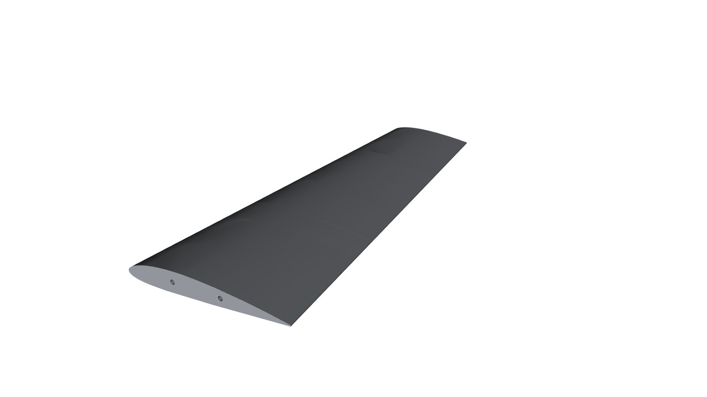
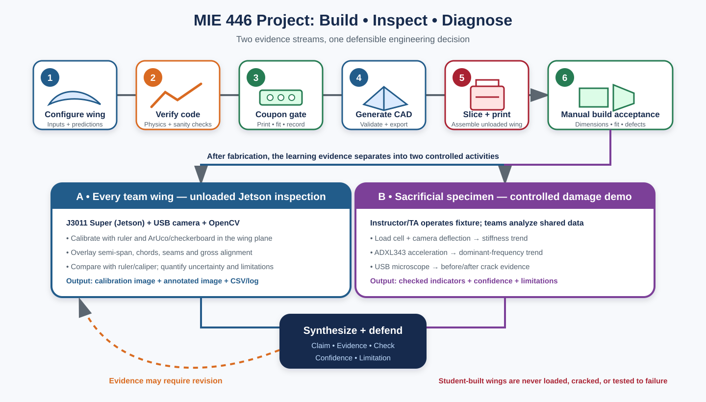

# MIE 446 · Aerospace Structures

**University of Massachusetts Amherst · Fall 2026** 
Tuesday & Thursday · 11:30 a.m.–12:45 p.m. · ELAB 323 
Dr. Ehsan Roohi Golkhatmi · Gunness Laboratory, Room 1 · [roohie@umass.edu](mailto:roohie@umass.edu)

## Open for class

**[Launch Wing Lab: beams → printed wing](https://ehsan-roohi.github.io/Aerospace-Structures/wing-lab.html)** — start with cantilever, fixed–fixed and simply supported beams; then compare skin-only, reinforced, ribbed and modular wings. Apply point or distributed loads and explore reactions, stress, deflection and modes. No installation; internet access is required for the wing's 3-D graphics library. [Learning pathway and model limits](computational/printed-wing-solver/README.md#progressive-learning-pathway).

**[Syllabus](SYLLABUS.md)** · **[Download Word syllabus](docs/MIE_446_Aerospace_Structures_Fall_2026_Syllabus_Updated.docx)** · **[Weekly schedule](SYLLABUS.md#7-weekly-schedule--fall-2026)** · **[Lecture notebooks](#lecture-notebooks)** · **[Stipa-Caproni: the Venturi-fuselage aircraft](STIPA_CAPRONI.md)** · **[Boeing 747: uranium, mass balance and flutter](BOEING_747_MASS_BALANCE.md)** · **[Gimli Glider case study](GIMLI_GLIDER.md)** · **[Navier–Stokes and AI reading](NAVIER_STOKES_AI.md)** · **[Wing project](PROJECT.md)** · **[Homework 1 PDF](assignments/homework-01/MIE446_HW1_Surface_Pressure.pdf)** · **[Homework 1 Excel data](assignments/homework-01/MIE446_HW1_NACA2412_Data.xlsx)** · **[All homework](ASSIGNMENTS.md)** · **[General OrcaSlicer + USB guide](PRINTING.md)**

**Homework 1 solutions are available:** [download the solution (Word)](https://raw.githubusercontent.com/Ehsan-Roohi/Aerospace-Structures/main/assignments/homework-01/solutions/MIE446_HW1_solution.docx) · [download the solution workbook (Excel)](https://raw.githubusercontent.com/Ehsan-Roohi/Aerospace-Structures/main/assignments/homework-01/solutions/MIE446_HW1_NACA2412_Data.xlsx) · [solution overview](assignments/homework-01/README.md#released-solutions).

This is the classroom home for released MIE 446 learning materials. Open a lecture below, save your own copy in Google Drive, and work through the predictions, theory and experiments. No prior aerospace course is assumed.

**Homework 2 is available:** [step-by-step guide (PDF)](assignments/homework-02/MIE446_HW2_Control_Forces_Moments.pdf)
and [student package with MATLAB and Excel starters](assignments/homework-02/MIE446_HW2_Student_Pack.zip).
Use the [Lecture 1 reading map](assignments/homework-02/README.md) for the Lilienthal,
force/moment and modern-control sections.

> **What makes an engineering answer trustworthy?** 
> Learn to frame the problem, predict behavior, justify the model, check the evidence and defend the decision—even when AI supplies the calculation or code.

## Lecture notebooks

| Lecture | What we study | Open and run |
|---|---|---|
| **01 · Aircraft forces and airfoils** | Flight-path equilibrium, CG/trim/static margin, airfoil/NACA geometry and wing/empennage load paths; Lilienthal tail and tip controls; modern UAV photo atlas (MQ-9, X-48B, X-36, X-47B), MAGMA blown-air control and interactive elevon mixing · Multi-session lecture |  |
| **02 · Finite wings and load paths** | Span, chord, taper, aspect ratio, sweep, dihedral, induced drag, distributed loads and root reactions · 75 min |  |
| **Independent lecture · Wing structure, buckling, materials and flutter** | Spars, ribs, stringers and skins; clear displacement views; Wright wings; Horikoshi's 7-Shi, 9-Shi and Zero; built-up/extruded spars, duralumin and aeroelastic energy. Historical photographs, original schematics and short numerical activities. |  |
| **Numerical wing structural design** | Two teaching sessions + design studio: theory, schematics, signed load cases, bending/shear/torsion, cap buckling, whole-span fit, independent beam FEM, Pareto search, uncertainty and downloadable CAD/report data. No lab or Excel required. |  |
| **Printed-wing structural solver** | Analyse your team's as-printed semi-wing: exact shell/sleeve/rod section, 2-D FE torsion and shear centre, lift or tip-force loads, V–M–T, deflection, twist, skin buckling, rod and seam checks, natural frequencies and assembly comparison. [Launch Wing Lab 3-D app](https://ehsan-roohi.github.io/Aerospace-Structures/wing-lab.html) (runs directly in your browser) · [SolidWorks cross-check guide](SOLIDWORKS_SIMULATION_GUIDE.md) |  |

Lectures 01 and 02 and the independent wing-structure lecture are released. Later lecture notebooks will appear here when ready; the [syllabus schedule](SYLLABUS.md#7-weekly-schedule--fall-2026) describes the full semester, not a list of already-published notebooks.

### Engineering case studies

**[Why did early Boeing 747s carry uranium counterweights?](BOEING_747_MASS_BALANCE.md)** distinguishes whole-aircraft CG from local control-surface mass balance, explains compact dense weights and flutter, follows attachment load paths, and compares tungsten substitution with modern aeroelastic validation. Includes three real photographs, three original teaching diagrams, transparent numerical examples, discussion questions and official FAA/NRC/Airbus sources.

**[Stipa-Caproni: when the fuselage becomes a duct](STIPA_CAPRONI.md)** connects the unusual ducted-propeller aircraft to pressure forces, lift, thrust, wooden shell construction, wire-braced wing load paths and structural tradeoffs. Includes original schematics, a historical construction-photo link, archival video and NACA sources, a worked numerical example and an AI-audit discussion.

**[How did OpenAI solve Navier–Stokes in 88 hours? — full Zoomit translation](NAVIER_STOKES_AI.md)** presents the complete English translation of the supplied Zoomit article, credited to Pooyesh Pourmohammad, with all 11 article visuals, including seven diagrams redrawn entirely in English. A separate technical supplement derives the energy scaling, clarifies the Euler result, updates the data-use discussion and links the original video player, English lectures, proof and Lean repository.

**[The Gimli Glider: an aerospace-structures case study](GIMLI_GLIDER.md)** follows Air Canada Flight 143 from a failed fuel-quantity defense to a 17-minute unpowered glide and emergency landing. It connects unit discipline, system redundancy, landing loads, changing load paths, local damage, crashworthiness and occupant survival. The reading includes licensed historical photographs, original engineering diagrams, discussion questions, the official investigation report and video links.

### Your classroom workflow

1. Click **Open in Colab** and choose **File → Save a copy in Drive**.
2. Run the setup cell, then proceed from top to bottom.
3. Record a prediction **before** revealing the result. Change the marked inputs and rerun the affected cells.
4. Explain the result using **Claim — Evidence — Check — Confidence — Limitation**.
5. Keep your own notebook; submit only through the assigned Canvas link.

[Notebook index and troubleshooting](notebooks/README.md)

## Design and build a wing

### Assigned teams and October build

Three-person teams are already assigned. **Three meetings remain before the October 13 build: October 1, 6 and 8.** Finish Lecture 1 and the seven-rib R01 layout on October 1; use October 6 for geometry/load checks and coupon evidence; complete R02 and slicer review on October 8. See the [three-meeting teaching plan](SYLLABUS.md#class-plan-before-october-fabrication) and [project milestones](SYLLABUS.md#5-project-workflow-and-deliverables). Physical coupon printing/testing requires an earlier authorized appointment; if the first printer access is October 13, start with the coupon, not final wing modules. Canvas assigns supervised ELab slots.

### September 29 wing-design packet

Use the fillable worksheet and fit/release record below, retaining a copy for your team. **Their original timing is superseded by the October 1/6/8 plan above.** On R01, mark all seven baseline ribs using the updated [project explanation](PROJECT.md#why-the-baseline-has-seven-ribs). The September 29 instructor guide is retained as a previous lesson plan, not the current timetable. Canvas remains authoritative for submissions and supervised appointments.

- [Team Wing Layout — R01 (student worksheet)](docs/course-packets/2026-09-29/MIE446_Team_Wing_Layout_R01.pdf)
- [September 29 Wing Lecture Guide (instructor)](docs/course-packets/2026-09-29/MIE446_September_29_Instructor_Guide.pdf)
- [Coupon Fit and R02 Release Record (team and staff form)](docs/course-packets/2026-09-29/MIE446_Coupon_Fit_and_R02_Release_Record.pdf)

Teams of three use instructor-provided code to define a parametric semi-wing, verify its geometry, print a rod-fit coupon, build approved modules and document the assembled result. Students may use AI for code assistance, but must understand and independently verify the work.

Every team then performs an **unloaded, non-contact dimensional inspection** with a shared **Seeed Studio reComputer Super J3011 (NVIDIA Jetson Orin Nano 8GB)** and USB camera station. In a separate instructor-led activity, teams analyze force–deflection, vibration and crack evidence collected before and after controlled damage to a sacrificial wing-box specimen.

**Student-built wings are not loaded, cracked, flown or tested to failure.** Assessment focuses on reproducibility, geometry, calibrated inspection, diagnostic reasoning, uncertainty, fabrication evidence, revision and individual understanding.

**[Project guide and code documentation](PROJECT.md)** · **[Printed-wing structural solver](notebooks/MIE446_Printed_Wing_Structural_Solver.ipynb)** · [SolidWorks cross-check](SOLIDWORKS_SIMULATION_GUIDE.md) · [Project rubric](SYLLABUS.md#4-project-brief--code-to-print-wing--fabrication-machine-vision-inspection-and-damage-diagnostics) · **[General OrcaSlicer + USB guide](PRINTING.md)** ([Word](docs/OrcaSlicer_Offline_USB_3D_Printing_Guide.docx) · [PDF](docs/OrcaSlicer_Offline_USB_3D_Printing_Guide.pdf)) · [AI-use log template](AI_USE_LOG_TEMPLATE.md)

### Download the printing examples

Use these files to practice the STL-to-G-code workflow and to inspect a successful reference output:

- **[Download the sample STL](https://raw.githubusercontent.com/Ehsan-Roohi/Aerospace-Structures/main/docs/printing/examples/reference-glider-model.stl)**
- **[Download the matching reference G-code](https://raw.githubusercontent.com/Ehsan-Roohi/Aerospace-Structures/main/docs/printing/examples/reference-k2pro-orcaslicer.gcode)**

The G-code is provided for inspection only. Do not send it directly to a printer; import the STL into OrcaSlicer and generate new G-code using the validated profile for the exact printer, nozzle and material.

## Assessment and course support

| Component | Course weight | Details |
|---|---:|---|
| Six individual homeworks | 52.5% total; 8.75% each | [Checklist, dates and oral-check format](ASSIGNMENTS.md) |
| One individual midterm | 17.5% | October 27; [exam policy](SYLLABUS.md#midterm) |
| Team wing project and presentation | 30% | [Milestones, evidence and individual defense](SYLLABUS.md#5-project-workflow-and-deliverables) |

There is no final examination. See the [full syllabus](SYLLABUS.md) for grading, extensions, accommodations, academic integrity and University statements.

AI use is **permitted with disclosure and verification**, except during the midterm or another explicitly restricted component. The course develops teamwork, hands-on experience, creativity, empathy, human communication, critical thinking and lifelong learning. [Read the complete AI statement](SYLLABUS.md#ai-statement-learning-and-engineering-judgment-in-the-age-of-ai).

[Teaching team and contacts](SYLLABUS.md#2-people-communication-and-resources) · [Guest events](SYLLABUS.md#guest-learning-events) · [Course overview](COURSE.md)

## What stays in Canvas

Use GitHub for classroom navigation, the web syllabus, released notebooks, project code, public checklists and instructor-released solutions. Use Canvas for announcements, authoritative deadline changes, assignment question sheets and answer keys until released here by the instructor, submissions, grades, office-hour updates, oral-check rotations, printer reservations and private access information. No student submissions or room access codes are published here.

## Code and maintenance

[Source package](src/mie446_wing) · [Tests](tests) · [Project troubleshooting](PROJECT.md#11-troubleshooting-the-guided-notebook) · [Final ZIP contents](PROJECT.md#step-6-export-and-download-the-submission)

