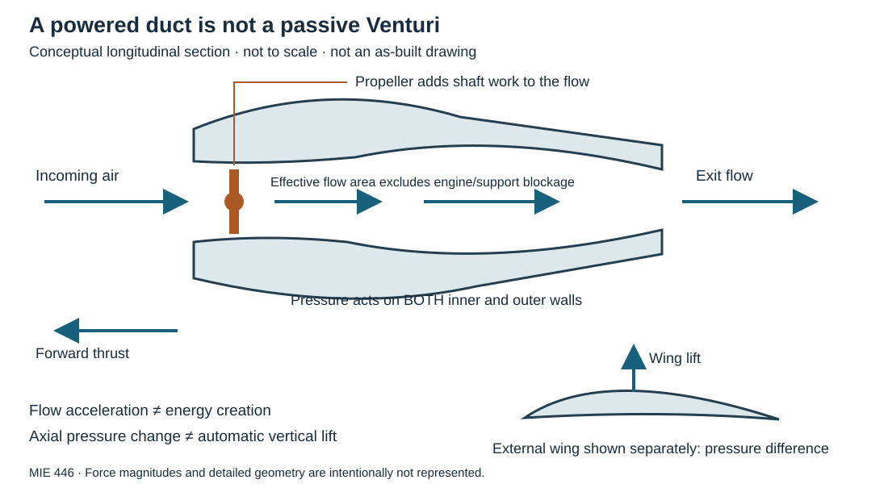
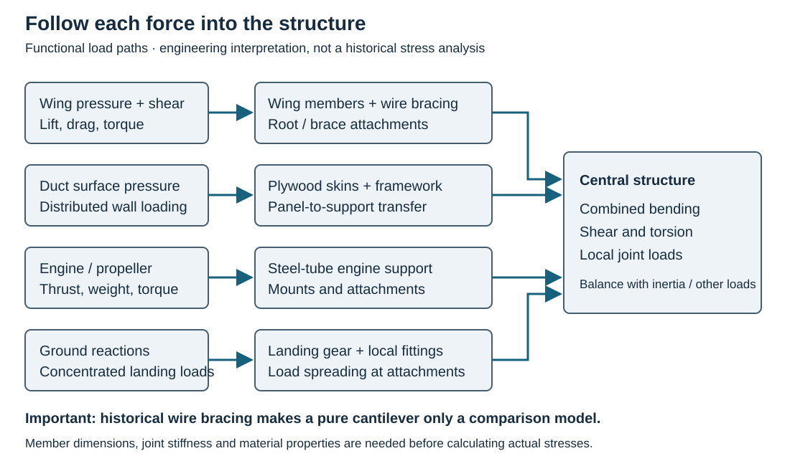

# Stipa-Caproni: when the fuselage becomes a duct

**MIE 446 · Aerospace Structures · UMass Amherst**  
[Course home](README.md) · [Aircraft forces](notebooks/MIE446_Lecture_01_Trust_Forces_Airfoils.ipynb) · [Numerical wing studio](notebooks/MIE446_Wing_Structural_Design_Numerical.ipynb)

> **Driving question:** Can a shape improve propulsion and produce lift, yet introduce structural and aerodynamic penalties?

This case connects pressure, lift, propulsion, thin-walled structures and load paths. Read the explanations before attempting the discussion questions. Allow about **20–25 minutes** for the classroom activity. The engineering models below are educational interpretations, not a reconstruction or airworthiness assessment.

## 1. Meet the aircraft

The Stipa-Caproni was an Italian experimental aircraft built by Caproni around Luigi Stipa's ducted-propeller concept. A contemporary October 1932 *Flight* account describes a 120 hp engine, a hollow fuselage and a conventional external wing. Its engine was supported by a steel-tube framework inside the duct; the tail surfaces sat at the duct exit. [Contemporary account: *A Flying Venturi Tube*, reproduced here](https://aviadejavu.ru/Site/Crafts/Craft34486.htm).

**Look at the real construction:** [Open the historical photograph and attribution](https://commons.wikimedia.org/wiki/File:Fasi_della_costruzione_della_carlinga_dello_Stipa-Caproni_02.jpg). It comes from Stipa's 1933 article in *Rivista Aeronautica*; Commons identifies the photographer as unknown and lists public-domain status in Italy and the United States. Look for the supporting framework rather than interpreting the barrel as a solid block.

### Watch and investigate

- [Historical footage — *1933 Voli sperimentali aeroplano Stipa Caproni*](https://www.youtube.com/watch?v=mQ0ZQesixms), attributed to SEA/Milan Airports. Identify the open inlet, external wings, cockpit and tail. The video page could not be played during preparation of this reading; no timestamp-specific claims are made.
- [Original discussion prompt on LinkedIn](https://lnkd.in/p/gBuhwKju). Treat the post as a starting claim, not as engineering evidence. Its supplied screenshot was readable; the linked video was not directly accessible during preparation.
- [Stipa, *Experiments with Intubed Propellers*, NACA TM 655 (1932)](https://ntrs.nasa.gov/citations/19930094761).
- [Stipa, *Stipa Monoplane with Venturi Fuselage*, NACA TM 753 (1934)](https://ntrs.nasa.gov/citations/19930094664), also [catalogued by UNT](https://digital.library.unt.edu/ark:/67531/metadc63476/). The NASA abstract explicitly describes external asymmetry intended to generate lift at zero tube-axis incidence. This is more informative than saying merely “the tube accelerates the air.”

The NACA links provide primary-source downloads. This reading uses their verified catalog descriptions; it does not claim a full reanalysis of their experimental data.

## 2. Where do lift and thrust come from?

*Original teaching schematic, not to scale. The outer asymmetry, engine supports and three-dimensional flow are simplified. Air travels left to right relative to the aircraft; forward thrust points left. The wing section is shown separately, not as a wall inside the duct.*

### First: pressure and shear act on surfaces

Pressure pushes normal to a surface; viscous shear acts tangentially. Their vector sum gives the aerodynamic force:

$$
\mathbf F=\int_{S_b}\left[-(p-p_\infty)\mathbf n+\boldsymbol{\tau}\cdot\mathbf n\right]\,dS.
$$

Here $S_b$ is the complete wetted body surface, $\mathbf n$ points from the solid into the air, and $\boldsymbol{\tau}$ is the viscous stress tensor. Lift is the component perpendicular to the incoming flow; drag is the component along it. Include both inner and outer duct surfaces when evaluating the duct force.

For a thin, approximately horizontal wing section, neglecting shear and projecting onto the chord-normal direction gives the useful approximation

$$
N'\approx\int_0^c[p_{\mathrm{lower}}(x)-p_{\mathrm{upper}}(x)]\,dx.
$$

$N'$ has units N/m of span. It approximates section lift at small incidence; at finite incidence, resolve both chord-normal and chordwise forces into wind axes. A pressure difference produces force on a surface—not an unexplained “suction force” elsewhere.

**The aircraft has external wings.** They produce lift through their pressure and shear distributions. The duct can also have a vertical aerodynamic force when its geometry or flow is asymmetric. An ideal, axisymmetric duct aligned with uniform flow cannot generate net vertical lift by symmetry alone. The actual distribution among wings, duct and tail requires measurements or a coupled flow solution; a video does not determine those percentages.

### Second: a narrowing duct is not a source of energy

For steady incompressible flow through a streamtube,

$$
\dot m=\rho A_1\bar V_1=\rho A_2\bar V_2.
$$

Use the **effective flow area**, accounting for the engine and supports. If the same mass flow passes through a smaller area, its mean speed increases. On an ideal streamline away from the propeller, with negligible height change and losses,

$$
p+\tfrac12\rho V^2=\text{constant}.
$$

Thus acceleration can accompany lower static pressure. But **do not apply this constant across the powered propeller**: the engine supplies shaft work, and the rotor raises the flow's total pressure. Downstream expansion may recover static pressure; separation and friction reduce that recovery.

### Third: account for the whole propulsor

The propeller pushes air rearward; the air reacts on the aircraft. The duct pressure distribution can contribute to axial force too. In a simplified steady one-dimensional streamtube with ambient-pressure inlet and exit, uniform velocities and no additional external aerodynamic forces,

$$
T=\dot m(V_e-V_\infty).
$$

$T$ is the forward force magnitude; $V_e$ and $V_\infty$ are rearward flow speeds in the aircraft frame. Nonambient section pressures, nonuniform flow and external duct forces require the full momentum balance. Do not calculate “propeller thrust” and then add the same wake momentum again as “duct thrust.”

**Connection to modern engines:** this is a useful historical example of duct–propeller integration. It is not itself a turbofan: a modern turbofan contains a gas-turbine core driving its fan. Similar geometry does not establish a direct historical lineage or equal performance.

## 3. What holds it together?

The contemporary *Flight* description reports a wooden duct framework covered with plywood on both inner and outer surfaces, a thin wing wire-braced to the fuselage, and the separate steel-tube engine support. That means a purely cantilever wing model is **not** an exact model of the reported aircraft. [Construction account](https://aviadejavu.ru/Site/Crafts/Craft34486.htm).

*Original load-path interpretation. Boxes represent structural functions, not verified joint locations, member sizes or an as-built drawing.*

| Component | Structural question to ask | Potential issue to investigate—not a documented failure |
|---|---|---|
| Inner/outer duct skins and supporting framework | How does distributed pressure reach the supports? | Panel bending, local buckling, joint and adhesive loads |
| Wing and wire bracing | How are lift, bending and torsion shared among wing members, braces and attachments? | Brace tension, attachment bearing, compression-member instability |
| Engine support | Where do thrust, engine weight and reaction torque go? | Combined loading, vibration, fatigue and clearance changes |
| Tail attachments | How does a tail force become a moment on the central structure? | Attachment loads and sensitivity to slipstream speed |
| Landing-gear attachments | How are concentrated ground reactions spread into a lightweight shell/frame? | Local crushing, bending and asymmetric landing loads |

**A large hollow shape is not automatically heavy or strong.** Separating material from a bending neutral axis can improve stiffness per unit mass, but skins, joints, cutouts and local instability must still be checked. Nor is this open duct a sealed pressure vessel: do not blindly apply a uniform internal-pressure cylinder formula to its nonuniform aerodynamic loading.

### Bending, shear and torsion: distinct actions

For an idealized unbraced semi-wing of length $\ell$, an upward distributed load $w(y)$ produces root reaction magnitudes

$$
V_r=\int_0^\ell w(y)\,dy,\qquad
M_r=\int_0^\ell y\,w(y)\,dy.
$$

**Derivation:** a short strip contributes $dF=w(y)dy$. Its lever arm from the root is $y$, so $dM=y\,dF$. Sum all strips to obtain the two integrals. Shear transmits the net transverse force; bending transmits its moment. Root reactions oppose the applied force and moment.

If the force acts at chordwise offset $e(y)$ from the shear center, it also contributes twisting torque. With a consistent sign convention,

$$
Q_r=\int_0^\ell e(y)w(y)\,dy+\int_0^\ell m_a(y)\,dy.
$$

$m_a$ is an aerodynamic moment per unit span. For the historical braced wing, include brace forces and their lever arms before calculating internal loads; their sharing also depends on geometry and stiffness. These cantilever equations are a classroom comparison, not historical stress results.

## 4. A numerical example—without a laboratory

Use **invented teaching inputs**, not Stipa-Caproni test data: one unbraced semi-wing, $\ell=3$ m, uniform $w=500$ N/m, and constant $e=0.10$ m; neglect distributed aerodynamic pitching moment and wing weight.

$$
V_r=w\ell=1500\ \mathrm N,\qquad
M_r=\frac{w\ell^2}{2}=2250\ \mathrm{N\,m},\qquad
Q_r=e\,w\ell=150\ \mathrm{N\,m}.
$$

The load resultant acts at $\ell/2=1.5$ m: $1500\times1.5=2250$ N m independently checks the moment. If that same total lift were concentrated nearer the root, the root bending moment would decrease. This is why **total lift alone is insufficient for structural design**.

To continue numerically, use the [wing structural design notebook in Colab](https://colab.research.google.com/github/Ehsan-Roohi/Aerospace-Structures/blob/main/notebooks/MIE446_Wing_Structural_Design_Numerical.ipynb). Compare distributed load shapes, stresses and deflection. Its beam model does not simulate this aircraft's powered duct or wire bracing.

## 5. Evaluate the claim, not just the unusual appearance

| Claim | Engineering response |
|---|---|
| “The Venturi produces lift.” | Which surface-force component? A symmetric axial pressure change is not sufficient for vertical force. Include external wings and duct asymmetry. |
| “The slipstream improves the tail.” | Higher local speed can increase control forces, but trim, stability, controllability and structural loads are different questions. More stability is not automatically better maneuverability. |
| “A duct must make the aircraft more efficient.” | Compare the complete aircraft at equal mission and power: useful thrust, drag, structural mass, losses and installation effects. |
| “Low takeoff and landing speeds prove the explanation.” | Speeds alone do not isolate duct lift. Require mass, wind, configuration, power and measurement definitions. The social post's 72/68 km/h values are not adopted here as validated design data. |

## 6. Classroom discussion and an AI-audit exercise

After reading the theory, work in groups of three: one person draws the force diagram, one traces the load path, and one challenges the assumptions. Rotate roles.

1. **Locate:** In the construction photograph and video, identify the duct, external wing, engine support and tail. Separate visible evidence from inferred internal details.
2. **Explain:** Why can flow accelerate through a narrowing passage without that passage supplying energy? Where does the energy enter this aircraft's airflow?
3. **Calculate:** Using Section 4, double the span while holding $w$ and $e$ fixed. Predict the changes in root shear, bending and torsion before calculating them.
4. **Critique:** An AI says, “Because the throat pressure is low, the aircraft rises even without wings, asymmetry or incidence.” Identify the missing vector-force argument.
5. **Decide:** Propose a numerical comparison of duct-on and duct-off configurations. State what must be held fixed, which outputs matter, and why a simple beam model cannot settle the aerodynamic question.

Instructor check: the numerical scaling

Root shear doubles, root bending moment quadruples, and offset-induced root torsion doubles. These results assume fixed uniform load per unit span, not fixed total lift. At fixed total lift, the bending moment instead doubles for the same normalized load shape.

**Takeaway:** The design couples aerodynamics, propulsion and structure. A credible explanation must conserve momentum and energy, identify the surfaces carrying the forces, and show how those forces reach the rest of the aircraft.
